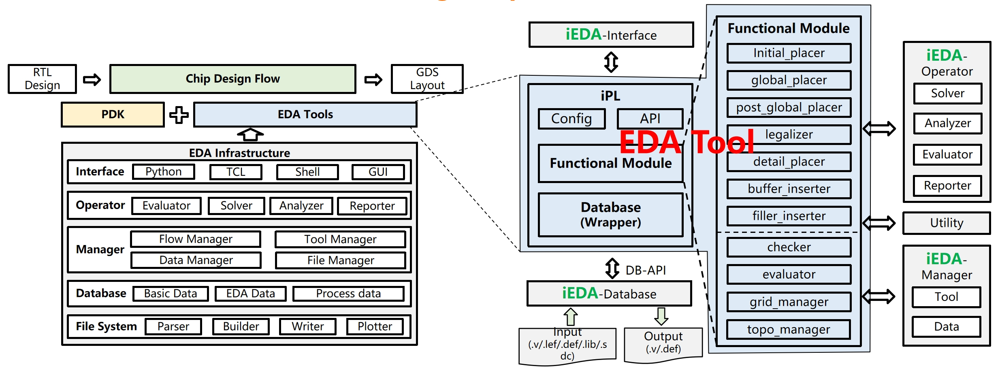

<div align="center">

<!--  -->


 <h1>iEDA</h1>
 <h3>从 Netlist 到 GDS 的开源数字芯片设计 EDA 基础设施和工具</h3>

<p align="center">
    <a title="Project Version">
        
    </a>
        <a title="Node Version" target="_blank" href="https://nodejs.org">
        
    </a>
    <a title="License" target="_blank" href="https://github.com/OSCC-Project/iEDA/blob/master/LICENSE">
        
    </a>
    <br/>
    <a title="GitHub Watchers" target="_blank" href="https://github.com/OSCC-Project/iEDA/watchers">
        
    </a>
    <a title="GitHub Stars" target="_blank" href="hhttps://github.com/OSCC-Project/iEDA/stargazers">
        
    </a>
    <a title="GitHub Forks" target="_blank" href="https://github.com/OSCC-Project/iEDA/network/members">
        
    </a>
</p>

**简体中文** | [English][README-en-path]

<h2> 
Open-source is not a goal but a way 

开源不是目的，而是实现方式
</h2>

</div>


### **iEDA Homepage：[ieda.oscc.cc](https://ieda.oscc.cc)**

## **iEDA 介绍总览**
- **1 EDA Infrastructure、11 EDA Tools、4 times tape-out design by iEDA**
  - Level 1: Open-source EDA, RTL, PDK, supporting chip design；
  - Level 2:  Open-source Infrastructure supports EDA development and research


<div align="center">
 
</div>

## **iEDA 基础平台和工具**
- To fast develop high-quality EDA tool, we need a Software Development Kit (SDK)  
- iEDA can be used to support developing EDA tool or algorithm
- Infrastructure: Database, Manager, Operator, Interface 

<div align="center">
 
</div>

## **iEDA 流片**

<div align="center">
 
</div>


🎉 **News:**

**https://ieda.oscc.cc/en/publicity/news/**

---

## **论文和报告**  [[查看更多](https://ieda.oscc.cc/en/research/achieves/papers.html)]
- iRT: Net Resource Allocation: A Desirable Initial Routing Step, DAC, 2024
- iCTS: Toward Controllable Hierarchical Clock Tree Synthesis with Skew-Latency-Load Tree, DAC, 2024
- AiEDA: An Open-source AI-native EDA Library, ISEDA, 2024
- iEDA: An Open-source infrastructure of EDA (invited), ASPDAC, 2024.
- iPD: An Open-source intelligent Physical Design Tool Chain (invited), ASPDAC, 2024.
- AiMap: Learning to Improve Technology Mapping for ASICs via Delay Prediction, ICCD, 2023
- iPL-3D: A Novel Bilevel Programming Model for Die-to-Die Placement, ICCAD, 2023.
- iEDA: An Open-source Intelligent Physical Implementation Toolkit and Library, ISEDA, 2023. (BPA) \[[paper][iEDA-paper], [slides][iEDA-slides]\]


## iEDA 使用指导

使用 iEDA 进行芯片设计，需首先获得 iEDA 可执行文件。

若您需要对 iEDA 进行修改，通过源码构建，请按照顺序阅读，查看 [iEDA user guide](https://ieda.oscc.cc/en/tools/ieda-platform/guide.html).。

您也可以直接使用最新的 [iEDA docker 镜像](docker.cnb.cool/ecoslab/rtl2gds/ieda)，即可跳过 "*1. 源码构建 iEDA*"。

PS: 关于如何安装 Docker，可参考[Docker安装及初始化](https://www.cnblogs.com/harrypotterisdead/p/17223606.html)。

### 1. 源码构建 iEDA

我们提供两种源码构建 iEDA 的方法作为示例。

#### 方法1 使用iEDA镜像（推荐）

通过 docker pull 拉取最新的 docker.cnb.cool/ecoslab/rtl2gds/ieda:latest 镜像，镜像中包含了最新的 master 分支代码和依赖（构建工具和依赖库）。也可使用 `-v` 命令挂载自行下载的 iEDA 代码仓库，仅使用镜像提供的编译工具和依赖库进行构建。

参考如下命令，进入容器后的当前目录即为 iEDA master 分支代码。

```bash
# docker.cnb.cool/ecoslab/rtl2gds/ieda:latest
docker run -it --rm docker.cnb.cool/ecoslab/rtl2gds/ieda:latest bash 
# 进入容器后执行 build.sh 进行构建
bash build.sh
# 若能够正常输出 "Hello iEDA!" 则编译成功
./bin/iEDA -script scripts/hello.tcl
```

#### 方法2 手动安装依赖并编译

在 Ubuntu 22.04 下执行如下命令：

```bash
# 下载iEDA仓库
git clone --recursive https://gitee.com/oscc-project/iEDA.git iEDA && cd iEDA
# 通过apt安装编译依赖，需要root权限
sudo bash build.sh -i apt
# 编译 iEDA
bash build.sh
# 若能够正常输出 "Hello iEDA!" 则编译成功
./bin/iEDA -script scripts/hello.tcl
```

### 2. 使用 iEDA 完成芯片设计

详细内容请移步至 [iEDA 用户手册](docs/user_guide/iEDA_user_guide.md)

<!-- # 未来路线图

Roadmap -->

## 贡献指南

Fork 此 iEDA 仓库，修改代码后提交 [Pull Request](https://gitee.com/oscc-project/iEDA/pulls)。

请注意 iEDA 使用的[编程规范][Code-conduct-md]。

## **论文引用**
```
@inproceedings{li2024ieda,
title={iEDA: An Open-source infrastructure of EDA},
author={Li, Xingquan and Huang, Zengrong and Tao, Simin and Huang, Zhipeng and Zhuang, Chunan and Wang, Hao and Li, Yifan and Qiu, Yihang and Luo, Guojie and Li, Huawei and Shen, Haihua and Chen, Mingyu and Bu, Dongbo and Zhu, Wenxing and Cai, Ye and Xiong, Xiaoming and Jiang, Ying and Heng, Yi and Zhang, Peng and Yu, Bei and Xie, Biwei and Bao, Yungang},
booktitle={2024 29th Asia and South Pacific Design Automation Conference (ASP-DAC)},
pages={77--82},
year={2024},
organization={IEEE}
}

@inproceedings{li2024ipd,
title={iPD: An Open-source intelligent Physical Design Toolchain},
author={Li, Xingquan and Tao, Simin and Chen, Shijian and Zeng, Zhisheng and Huang, Zhipeng and Wu, Hongxi and Li, Weiguo and Huang, Zengrong and Ni, Liwei and Zhao, Xueyan and Liu, He and Long, Shuaiying and Liu, Ruizhi and Lin, Xiaoze and Yang, Bo and Huang, Fuxing and Yang, Zonglin and Qiu, Yihang and Shao, Zheqing and Liu, Jikang and Liang, Yuyao and Xie, Biwei and Bao, Yungang and Yu, Bei},
booktitle={2024 29th Asia and South Pacific Design Automation Conference (ASP-DAC)},
pages={83--88},
year={2024},
organization={IEEE}
}
```

## 讨论和反馈

- 新建 [issue](https://gitee.com/oscc-project/iEDA/issues)，我们将及时反馈。
- QQ 群：**793409748**
- 微信讨论群：

<div align="center">
 
</div>

## License

[木兰宽松许可证, 第2版][License-url]

## 致谢

在iEDA的开发过程中，我们采用了来自开源社区的子模块。具体情况如下：

| 子模块         | 来源                                                                                                  | 详细用途                                                          |
| -------------- | ----------------------------------------------------------------------------------------------------- | ----------------------------------------------------------------- |
| flute3         | [FastRoute](http://home.eng.iastate.edu/~cnchu/FastRoute)                                                | 借助flute3来产生rectange steiner tree.                            |
| abseil-cpp     | [Google abseil](https://github.com/abseil/abseil-cpp.git)                                                | 使用Google的高性能C++容器和算法库提升性能，相比STL会改进程序性能. |
| json           | [JSON for Modern C++](https://github.com/nlohmann/json)                                                  | Json C++库，用来解析程序Json配置文件.                             |
| magic_enum     | [Static reflection for enums (to string, from string, iteration)](https://github.com/Neargye/magic_enum) | 支持 enum 值和字符串的相互转换.                                   |
| libfort        | [Seleznev Anton libfort](https://github.com/seleznevae/libfort.git)                                      | C/C++ library 产生格式化的 ASCII tables.                          |
| pegtl          | [PEGTL（Parsing Expression Grammar Template Library）](https://github.com/taocpp/PEGTL/)                 | 使用PEGTL来方便的解析SPEF文件.                                    |
| pybind11       | [pybind 11](https://github.com/pybind/pybind11.git)                                                      | 方便python调用C++.                                                |
| VCDParser      | [ben-marshall verilog-vcd-parser](https://github.com/ben-marshall/verilog-vcd-parser.git)                | 解析功耗VCD波形文件.                                              |
| def lef        | [def lef parser](https://github.com/asyncvlsi/lefdef.git)                                                | 解析物理设计DEF/LEF文件.                                          |
| ThreadPool     | [Jakob Progsch, Václav Zeman threadpool](https://github.com/progschj/ThreadPool.git)                    | C++11模板库实现的多线程池.                                        |
| fft            | [fft](https://www.kurims.kyoto-u.ac.jp/~ooura/fft.html)                                                  | 快速傅立叶变换库.                                                 |
| hMETIS         | [hMETIS](http://glaros.dtc.umn.edu/gkhome/metis/hmetis/overview)                                        | 高效的图划分算法.                                                 |
| lemon          | [lemon](https://lemon.cs.elte.hu/trac/lemon)                                                             | 图、网络中的高效建模和优化.                                       |
| SALT           | [SALT]([SALT](https://github.com/chengengjie/salt))                                                      | 生成VLSI路由拓扑，在路径长度(浅度)和总线长(亮度)之间进行权衡.     |
| scipoptsuite   | [SCIP](https://scipopt.org/index.php#welcome)                                                            | 用于快速求解混合整数规划 (MIP) 和混合整数非线性规划 (MINLP) .     |
| mt-kahypar | [mt-kahypar]([mt-kahypar]https://github.com/kahypar/mt-kahypar.git)          | 多线程超图划分器.                                                                                         |

我们深深地感谢来自开源社区的支持，我们也鼓励其他开源项目在[木兰宽松许可证](LICENSE)的范围下复用我们的代码。

<!-- links -->

<!-- [README-CN-path]: README.zh-cn.md -->

<!-- links -->

[License-url]: LICENSE
[README-en-path]: README.md
[Code-conduct-md]: docs/tbd/CodeConduct.md
[iEDA-OSCC-url]: https://ieda.oscc.cc/
[iEDA-paper]: docs/paper/ISEDA'23-iEDA-final.pdf
[iEDA-slides]: docs/ppt/ISEDA'23-iEDA-lxq-v8.pptx
