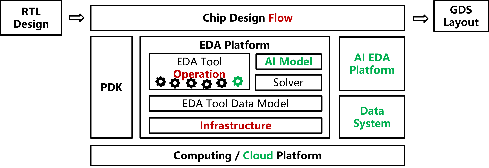
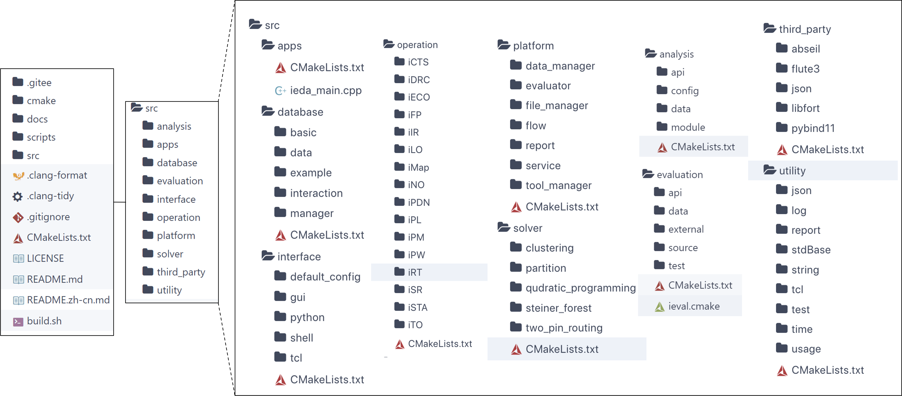
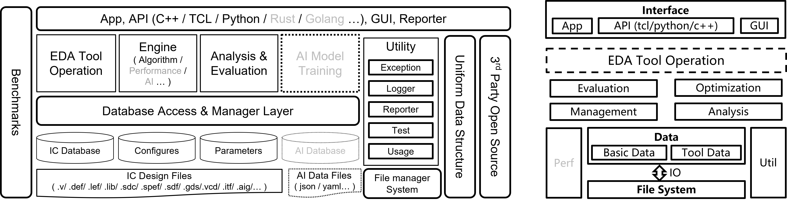
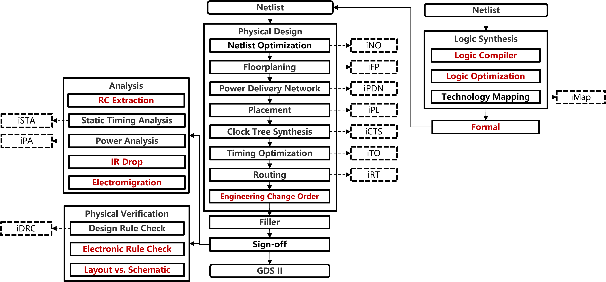

<div align="center">

<!--  -->


 <h1>iEDA</h1>
 <h3> An pen-source from netlist to GDS EDA platform for ASIC design.</h3>

[License][License-url]

[Chinese][README-CN-path] | **English**

</div>

iEDA Homepage：[ieda.oscc.cc][iEDA-OSCC-url]

## **About iEDA**

- **About “i”in iEDA**
  - Meaning 1: Infrastructure
  - Meaning 2: Intelligent
- **The goal of the iEDA project**
  - EDA Infrastructure
  - High quality and performance EDA tool
- **Open-source is not a goal but a way**

## **Main Contents and Plans**

- Enhance the **infrastructure** to support more design requirement
- Complete the EDA tool chain from **RTL-GDS II**
- Improve the **quality and performance** of all EDA tool operations
- Construct **AI for EDA** platform and introduce trained **AI model** to the EDA platform
- Build **data system** with enough chip design and labeling process data
- Achieve the adaptability of the EDA platform for **cloud-native**

<div align="center">
 
</div>

## **iEDA Structure**

<div align="center">
 
</div>

## **iEDA Infrastructure**

<div align="center">
 
</div>

## **iEDA Operations (Tools)**

<div align="center">
 
</div>

## **iEDA Tapeout**

<div align="center">
 
</div>

---

🎉 **News:**

Presentation in ISEDA-2023, May-09 2023, Nanjing, China, Session 2: [iEDA: An Open-Source Intelligent Physical lmplementation Toolkit and Library][ISEDA-2023-iEDA-url] \[[paper][iEDA-paper], [slides][iEDA-slides]\]，and Panel 4 [Is ML a real cure for modern design automation?][ISEDA-2023-panel4-url], and Panel 6 [Open-source EDA and Standards][ISEDA-2023-panel6-url]

---

## **Papers and Presentations**

- ISEDA 2023: iEDA：An Open-Source Intelligent Physical Implementation Toolkit and Library \[[paper][iEDA-paper], [slides][iEDA-slides]\]

# **iEDA User Guide**

Before designing chip by iEDA，you need to obtain the execution binary of iEDA.

If you need to modify iEDA through source code construction, please read in sequence.

You can also directly  use the latest release docker， then you can skip "1. Source code construction of iEDA".

PS: you can refer [Docker install and initilization](https://www.cnblogs.com/harrypotterisdead/p/17223606.html) to know how to install Docker.

## 1. Build iEDA from source code

We provide two methods for source code construction of iEDA as examples.

### Method 1. Use  the iEDA mirror (Redommended)

Download the latest “iedaopensource/base” mirror from Dockerhub, which includes the latest master branch code and dependencies (build tools and dependency libraries). You can also use the ‘-v’ command to mount your own downloaded iEDA code repository. The build will only use the compile tools and dependency libraries provided by the mirror.

The current directory after entering the container is the iEDA master branch code, refering the following commands:

```bash
# ieda opensource/base:(latest, ubuntu, debian)
docker run -it --rm iedaopensource/base:latest bash 
# enter docker and run build.sh to build
bash build.sh
# if output "Hello iEDA!", then compile successfully
./bin/iEDA -script scripts/hello.tcl
```

We have ubuntu（Ubuntu20.04）and debian（Debian11）mirror tag.

### Method 2.  Install dependencies and compile

installing command on Ubuntu 20.04:

```bash
# download iEDA repo
git clone https://gitee.com/oscc-project/iEDA.git iEDA && cd iEDA
# compile dependencies with an apt installation requires root permission
sudo bash build.sh -i apt
# comple iEDA
bash build.sh
# if output "Hello iEDA!", then compile successfully
./bin/iEDA -script scripts/hello.tcl
```

## 2. Design chip by using iEDA

Here, two iEDA operation methods are provided for reference

About how to use iEDA, please refer [Tcl command manual][Tcl-menu-xls]  and the tool instruction docs of `readme.md` in `src/operation`.

### Method 1. Run release or demo mirror（Redommended)

If you need to use custom processes and designs, mount the associated files into the docker to run. About the structure and the corresponding config files, please refer the demo in `scripts/sky130`.

```
docker run -it -v ${file directory of pdk and design}:${file directory in docker} --rm iedaopensource/release:latest
```

### Method 2.  Compile iEDA binary and run

Refering the file directory in `scripts/sky130`，add the path of iEDA execution binary into the system path variable $PATH, and runing `sh run_iEDA.sh`，and seeing the result in `result`.

```
iEDA/scripts/sky130
├── iEDA_config   # iEDA parameters configuration files
├── lef           # lef files
├── lib           # lib files
├── result        # iEDA result output files
├── script        # Tcl script files
├── sdc           # sdc files
├── run_iEDA.py   # Python3 script for running iEDA
└── run_iEDA.sh   # POSIX shell script for running iEDA
```

<!-- # 未来路线图

Roadmap -->

## **Contribution Guide**

Fork this iEDA repository，after adding and commiting code, please summit [Pull Request](https://gitee.com/oscc-project/iEDA/pulls)。

Please note the using [Coding Style][Code-conduct-md] of iEDA。

## **Discussion**

- Create [issue](https://gitee.com/oscc-project/iEDA/issues) in repo
- QQ Group：**793409748**
- WeChat Group：

<div align="center">
 
</div>

## **License**

[MulanPSL-2.0][License-url]

## Acknowledgement

In the development of iEDA, some sub-modules from the open-source community are employed. All relevant usage is listed below.

| Sub-module   | Source                                                                                                   | Detail                                                                                                        |
| ------------ | -------------------------------------------------------------------------------------------------------- | ------------------------------------------------------------------------------------------------------------- |
| flute3       | [FastRoute](http://home.eng.iastate.edu/~cnchu/FastRoute)                                                | Generate rectange steiner tree by flute3.                                                                     |
| abseil-cpp   | [Google abseil](https://github.com/abseil/abseil-cpp.git)                                                | Use Google's high performance C++ container and algorithm library to improve performance compared to STL.     |
| json         | [JSON for Modern C++](https://github.com/nlohmann/json)                                                  | Json C++ library, used to parse the program Json configuration file.                                          |
| magic_enum   | [Static reflection for enums (to string, from string, iteration)](https://github.com/Neargye/magic_enum) | Supports the conversion of enum values and character strings.                                                 |
| libfort      | [Seleznev Anton libfort](https://github.com/seleznevae/libfort.git)                                      | The C/C++ library produces formatted ASCII tables.                                                            |
| pegtl        | [PEGTL（Parsing Expression Grammar Template Library）](https://github.com/taocpp/PEGTL/)                 | Use PEGTL to parse SPEF files easily.                                                                         |
| pybind11     | [pybind 11](https://github.com/pybind/pybind11.git)                                                      | Easy for python to call C++.                                                                                  |
| VCDParser    | [ben-marshall verilog-vcd-parser](https://github.com/ben-marshall/verilog-vcd-parser.git)                | Parse power VCD waveform file.                                                                                |
| def lef      | [def lef parser](https://github.com/asyncvlsi/lefdef.git)                                                | Parse physical layout and design DEF/LEF files.                                                               |
| ThreadPool   | [Jakob Progsch, Václav Zeman threadpool](https://github.com/progschj/ThreadPool.git)                     | C++11 template library implementation of multithreaded pool.                                                  |
| fft          | [fft](https://www.kurims.kyoto-u.ac.jp/~ooura/fft.html)                                                  | Fast Fourier transform library.                                                                               |
| hmetics      | [hmetics](http://glaros.dtc.umn.edu/gkhome/metis/hmetis/overview)                                        | Efficient graph partitioning algorithm.                                                                       |
| lemon        | [lemon](https://lemon.cs.elte.hu/trac/lemon)                                                             | Efficient modeling and optimization in graphs and networks.                                                   |
| SALT         | [SALT]([SALT](https://github.com/chengengjie/salt))                                                      | Generating VLSI routing topology, It trades off between path length (shallowness) and wirelength (lightness). |
| scipoptsuite | [SCIP](https://scipopt.org/index.php#welcome)                                                            | It is used to quickly solve mixed integer programming (MIP) and mixed integer nonlinear programming (MINLP).                                                 |
| parser/liberty | [OpenROAD/OpenSTA/liberty](https://github.com/The-OpenROAD-Project/OpenSTA/tree/master/liberty)                                                            |  parse .lib file .     |
| parser/verilog | [OpenROAD/OpenSTA/verilog](https://github.com/The-OpenROAD-Project/OpenSTA/tree/master/verilog)                                                            | parse netlist file .     |
| parser/spef | [OpenTimer/spef](https://github.com/OpenTimer/OpenTimer/blob/master/ot/parser-spef/parser-spef.hpp)                                                            | parse spef file .     |

We are grateful for the support of the open-source community and encourage other open-source projects to reuse our code within the scope of the [MulanPSL-2.0](LICENSE).

<!-- links -->

<!-- [README-CN-path]: README.zh-cn.md -->

<!-- links -->

[License-url]: LICENSE
[README-CN-path]: README.md
[Code-conduct-md]: docs/tbd/CodeConduct.md
[Tcl-menu-xls]: docs/tbd/TclMenu.xls
[iEDA-OSCC-url]: https://ieda.oscc.cc/
[ISEDA-2023-iEDA-url]: https://www.eda2.com/conferenceHome/program/detail?key=s2
[ISEDA-2023-panel4-url]: https://www.eda2.com/conferenceHome/program/detail?key=panel4
[ISEDA-2023-panel6-url]: https://www.eda2.com/conferenceHome/program/detail?key=panel6
[iEDA-paper]: docs/paper/ISEDA'23-iEDA-final.pdf
[iEDA-slides]: docs/ppt/ISEDA'23-iEDA-lxq-v8.pptx
