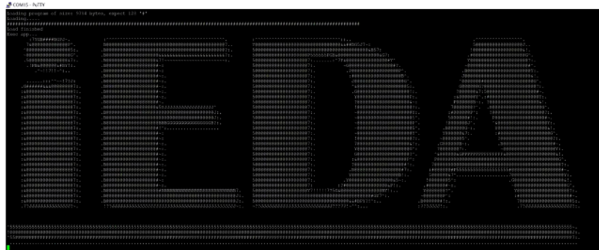
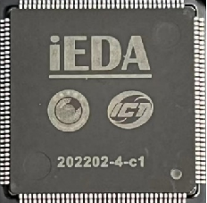
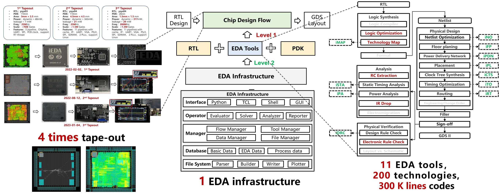
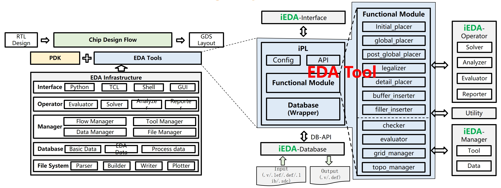

<div align="center">

<!--  -->

<!--  -->


 <h1>iEDA</h1>

<h3> An open-source  EDA infracstructure and tools from Netlist to GDS for ASIC design.</h3>

<p align="center">
    <a title="Project Version">
        
    </a>
        <a title="Node Version" target="_blank" href="https://nodejs.org">
        
    </a>
    <a title="License" target="_blank" href="https://github.com/OSCC-Project/iEDA/blob/master/LICENSE">
        
    </a>
    <br/>
    <a title="GitHub Watchers" target="_blank" href="https://github.com/OSCC-Project/iEDA/watchers">
        
    </a>
    <a title="GitHub Stars" target="_blank" href="hhttps://github.com/OSCC-Project/iEDA/stargazers">
        
    </a>
    <a title="GitHub Forks" target="_blank" href="https://github.com/OSCC-Project/iEDA/network/members">
        
    </a>
</p>

[Chinese][README-CN-path] | **English**

<h2> Open-source is not a goal but a way <h2>
</div>


### **iEDA Homepage：[ieda.oscc.cc/en/](https://ieda.oscc.cc/en/)**

## **iEDA Overview**
- **1 EDA Infrastructure、11 EDA Tools、4 times tape-out design by iEDA**
  - Level 1: Open-source EDA, RTL, PDK, supporting chip design；
  - Level 2:  Open-source Infrastructure supports EDA development and research


<div align="center">
 
</div>

## **iEDA Infrastructure and tool**
- To fast develop high-quality EDA tool, we need a Software Development Kit (SDK)  
- iEDA can be used to support developing EDA tool or algorithm
- Infrastructure: Database, Manager, Operator, Interface 

<div align="center">
 
</div>

## **iEDA Tapeout**

<div align="center">
 
</div>


🎉 **News:**

**https://ieda.oscc.cc/en/publicity/news/**

---

## **Papers and Presentations**  [[See more](https://ieda.oscc.cc/en/research/papers/)]
- iRT: Net Resource Allocation: A Desirable Initial Routing Step, DAC, 2024
- iCTS: Toward Controllable Hierarchical Clock Tree Synthesis with Skew-Latency-Load Tree, DAC, 2024
- AiEDA: An Open-source AI-native EDA Library, ISEDA, 2024
- iEDA: An Open-source infrastructure of EDA (invited), ASPDAC, 2024.
- iPD: An Open-source intelligent Physical Design Tool Chain (invited), ASPDAC, 2024.
- AiMap: Learning to Improve Technology Mapping for ASICs via Delay Prediction, ICCD, 2023
- iPL-3D: A Novel Bilevel Programming Model for Die-to-Die Placement, ICCAD, 2023.
- iEDA: An Open-source Intelligent Physical Implementation Toolkit and Library, ISEDA, 2023. (BPA) \[[paper][iEDA-paper], [slides][iEDA-slides]\]


## **iEDA User Guide** 

Before designing chip by iEDA，you need to obtain the execution binary of iEDA.

If you need to modify iEDA through source code construction, please read [iEDA user guide](https://ieda.oscc.cc/en/tools/ieda-platform/guide.html).

You can also directly  use the latest release docker， then you can skip "1. Source code construction of iEDA".

PS: you can refer [Docker install and initilization](https://www.cnblogs.com/harrypotterisdead/p/17223606.html) to know how to install Docker.

### 1. Build iEDA from source code

We provide two methods for source code construction of iEDA as examples.

#### Method 1. Use  the iEDA mirror (Redommended)

Download the latest “iedaopensource/base” mirror from Dockerhub, which includes the latest master branch code and dependencies (build tools and dependency libraries). You can also use the ‘-v’ command to mount your own downloaded iEDA code repository. The build will only use the compile tools and dependency libraries provided by the mirror.

The current directory after entering the container is the iEDA master branch code, refering the following commands:

```bash
# ieda opensource/base:(latest, ubuntu, debian)
docker run -it --rm iedaopensource/base:latest bash 
# enter docker and run build.sh to build
bash build.sh
# if output "Hello iEDA!", then compile successfully
./bin/iEDA -script scripts/hello.tcl
```

We have ubuntu（Ubuntu20.04）and debian（Debian11）mirror tag.

#### Method 2.  Install dependencies and compile

installing command on Ubuntu 20.04:

```bash
# download iEDA repo
git clone --recursive https://gitee.com/oscc-project/iEDA.git iEDA && cd iEDA
# compile dependencies with an apt installation requires root permission
sudo bash build.sh -i apt
# comple iEDA
bash build.sh
# if output "Hello iEDA!", then compile successfully
./bin/iEDA -script scripts/hello.tcl
```

### 2. Design chip by using iEDA

Here, two iEDA operation methods are provided for reference

About how to use iEDA, please refer [Tcl command manual][Tcl-menu-xls]  and the tool instruction docs of `readme.md` in `src/operation`.

#### Method 1. Run release or demo mirror（Redommended)

If you need to use custom processes and designs, mount the associated files into the docker to run. About the structure and the corresponding config files, please refer the demo in `scripts/sky130`.

```
docker run -it -v ${file directory of pdk and design}:${file directory in docker} --rm iedaopensource/release:latest
```

#### Method 2.  Compile iEDA binary and run

Refering the file directory in `scripts/sky130`，add the path of iEDA execution binary into the system path variable $PATH, and runing `sh run_iEDA.sh`，and seeing the result in `result`.

```
iEDA/scripts/sky130
├── iEDA_config   # iEDA parameters configuration files
├── lef           # lef files
├── lib           # lib files
├── result        # iEDA result output files
├── script        # Tcl script files
├── sdc           # sdc files
├── run_iEDA.py   # Python3 script for running iEDA
└── run_iEDA.sh   # POSIX shell script for running iEDA
```

<!-- # 未来路线图

Roadmap -->

## **Contribution Guide**

Fork this iEDA repository，after adding and commiting code, please submit [Pull Request](https://gitee.com/oscc-project/iEDA/pulls)。

Please note the using [Coding Style][Code-conduct-md] of iEDA。

## **Citation**
```
@inproceedings{li2024ieda,
title={iEDA: An Open-source infrastructure of EDA},
author={Li, Xingquan and Huang, Zengrong and Tao, Simin and Huang, Zhipeng and Zhuang, Chunan and Wang, Hao and Li, Yifan and Qiu, Yihang and Luo, Guojie and Li, Huawei and Shen, Haihua and Chen, Mingyu and Bu, Dongbo and Zhu, Wenxing and Cai, Ye and Xiong, Xiaoming and Jiang, Ying and Heng, Yi and Zhang, Peng and Yu, Bei and Xie, Biwei and Bao, Yungang},
booktitle={2024 29th Asia and South Pacific Design Automation Conference (ASP-DAC)},
pages={77--82},
year={2024},
organization={IEEE}
}

@inproceedings{li2024ipd,
title={iPD: An Open-source intelligent Physical Design Toolchain},
author={Li, Xingquan and Tao, Simin and Chen, Shijian and Zeng, Zhisheng and Huang, Zhipeng and Wu, Hongxi and Li, Weiguo and Huang, Zengrong and Ni, Liwei and Zhao, Xueyan and Liu, He and Long, Shuaiying and Liu, Ruizhi and Lin, Xiaoze and Yang, Bo and Huang, Fuxing and Yang, Zonglin and Qiu, Yihang and Shao, Zheqing and Liu, Jikang and Liang, Yuyao and Xie, Biwei and Bao, Yungang and Yu, Bei},
booktitle={2024 29th Asia and South Pacific Design Automation Conference (ASP-DAC)},
pages={83--88},
year={2024},
organization={IEEE}
}
```

## **Discussion**

- Create [issue](https://gitee.com/oscc-project/iEDA/issues) in repo
- QQ Group：**793409748**
- WeChat Group：

<div align="center">
 
</div>

## **License**

[MulanPSL-2.0][License-url]

## Acknowledgement

In the development of iEDA, some sub-modules from the open-source community are employed. All relevant usage is listed below.

| Sub-module     | Source                                                                                                | Detail                                                                                                        |
| -------------- | ----------------------------------------------------------------------------------------------------- | ------------------------------------------------------------------------------------------------------------- |
| flute3         | [FastRoute](http://home.eng.iastate.edu/~cnchu/FastRoute)                                                | Generate rectange steiner tree by flute3.                                                                     |
| abseil-cpp     | [Google abseil](https://github.com/abseil/abseil-cpp.git)                                                | Use Google's high performance C++ container and algorithm library to improve performance compared to STL.     |
| json           | [JSON for Modern C++](https://github.com/nlohmann/json)                                                  | Json C++ library, used to parse the program Json configuration file.                                          |
| magic_enum     | [Static reflection for enums (to string, from string, iteration)](https://github.com/Neargye/magic_enum) | Supports the conversion of enum values and character strings.                                                 |
| libfort        | [Seleznev Anton libfort](https://github.com/seleznevae/libfort.git)                                      | The C/C++ library produces formatted ASCII tables.                                                            |
| pegtl          | [PEGTL（Parsing Expression Grammar Template Library）](https://github.com/taocpp/PEGTL/)                 | Use PEGTL to parse SPEF files easily.                                                                         |
| pybind11       | [pybind 11](https://github.com/pybind/pybind11.git)                                                      | Easy for python to call C++.                                                                                  |
| VCDParser      | [ben-marshall verilog-vcd-parser](https://github.com/ben-marshall/verilog-vcd-parser.git)                | Parse power VCD waveform file.                                                                                |
| def lef        | [def lef parser](https://github.com/asyncvlsi/lefdef.git)                                                | Parse physical layout and design DEF/LEF files.                                                               |
| ThreadPool     | [Jakob Progsch, Václav Zeman threadpool](https://github.com/progschj/ThreadPool.git)                    | C++11 template library implementation of multithreaded pool.                                                  |
| fft            | [fft](https://www.kurims.kyoto-u.ac.jp/~ooura/fft.html)                                                  | Fast Fourier transform library.                                                                               |
| hMETIS         | [hMETIS](http://glaros.dtc.umn.edu/gkhome/metis/hmetis/overview)                                        | Efficient graph partitioning algorithm.                                                                       |
| lemon          | [lemon](https://lemon.cs.elte.hu/trac/lemon)                                                             | Efficient modeling and optimization in graphs and networks.                                                   |
| SALT           | [SALT]([SALT](https://github.com/chengengjie/salt))                                                      | Generating VLSI routing topology, It trades off between path length (shallowness) and wirelength (lightness). |
| scipoptsuite   | [SCIP](https://scipopt.org/index.php#welcome)                                                            | It is used to quickly solve mixed integer programming (MIP) and mixed integer nonlinear programming (MINLP).  |
| mt-kahypar | [mt-kahypar]([mt-kahypar]https://github.com/kahypar/mt-kahypar.git)          | Multi-Threaded Karlsruhe Hypergraph Partitioner .                                                                                          |

We are grateful for the support of the open-source community and encourage other open-source projects to reuse our code within the scope of the [MulanPSL-2.0](LICENSE).


<!-- links -->

<!-- [README-CN-path]: README.zh-cn.md -->

<!-- links -->

[License-url]: LICENSE
[README-CN-path]: README-CN.md
[Code-conduct-md]: docs/tbd/CodeConduct.md
[Tcl-menu-xls]: docs/tbd/TclMenu.xls
[iEDA-OSCC-url]: https://ieda.oscc.cc/
[ISEDA-2023-iEDA-url]: https://www.eda2.com/conferenceHome/program/detail?key=s2
[ISEDA-2023-panel4-url]: https://www.eda2.com/conferenceHome/program/detail?key=panel4
[ISEDA-2023-panel6-url]: https://www.eda2.com/conferenceHome/program/detail?key=panel6
[iEDA-paper]: docs/paper/ISEDA'23-iEDA-final.pdf
[iEDA-slides]: docs/ppt/ISEDA'23-iEDA-lxq-v8.pptx
