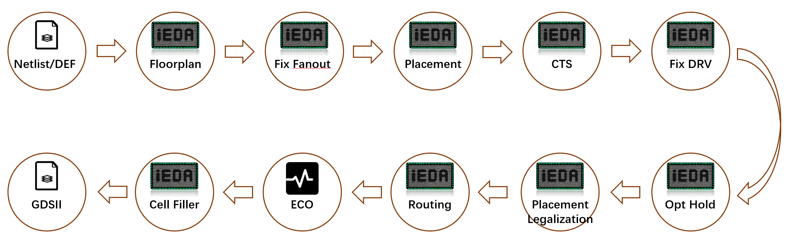
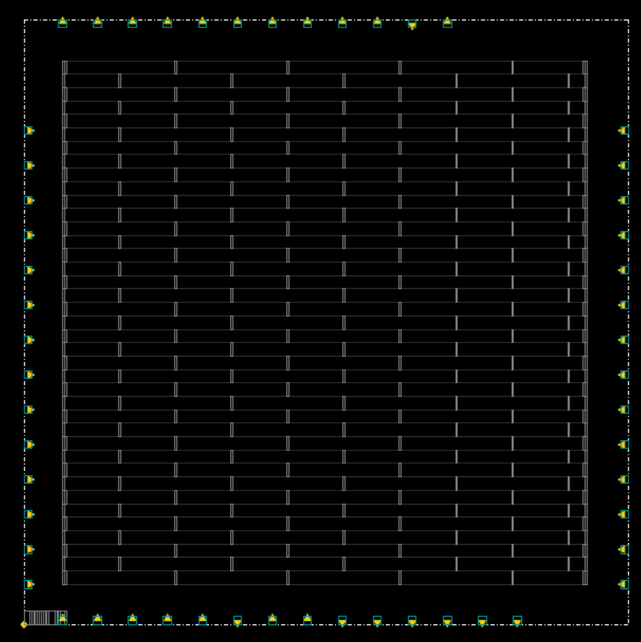
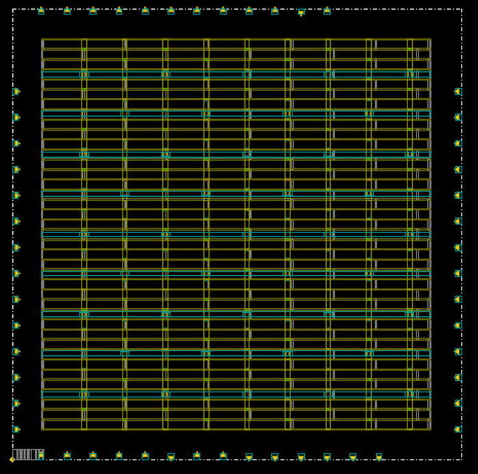
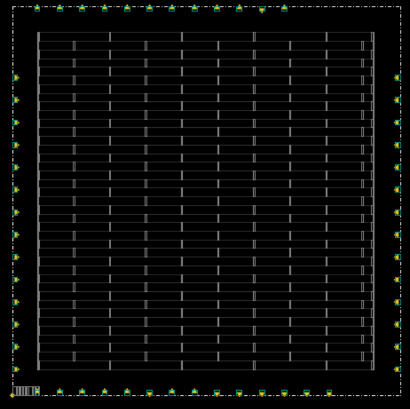
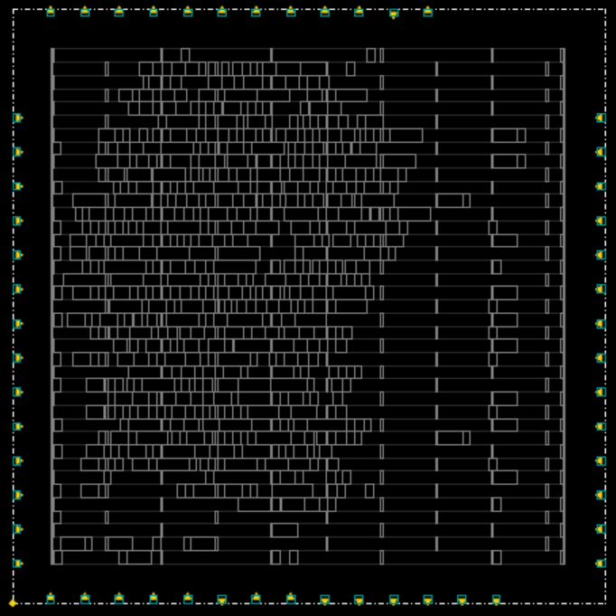
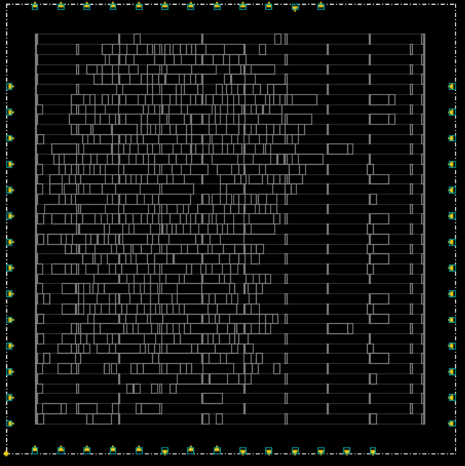
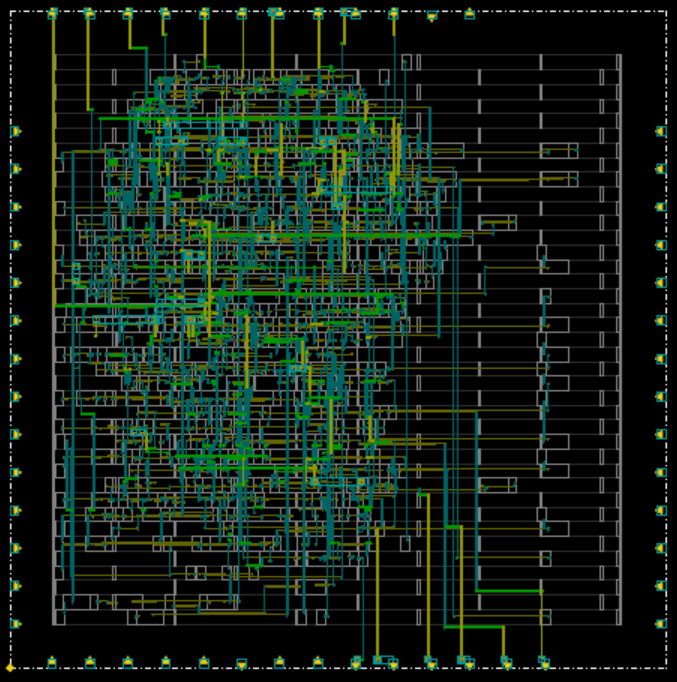

# iEDA 用户手册

## iEDA概述

### iEDA系统部署图

<div align=center>  </div>

## 工具准备

### 环境

- 服务器配置
- 操作系统   Ubuntu 20.04.5 LTS
- 工艺环境   SkyWater PDK

### 编译构建

```bash
# 下载iEDA仓库
git clone https://gitee.com/oscc-project/iEDA.git iEDA && cd iEDA
# 通过apt安装编译依赖，需要root权限
sudo bash build.sh -i apt
# 编译 iEDA
bash build.sh -j 16
# 若能够正常输出 "Hello iEDA!" 则编译成功
./bin/iEDA -script scripts/hello.tcl
```

拷贝 ./bin/iEDA 到目录 ./scripts/design/sky130_gcd

```bash
# 拷贝 iEDA 到sky130 目录 
cp ./bin/iEDA scripts/design/sky130_gcd/.
```

### 工艺文件准备

下载SkyWater PDK
拷贝TechLEF 文件 和 LEF文件到目录 ./scripts/foundry/sky130/lef

```bash
# 拷贝 TechLEF 文件到目录 ./scripts/foundry/sky130/lef
cp <skywater130pdk_tlef_path>/*.tlef scripts/foundry/sky130/lef/.
# 拷贝 LEF 文件到目录 ./scripts/foundry/sky130/lef
cp <skywater130pdk_lef_path>/*.lef scripts/foundry/sky130/lef/.
```

拷贝Lib文件到 ./scripts/foundry/sky130/lib

```bash
# 拷贝 Lib 文件到目录 ./scripts/foundry/sky130/lib
cp <skywater130pdk_lib_path>/*.lib scripts/foundry/sky130/lib/.
```

拷贝sdc文件到 ./scripts/foundry/sky130/sdc

```bash
# 拷贝 sdc 文件到目录 ./scripts/foundry/sky130/sdc
cp <skywater130pdk_sdc_path>/*.sdc scripts/foundry/sky130/sdc/.
```

### 设计文件准备

拷贝.v Netlist文件到目录 scripts/design/sky130_gcd/result/verilog

```bash
# 拷贝 .v 文件到目录 ./scripts/design/sky130_gcd/result/verilog
cp <skywater130pdk_verilog_path>/gcd.v scripts/design/sky130_gcd/result/verilog/.
```

## 工具流程

本文档以跑通skywater PDK 130nm工艺物理后端设计流程作为示例，说明iEDA各个点工具如何配置参数、运行和分析结果。

<div align=center>  </div>

### 模块划分

```
scripts
├── design                   #iEDA flows for different designs
│   ├── ispd18               #tbd
│   └── sky130_gcd           #flow of gcd in sky130
│       ├── iEDA           
│       ├── iEDA_config      # iEDA parameters configuration files
│       ├── README.md
│       ├── result           # iEDA result output files
│       ├── run_iEDA_gui.py  # Python3 script for running all iEDA flow with GUI layout
│       ├── run_iEDA.py      # Python3 script for running all iEDA flow
│       ├── run_iEDA.sh      # POSIX shell script for running all iEDA flow
│       └── script           # TCL script files
├── foundry
│   ├── README.md
│   └── sky130               # SkyWater Open Source PDK
│       ├── lef              # lef files
│       ├── lib              # lib files
│       ├── sdc              # sdc files
│       └── spef             # folder for spef files if needed
└── hello.tcl                # Test running iEDA

```

#### script 模块说明

script目录包含物理后端设计需要的所有流程脚本和结果分析评估脚本，并且按流程、功能划分好模块；流程脚本可支持顶层自动化运行脚本run_iEDA.py的调用，也可以支持独立运行。

```
scripts/design/sky130_gcd/script
├── DB_script                           # Data process flow scripts
│   ├── db_init_lef.tcl                 # initialize lef
│   ├── db_init_lib_drv.tcl             # initialize lib only for flow of drv 
│   ├── db_init_lib_fixfanout.tcl       # initialize lib only for flow of fix fanout
│   ├── db_init_lib_hold.tcl            # initialize lib only for flow of optimize hold
│   ├── db_init_lib_setup.tcl           # initialize lib only for flow of optimize setup
│   ├── db_init_lib.tcl                 # initialize lib for common flow
│   ├── db_init_sdc.tcl                 # initialize sdc 
│   ├── db_init_spef.tcl                # initialize spef
│   ├── db_path_setting.tcl             # set paths for all processing technology files, including TechLEF，LEF, Lib, sdc and spef
│   ├── run_db_checknet.tcl             # check net connectivity based on data built by DEF (.def) and LEF (.lef & .tlef)
│   ├── run_db_report_evl.tcl           # report wire length and congestion based on data built by DEF (.def) and LEF (.lef & .tlef)
│   ├── run_db.tcl                      # test building data by DEF (.def) and LEF (.lef & .tlef)
│   ├── run_def_to_gds_text.tcl         # transform data from DEF (.def) to GDSII (.gdsii)
│   ├── run_def_to_verilog.tcl          # transform data from DEF (.def) to netlist (.v)
│   ├── run_netlist_to_def.tcl          # transform data from netlist (.v) to DEF (.def)
│   └── run_read_verilog.tcl            # test read verilog file (.v)
├── iCTS_script                         # CTS flow scripts
│   ├── run_iCTS_eval.tcl               # report wire legnth for CTS result
│   ├── run_iCTS_STA.tcl                # report CTS STA
│   └── run_iCTS.tcl                    # run CTS
├── iDRC_script                         # DRC(Design Rule Check) flow scipts
│   ├── run_iDRC_gui.tcl                # show GUI for DRC result
│   └── run_iDRC.tcl                    # run DRC
├── iFP_script                          # Floorplan flow scripts
│   ├── module                          # submodule for Floorplan scripts
│   │   ├── create_tracks.tcl           # create tracks for routing layers
│   │   ├── pdn.tcl                     # create pdn networks 
│   │   └── set_clocknet.tcl            # set clock net
│   └── run_iFP.tcl                     # run Floorplan
├── iGUI_script                         # GUI flow scipts
│   └── run_iGUI.tcl                    # run GUI
├── iNO_script                          # NO(Netlist Optimization) flow scipts
│   └── run_iNO_fix_fanout.tcl          # run Fix Fanout
├── iPL_script                          # Placement flow scripts
│   ├── run_iPL_eval.tcl                # report congestion statistics and wire legnth for Placement result
│   ├── run_iPL_filler.tcl              # run standard cell filler
│   ├── run_iPL_gui.tcl                 # run gui flow that shows Global Placement Processing result
│   ├── run_iPL_legalization_eval.tcl   # report congestion statistics and wire legnth for Legalization result
│   ├── run_iPL_legalization.tcl        # run Cell Legalization
│   └── run_iPL.tcl                     # run Placement
├── iRT_script                          # Routing flow scripts
│   ├── run_iRT_DRC.tcl                 # run DRC for Routing result
│   ├── run_iRT_eval.tcl                # report wire legnth for Routing result
│   ├── run_iRT_STA.tcl                 # run STA for Routing result
│   └── run_iRT.tcl                     # run Routing
├── iSTA_script                         # STA flow scripts
│   ├── init_iSTA.tcl                   # STA initialization
│   ├── report_iSTA.tcl                 # report STA result
│   └── run_iSTA.tcl                    # run STA
└── iTO_script                          # TO(Timing Optimization) flow script
    ├── run_iTO_drv_STA.tcl             # run STA for DRV result
    ├── run_iTO_drv.tcl                 # run DRV
    ├── run_iTO_hold_STA.tcl            # run STA for Fix Hold Violation result
    ├── run_iTO_hold.tcl                # run Fix Hold Violation
    ├── run_iTO_setup_STA.tcl           # run STA for Fix Setup Violation result
    └── run_iTO_setup.tcl               # run Fix Setup Violation
```

### 运行Flow

准备好iEDA和工艺文件后，您可以选择自动运行sky130流程脚本，也可以分步骤运行各个点工具脚本，所有的结果都默认保存在script/sky130/result文件夹

#### Flow基础流程

不管是自动运行顶层 run_iEDA.py 脚本还是单独运行点工具脚本，基于 iEDA 平台设计的脚本都有着相似的步骤，具体流程如下 `<br>`
**step 1 路径设置**`<br>`
首先必须先配置工艺环境路径，为方便查找和配置路径参数，脚本将TechLEF、LEF、Lib、sdc、spef的路径统一在文件 ./script/DB_script/db_path_setting.tcl配置，如下表所示

| 功能                              | 配置命令                   | 参考 TCL 样例                                           |
| :-------------------------------- | :------------------------- | :------------------------------------------------------ |
| 设置 TechLef 路径                 | set TECH_LEF_PATH xxx      | set TECH_LEF_PATH "./lef/sky130_fd_sc_hs.tlef"          |
| 设置 Lef 路径                     | set LEF_PATH xxx           | set LEF_PATH ./lef/sky130_ef_io__com_bus_slice_10um.lef |
| 设置 Lib 路径                     | set LIB_PATH xxx           | set LIB_PATH ./lib/sky130_dummy_io.lib                  |
| 设置 Fix Fanout Lib 路径          | set LIB_PATH_FIXFANOUT xxx | set LIB_PATH_FIXFANOUT ./lib/sky130_dummy_io.lib        |
| 设置 Fix DRV Violation Lib 路径   | set LIB_PATH_DRV xxx       | set LIB_PATH_DRV ./lib/sky130_dummy_io.lib              |
| 设置 Fix Hold Violation Lib 路径  | set LIB_PATH_HOLD xxx      | set LIB_PATH_HOLD ./lib/sky130_dummy_io.lib             |
| 设置 Fix Setup Violation Lib 路径 | set LIB_PATH_SETUP xxx     | set LIB_PATH_SETUP ./lib/sky130_dummy_io.lib            |
| 设置 SDC 路径                     | set SDC_PATH xxx           | set SDC_PATH "./sdc/gcd.sdc"                            |
| 设置 SPEF 路径                    | set SPEF_PATH xxx          | set SPEF_PATH "./spef/xxx.spef"                         |

**step 2 配置点工具Config**`<br>`
所有点工具的参数设置Config都在路径 ./iEDA_config 中，可查看后面章节的 **输入输出一览表** 修改对应的点工具Config文件

**step 3 读 .def 设计文件**`<br>`
以 CTS 为例，执行 def_init 命令，读取布局后的结果

```bash
#===========================================================
##   read def
#===========================================================
def_init -path ./result/iPL_result.def
```

步骤 1 - 3 后，Tech LEF、LEF、DEF 文件数据将被加载，这是点工具启动的前提条件

**step 4 启动点工具**`<br>`
以 CTS 为例，执行 run_cts 命令，将启动 CTS 流程

```bash
#===========================================================
##   run CTS
#===========================================================
run_cts -config ./iEDA_config/cts_default_config.json
```

**step 5 保存点工具运行结果**`<br>`
以 CTS 为例，执行完点工具流程后，将点工具运行结果保存在路径 ./result/ 中

```bash
#===========================================================
##   Save def
#===========================================================
def_save -path ./result/iCTS_result.def

#===========================================================
##   Save netlist 
#===========================================================
netlist_save -path ./result/iCTS_result.v -exclude_cell_names {}
```

**step 6 输出报告**`<br>`
以 CTS 为例，数据存储后，将输出设计结果相关的总体报告，报告路径存储在 ./result/report/ 中

```bash
#===========================================================
##   report 
#===========================================================
report_db -path "./result/report/cts_db.rpt"
```

**step 7 退出**`<br>`

```bash
#===========================================================
##   Exit 
#===========================================================
flow_exit
```

以上步骤为执行单个点工具的一般流程，其中步骤 1 - 3 初始化配置和数据库，为必须的步骤，步骤 4 之后，可以按照需求灵活接入各个点工具或模块命令`<br>`

#### 报告分析

点工具运行完成后，分析报告将存储在路径 ./result/report 中，模块划分如下表所示`<br>`

| 报告类型                   | 路径                 | 说明                                                               |
| :------------------------- | :------------------- | :----------------------------------------------------------------- |
| Tech LEF、LEF、DEF数据报告 | ./result/report      | 分析、统计 Design 文件的数据，并对PR过程单元、线网数据进行详细报告 |
| 线长、拥塞评估报告         | ./result/report/eval | 分析、统计点工具输出结果的线长、单元密度、布线拥塞等数据           |
| DRC报告                    | ./result/report/drc  | 主要检测布线后的DRC违例情况，已支持GUI可视化分析                   |

##### 基础信息

以 CTS 后的结果报告为例`<br>`
查看 CTS 的数据报告，路径在 ./result/report/cts_db.rpt`<br>`

```
+-----------------+-----------------------------+
| iEDA            | V23.03-OS-01                |
+-----------------+-----------------------------+
| Stage           | iCTS - Clock Tree Synthesis |
| Runtime         | 2.863340 s                  |
| Memmory         | 5745.216000 MB              |
|                 |                             |
| Design Name     | gcd                         |
| DEF&LEF Version | 5.8                         |
| DBU             | 1000                        |
+-----------------+-----------------------------+
```

各标签含义如下表`<br>`

| 标签            | 样例值                      | 说明                                                                                     |
| :-------------- | :-------------------------- | :--------------------------------------------------------------------------------------- |
| iEDA            | V23.03-OS-01                | iEDA 当前版本号                                                                          |
| Stage           | iCTS - Clock Tree Synthesis | 当前结果的流程阶段，iCTS表示当前结果由 CTS 输出                                          |
| Runtime         | 2.863340 s                  | 当前点工具读入数据到保存结果所需运行时间                                                 |
| Memmory         | 5745.216000 MB              | 当前点工具读入数据到保存结果所需最大峰值内存                                             |
| Design Name     | gcd                         | 设计名称                                                                                 |
| DEF&LEF Version | 5.8                         | 当前设计的工艺文件版本号                                                                 |
| DBU             | 1000                        | 1 微米含单位长度个数，用于转换 DEF 和 Tech LEF 参数值(DATABASE MICRONS LEFconvertFactor) |

##### Design 数据报告

以 CTS 后的 Design 数据报告为例，以下对报告的各个参数、标签进行说明`<br>`
查看 CTS 的数据报告，路径在 ./result/report/cts_db.rpt`<br>`
**Summary**`<br>`
Summary 报告基于 Tech LEF 和 DEF 数据，统计了各个数据类型的基本信息`<br>`
以 CTS 结果的 Summary 为例`<br>`

```
###################################################################
Summary
+------------------------+----------------------------------------+
| Module                 | Value                                  |
+------------------------+----------------------------------------+
| DIE Area ( um^2 )      | 22513.194880 = 149.960000 * 150.128000 |
| DIE Usage              | 0.297306                               |
| CORE Area ( um^2 )     | 16893.489600 = 130.080000 * 129.870000 |
| CORE Usage             | 0.396206                               |
|                        |                                        |
| Number - Site          | 2                                      |
| Number - Row           | 39                                     |
| Number - Track         | 12                                     |
| Number - Layer         | 13                                     |
| Number - Routing Layer | 6                                      |
| Number - Cut Layer     | 5                                      |
| Number - GCell Grid    | 0                                      |
| Number - Cell Master   | 856                                    |
| Number - Via Rule      | 54                                     |
|                        |                                        |
| Number - IO Pin        | 56                                     |
| Number - Instance      | 941                                    |
| Number - Blockage      | 0                                      |
| Number - Filler        | 0                                      |
| Number - Net           | 683                                    |
| Number - Special Net   | 2                                      |
+------------------------+----------------------------------------+
```

报告的参数说明如下表所示

| 参数名                 | Tech LEF/LEF 关键字段 | DEF 关键字段 | 说明                                                                   |
| :--------------------- | :-------------------- | :----------- | :--------------------------------------------------------------------- |
| DIE Area ( um^2 )      |                       | DIEAREA      | 版图 DIE 面积，单位 平方微米                                           |
| DIE Usage              |                       |              | 版图 DIE 的利用率，即 Design中所有 Instance 面积 / DIE 面积            |
| CORE Area ( um^2 )     |                       |              | 版图 CORE 面积， 单位 平方微米, CORE 的面积为所有标准单元ROW的面积之和 |
| CORE Usag              |                       |              | 版图 CORE 的利用率, 即 Design中所有 Instance 面积 / CORE 面积          |
| Number - Site          | SITE                  |              | Tech LEF 中定义的 SITE 的个数                                          |
| Number - Row           |                       | ROW          | 版图生成的 标准单元ROW 的个数                                          |
| Number - Track         |                       | TRACKS       | 版图生成的 TRACK 的个数                                                |
| Number - Layer         | LAYER                 |              | Tech LEF 中定义的 总层数                                               |
| Number - Routing Layer | TYPE ROUTING ;        |              | Tech LEF 中定义的 布线层 层数                                          |
| Number - Cut Layer     | TYPE CUT ;            |              | Tech LEF 中定义的 通孔层 层数                                          |
| Number - GCell Grid    |                       | GCELLGRID    | 版图生成的 GCell Grid 的个数                                           |
| Number - Cell Master   | MACRO                 |              | LEF 中定义的所有 Cell Master 个数，包括宏单元、标准单元、填充单元等    |
| Number - Via Rule      | VIA`<br>` VIARULE   | VIAS         | LEF 中定义的 Via 个数                                                  |
| Number - IO Pin        |                       | PINS         | DEF 中生成的 IO Pin 的个数                                             |
| Number - Instance      |                       | COMPONENTS   | DEF 中生成的所有 Instance 个数                                         |
| Number - Blockage      |                       | BLOCKAGES    | DEF 中生成的所有 Blockage 个数                                         |
| Number - Filler        |                       | FILLS        | DEF 中生成的所有 Filler 个数                                           |
| Number - Net           |                       | NETS         | DEF 中生成的所有 Net 个数                                              |
| Number - Special Net   |                       | SPECIALNETS  | DEF 中生成的所有 Special Net 个数                                      |

**Summary - Instance**`<br>`
按不同的分类规则，统计所有 Instance 的信息`<br>`
以 CTS 的结果为例`<br>`

```
Summary - Instance
+---------------+--------+--------------+------------+------------+
| Type          | Number | Number Ratio | Area       | Area Ratio |
+---------------+--------+--------------+------------+------------+
| All Instances | 941    | 1            | 7161635200 | 1          |
|               |        |              |            |            |
| Netlist       | 648    | 0.688629     | 6693304000 | 0.934606   |
| Physical      | 293    | 0.311371     | 468331200  | 0.0653945  |
| Timing        | 0      | 0            | 0          | 0          |
|               |        |              |            |            |
| Core          | 940    | 0.998937     | 7157635200 | 0.999441   |
| Core - logic  | 647    | 0.687566     | 6689304000 | 0.934047   |
| Pad           | 0      | 0            | 0          | 0          |
| Block         | 0      | 0            | 0          | 0          |
| Endcap        | 0      | 0            | 0          | 0          |
| Cover         | 0      | 0            | 0          | 0          |
| Ring          | 0      | 0            | 0          | 0          |
+---------------+--------+--------------+------------+------------+
```

报告的参数说明如下表所示`<br>`

| 参数名       | 说明                                                                          |
| :----------- | :---------------------------------------------------------------------------- |
| Type         | Instance 的类型                                                               |
| Number       | 统计的 Instance 的个数                                                        |
| Number Ratio | 统计的 Instance 个数占比，即 统计的 Instance 个数 / 所有 Instance 个数        |
| Area         | 统计的 Instance 的总面积                                                      |
| Area Ratio   | 统计的 Instance 的面积占比， 即 统计的 Instance 总面积 / 所有 Instance 总面积 |

其中类型 Type 的分类说明如下`<br>`

- All Instances ： 所有 Instance
- Netlist ： 所有 线网 类型的 Instance，对应关键字为 DEF 里的 COMPONENTS 的 SOURCE 属性为 NETLIST
- Physical :　所有 物理单元 类型的 Instance，对应关键字为 DEF 里的 COMPONENTS 的 SOURCE 属性为 DIST
- Timing :　所有 用于改变线网时序 的 Instance，比如　Buffer，对应关键字为 DEF 里的 COMPONENTS 的 SOURCE 属性为 TIMING
- Core : 所有Core区域内的 标准单元 个数，对应关键字为 LEF 里的 MACRO 的 CLASS 属性为 CORE
- Core - logic : 所有Core区域内的 **非填充单元**的标准单元 个数
- Pad : 所有 I/O Pad Instance，对应关键字为 LEF 里的 MACRO 的 CLASS 属性为 PAD
- Block : 所有 Block Instance，对应关键字为 LEF 里的 MACRO 的 CLASS 属性为 BLOCK
- Endcap : 所有 Endcap Instance，对应关键字为 LEF 里的 MACRO 的 CLASS 属性为 ENDCAP
- Cover : 所有 Cover Instance，对应关键字为 LEF 里的 MACRO 的 CLASS 属性为 COVER
- Ring : 所有 Ring Instance，对应关键字为 LEF 里的 MACRO 的 CLASS 属性为 RING

**Summary - Net**`<br>`
按不同的分类规则，统计所有 Net 的信息`<br>`
以 CTS 的结果为例`<br>`

```
Summary - Net
+----------------+--------+--------------+--------+--------------+
| Net Type       | Number | Number Ratio | Length | Length Ratio |
+----------------+--------+--------------+--------+--------------+
| All Nets       | 683    | 1            | 0      | 0            |
| Signal         | 674    | 0.986823     | 0      | 0            |
| Clock          | 9      | 0.0131772    | 0      | 0            |
| Power & Ground | 0      | 0            | 0      | 0            |
+----------------+--------+--------------+--------+--------------+
```

报告的参数说明如下表所示`<br>`

| 参数名       | 说明                                                               |
| :----------- | :----------------------------------------------------------------- |
| Net Type     | Net 类型                                                           |
| Number       | 统计的 Net 的个数                                                  |
| Number Ratio | 统计的 Net 个数占比，即 统计的 Net 个数 / 所有 Net 个数            |
| Length       | 统计的 Net 的总面积                                                |
| Length Ratio | 统计的 Net 的线网长度占比， 即 统计的 Net 总长度 / 所有 Net 总长度 |

其中类型 Net Type 的分类说明如下`<br>`

- All Nets ： 所有 Net
- Signal ： 所有信号 Net，对应关键字为 DEF 里的 NETS 的 USE 属性为 SIGNAL
- Clock :　所有时钟 Net，对应关键字为 DEF 里的 NETS 的 USE 属性为 CLOCK
- Power & Ground :　所有电源 Net，对应关键字为 DEF 里的 NETS 的 USE 属性为 GROUND 或者 POWER

**Summary - Layer**`<br>`
统计所有层的数据信息`<br>`
以 CTS 的结果为例`<br>`

```
Summary - Layer
+-------+-------------------+-------------------+------------------+--------------------+---------------------------+---------------------------+--------------------------+
| Layer | Net - Wire Length | Net - Wire Number | Net - Via Number | Net - Patch Number | Special Net - Wire Length | Special Net - Wire Number | Special Net - Via Number |
+-------+-------------------+-------------------+------------------+--------------------+---------------------------+---------------------------+--------------------------+
| nwell | 0                 | 0                 | 0                | 0                  | 0                         | 0                         | 0                        |
| pwell | 0                 | 0                 | 0                | 0                  | 0                         | 0                         | 0                        |
| li1   | 0                 | 0                 | 0                | 0                  | 0                         | 0                         | 0                        |
| mcon  | 0                 | 0                 | 0                | 0                  | 0                         | 0                         | 0                        |
| met1  | 0                 | 0                 | 0                | 0                  | 5203200                   | 40                        | 0                        |
| via   | 0                 | 0                 | 0                | 0                  | 0                         | 0                         | 180                      |
| met2  | 0                 | 0                 | 0                | 0                  | 0                         | 0                         | 0                        |
| via2  | 0                 | 0                 | 0                | 0                  | 0                         | 0                         | 180                      |
| met3  | 0                 | 0                 | 0                | 0                  | 0                         | 0                         | 0                        |
| via3  | 0                 | 0                 | 0                | 0                  | 0                         | 0                         | 180                      |
| met4  | 0                 | 0                 | 0                | 0                  | 1173150                   | 9                         | 0                        |
| via4  | 0                 | 0                 | 0                | 0                  | 0                         | 0                         | 41                       |
| met5  | 0                 | 0                 | 0                | 0                  | 1170720                   | 9                         | 0                        |
+-------+-------------------+-------------------+------------------+--------------------+---------------------------+---------------------------+--------------------------+

```

报告的参数说明如下表所示`<br>`

| 参数名                    | 说明                                                         |
| :------------------------ | :----------------------------------------------------------- |
| Layer                     | 第n层信息，按从下到上的层顺序递增                            |
| Net - Wire Length         | 统计当前层所有 Net 的总线长                                  |
| Net - Wire Number         | 统计当前层所有 Net 的 Wire 类型的Segment数据的总个数         |
| Net - Via Number          | 统计当前层所有 Net 的 Via 类型的Segment数据的总个数          |
| Net - Patch Number        | 统计当前层所有 Net 的 Patch 类型的Segment数据的总个数        |
| Special Net - Wire Length | 统计当前层所有 Special Net 的总线长                          |
| Special Net - Wire Number | 统计当前层所有 Special Net 的 Wire 类型的Segment数据的总个数 |
| Special Net - Via Number  | 统计当前层所有 Special Net 的 Via 类型的Segment数据的总个数  |

**Summary - Pin Distribution**`<br>`
按Pin的个数统计所有的 Net 和 Instance 的分布情况`<br>`
以 CTS 的结果为例`<br>`

```
Summary - Pin Distribution
+------------+------------+-----------+-----------------+----------------+
| Pin Number | Net Number | Net Ratio | Instance Number | Instance Ratio |
+------------+------------+-----------+-----------------+----------------+
| 0          | 0          | 0.000000  | 1               | 0.001063       |
| 1          | 0          | 0.000000  | 0               | 0.000000       |
| 2          | 490        | 0.717423  | 0               | 0.000000       |
| 3          | 116        | 0.169839  | 0               | 0.000000       |
| 4          | 20         | 0.029283  | 293             | 0.311371       |
| 5          | 25         | 0.036603  | 0               | 0.000000       |
| 6          | 16         | 0.023426  | 370             | 0.393199       |
| 7          | 0          | 0.000000  | 133             | 0.141339       |
| 8          | 7          | 0.010249  | 117             | 0.124336       |
| 9          | 1          | 0.001464  | 27              | 0.028693       |
| 10         | 0          | 0.000000  | 0               | 0.000000       |
| 11         | 6          | 0.008785  | 0               | 0.000000       |
| 12         | 0          | 0.000000  | 0               | 0.000000       |
| 13         | 1          | 0.001464  | 0               | 0.000000       |
| 14         | 0          | 0.000000  | 0               | 0.000000       |
| 15         | 0          | 0.000000  | 0               | 0.000000       |
| 16         | 0          | 0.000000  | 0               | 0.000000       |
| 17         | 0          | 0.000000  | 0               | 0.000000       |
| 18         | 0          | 0.000000  | 0               | 0.000000       |
| 19         | 0          | 0.000000  | 0               | 0.000000       |
| 20         | 0          | 0.000000  | 0               | 0.000000       |
| 21         | 0          | 0.000000  | 0               | 0.000000       |
| 22         | 0          | 0.000000  | 0               | 0.000000       |
| 23         | 1          | 0.001464  | 0               | 0.000000       |
| 24         | 0          | 0.000000  | 0               | 0.000000       |
| 25         | 0          | 0.000000  | 0               | 0.000000       |
| 26         | 0          | 0.000000  | 0               | 0.000000       |
| 27         | 0          | 0.000000  | 0               | 0.000000       |
| 28         | 0          | 0.000000  | 0               | 0.000000       |
| 29         | 0          | 0.000000  | 0               | 0.000000       |
| 30         | 0          | 0.000000  | 0               | 0.000000       |
| 31         | 0          | 0.000000  | 0               | 0.000000       |
| 32         | 0          | 0.000000  | 0               | 0.000000       |
| >= 32      | 0          | 0.000000  | 0               | 0.000000       |
+------------+------------+-----------+-----------------+----------------+
```

报告的参数说明如下表所示`<br>`

| 参数名          | 说明                                                                                        |
| :-------------- | :------------------------------------------------------------------------------------------ |
| Pin Number      | 当前统计的 Pin 个数                                                                         |
| Net Number      | 统计 Pin 个数相同的的 Net 数量                                                              |
| Net Ratio       | 统计 Pin 个数相同的的 Net 数量与总 Net 数量的占比 ，即 统计的 Net 个数 / 所有 Net 个数      |
| Instance Number | 统计非PDN PIN 的 Pin 个数相同的的 Instance 数量                                             |
| Instance Ratio  | 统计的 Instance 数量与总 Instance 数量的占比 ，即 统计的 Instance 个数 / 所有 Instance 个数 |

##### 线长、拥塞评估报告

以 Placement 结果的 Design 线长评估和拥塞评估报告为例，以下对评估报告的各个参数、标签进行说明`<br>`

**Congestion Report**`<br>`
查看 Placement 结果的拥塞评估报告，路径在 ./result/report/eval/iPL_result_congestion.rpt`<br>`

```
###################################################################
Congestion Report
+------------------------+---------------+-------------+
| Grid Bin Size          | Bin Partition | Total Count |
+------------------------+---------------+-------------+
| 509 * 508              | 256 by 256    | 65536       |
+------------------------+---------------+-------------+
| Instance Density Range | Bins Count    | Percentage  |
+------------------------+---------------+-------------+
| 0.95 ~ 1.00            | 24738         | 37.75       |
| 0.90 ~ 0.95            | 450           | 0.69        |
| 0.85 ~ 0.90            | 205           | 0.31        |
| 0.80 ~ 0.85            | 352           | 0.54        |
| 0.75 ~ 0.80            | 0             | 0.00        |
+------------------------+---------------+-------------+
| Pin Count Range        | Bins Count    | Percentage  |
+------------------------+---------------+-------------+
| 7 ~ 8                  | 17            | 0.03        |
| 6 ~ 7                  | 50            | 0.08        |
| 6 ~ 6                  | 0             | 0.00        |
| 5 ~ 6                  | 0             | 0.00        |
| 4 ~ 5                  | 388           | 0.59        |
+------------------------+---------------+-------------+
```

报告的参数说明如下表所示`<br>`

| 参数名                 | 说明                                                             |
| :--------------------- | :--------------------------------------------------------------- |
| Grid Bin Size          | 版图(core)区域所划分网格的：长度 * 宽度                          |
| Bin Partition          | 版图(core)区域所划分网格数：水平数 by 竖直数                     |
| Total Count            | 版图(core)区域所有网格数                                         |
| Instance Density Range | 与网格重叠的单元面积总和除以单个网格面积，用于表征较高密度的网格 |
| Bins Count             | 对应单元密度的网格数                                             |
| Percentage             | 对应单元密度的网格数与所有网格数的比值                           |
| Pin Count Range        | 单个网格内的引脚个数，用于表征较高引脚密度的网格                 |
| Bins Count             | 对应引脚密度的网格数                                             |
| Percentage             | 对应引脚密度的网格数与所有网格数的比值                           |

**Wire Length Report**`<br>`
查看 Placement 结果的线长评估报告，路径在 ./result/report/eval/iPL_result_wirelength.rpt`<br>`

```
###################################################################
Wire Length Report
+-------------------+--------------+----------------+------------------+----------------+
| Wire-length Model | Total Length | Average Length | Longest Net Name | Longest Length |
+-------------------+--------------+----------------+------------------+----------------+
| HPWL              | 9944165      | 14732          | clk              | 214845         |
| Bound2Bound       | 10618154     | 15730          | clk              | 315427         |
| Flute             | 10672566     | 15811          | clk              | 441165         |
+-------------------+--------------+----------------+------------------+----------------+
```

报告的参数说明如下表所示`<br>`

| 参数名            | 说明                                                                    |
| :---------------- | :---------------------------------------------------------------------- |
| Wire-length Model | 计算线长的方法，目前支持三种线长计算方法，包括 HPWL、Bound2Bound、Flute |
| Total Length      | 统计所有 Net 的总线长                                                   |
| Average Length    | 所有线网的平均线长，即 统计所有 Net 的总线长 / 所有 Net 个数            |
| Longest Net Name  | 线长最大的 Net 名称                                                     |
| Longest Length    | 线长最大的 Net 线长                                                     |

##### DRC违例报告

以 Routing 结果的 Design DRC报告为例，以下对报告的各个参数、标签进行说明`<br>`
查看 Routing 结果的DRC检测报告，路径在 ./result/report/drc/iRT_drc.rpt`<br>`

**Drc Summary**`<br>`
DRC 违例分布统计如下表所示

```
###################################################################
Drc Summary
+-----------------------------------+------------+
| DRC Type                          | Number     |
+-----------------------------------+------------+
| Cut Different Layer Spacing       | 0          |
| Cut EOL Spacing                   | 0          |
| Cut Enclosure                     | 537550672  |
| Cut EnclosureEdge                 | 1159733280 |
| Cut Spacing                       | 0          |
| Metal Corner Filling Spacing      | 892941358  |
| EndOfLine Spacing                 | 0          |
| Metal JogToJog Spacing            | 540357424  |
| Notch Spacing                     | 775040288  |
| Metal Parallel Run Length Spacing | 1663       |
| Metal Short                       | 747        |
| MinHole                           | 173298255  |
| MinStep                           | 1344282656 |
| Minimal Area                      | 808595560  |
+-----------------------------------+------------+
```

报告的参数说明如下表所示`<br>`

| 参数名   | 说明             |
| :------- | :--------------- |
| DRC Type | DRC 检测规则类型 |
| Number   | DRC 违例数量     |

其中类型 DRC Type 的分类说明如下`<br>`

- Cut Different Layer Spacing ：
- Cut EOL Spacing ：
- Cut Enclosure :　
- Cut EnclosureEdge :　
- Cut Spacing :　
- Metal Corner Filling Spacing :　
- EndOfLine Spacing :　
- Metal JogToJog Spacing :　
- Notch Spacing :　
- Metal Parallel Run Length Spacing :　
- Metal Short :　
- MinHole :　
- MinStep :　
- Minimal Area :　

**Connectivity Summary**`<br>`
检测所有 Net 的连通性

```
Connectivity Summary
+------------------------------------+----------+
| Connectivity Check                 | Number   |
+------------------------------------+----------+
| Disconneted nets [pin number >= 2] | 38 / 683 |
| Disconneted nets [pin number < 2]  | 0 / 683  |
+------------------------------------+----------+
```

报告的参数说明如下表所示`<br>`

| 参数名             | 说明                                                    |
| :----------------- | :------------------------------------------------------ |
| Connectivity Check | 未连通的 Net 类别，按 Net 中包含的 Pin 个数进行分别统计 |
| Number             | 未连通的 Net 数量和总 Net 数量 比值                     |

**DRC - Disconnected Net**`<br>`
记录未连通的所有 Net 名称

```
DRC - Disconnected Net
+------------------+
| Disconnected Net |
+------------------+
| req_rdy          |
| resp_val         |
| req_val          |
| resp_rdy         |
| reset            |
| clk              |
| req_msg[16]      |
| req_msg[17]      |
| req_msg[18]      |
| req_msg[19]      |
| req_msg[20]      |
| req_msg[21]      |
| req_msg[22]      |
| req_msg[23]      |
| req_msg[24]      |
| req_msg[25]      |
| req_msg[26]      |
| req_msg[27]      |
| req_msg[28]      |
| req_msg[29]      |
| req_msg[30]      |
| req_msg[31]      |
| req_msg[0]       |
| req_msg[1]       |
| req_msg[2]       |
| req_msg[3]       |
| req_msg[4]       |
| req_msg[5]       |
| req_msg[6]       |
| req_msg[7]       |
| req_msg[8]       |
| req_msg[10]      |
| req_msg[9]       |
| req_msg[11]      |
| req_msg[12]      |
| req_msg[14]      |
| req_msg[13]      |
| req_msg[15]      |
|                  |
+------------------+
```

#### 物理后端设计全流程运行

运行sky130目录的run_iEDA.py，将自动运行从读取.v Netlist文件到最后生成 .gdsii GDSII文件的全流程，全流程使用默认参数，所有运行结果将保存在scripts/design/sky130_gcd/result目录下，详细的功能描述、参数配置、输入、输出和报告等可查看点工具运行。

##### 运行脚本

```bash
# 切换目录到sky130
cd <sky130 path>
# 运行自动化流程脚本
./run_iEDA.py
```

##### 输入输出一览表

全流程自动运行，前后流程的输入、输出已在脚本中配置好且存在先后依赖关系，如下表所示

| Flow                               | Script                                                           | Config                                    | Design Input                       | Design Output                                                               | Report                                                                                                      |
| :--------------------------------- | :--------------------------------------------------------------- | :---------------------------------------- | :--------------------------------- | :-------------------------------------------------------------------------- | :---------------------------------------------------------------------------------------------------------- |
| 布图规划 (Floorpan)                | ./iEDA -script ./script/iFP_script/run_iFP.tcl                   |                                           | ./result/verilog/gcd.v             | ./result/iFP_result.def`<br>` ./result/iFP_result.v                       | ./result/report/fp_db.rpt                                                                                   |
| 网表优化（Fix Fanout）             | ./iEDA -script ./script/iNO_script/run_iNO_fix_fanout.tcl        | ./iEDA_config/cts_default_config.json     | ./result/iFP_result.def            | ./result/iTO_fix_fanout_result.def`<br>` ./result/iTO_fix_fanout_result.v | ./result/report/fixfanout_db.rpt                                                                            |
| 布局 (Placement)                   | ./iEDA -script ./script/iPL_script/run_iPL.tcl                   | ./iEDA_config/pl_default_config.json      | ./result/iTO_fix_fanout_result.def | ./result/iPL_result.def`<br>` ./result/iPL_result.v                       | ./result/report/pl_db.rpt                                                                                   |
| 布局结果评估 (评估线长和拥塞)      | ./iEDA -script ./script/iPL_script/run_iPL_eval.tcl              |                                           | ./result/iPL_result.def            |                                                                             | ./result/report/eval/iPL_result_wirelength.rpt`<br>` ./result/report/eval/iPL_result_congestion.rpt       |
| 时钟树综合 (CTS)                   | ./iEDA -script ./script/iCTS_script/run_iCTS.tcl                 | ./iEDA_config/cts_default_config.json     | ./result/iPL_result.def            | ./result/iCTS_result.def`<br>` ./result/iCTS_result.v                     | ./result/report/cts_db.rpt                                                                                  |
| 时钟树综合结果评估 (评估线长)      | ./iEDA -script ./script/iCTS_script/run_iCTS_eval.tcl            |                                           | ./result/iCTS_result.def           |                                                                             | ./result/report/eval/iCTS_result_wirelength.rpt                                                             |
| 时钟树综合时序评估 (评估时序)      | ./iEDA -script ./script/iCTS_script/run_iCTS_STA.tcl             |                                           | ./result/iCTS_result.def           |                                                                             | ./result/cts/sta/                                                                                           |
| 修复DRV违例 (Fix DRV Violation)    | ./iEDA -script ./script/iTO_script/run_iTO_drv.tcl               | ./iEDA_config/to_default_config_drv.json  | ./result/iCTS_result.def           | ./result/iTO_drv_result.def`<br>` ./result/iTO_drv_result.v               | ./result/report/drv_db.rpt                                                                                  |
| Fix DRV结果评估 (评估时序)         | ./iEDA -script ./script/iTO_script/run_iTO_drv_STA.tcl           |                                           | ./result/iTO_drv_result.def        |                                                                             | ./result/to/drv/sta/                                                                                        |
| 修复Hold违例（Fix Hold Violation） | ./iEDA -script ./script/iTO_script/run_iTO_hold.tcl              | ./iEDA_config/to_default_config_hold.json | ./result/iTO_drv_result.def        | ./result/iTO_hold_result.def`<br>` ./result/iTO_hold_result.v             | ./result/report/hold_db.rpt                                                                                 |
| Fix Hold结果评估（评估时序）       | ./iEDA -script ./script/iTO_script/run_iTO_hold_STA.tcl          |                                           | ./result/iTO_hold_result.def       |                                                                             | ./result/to/hold/sta/                                                                                       |
| 单元合法化（Legalization）         | ./iEDA -script ./script/iPL_script/run_iPL_legalization.tcl      | ./iEDA_config/pl_default_config.json      | ./result/iTO_hold_result.def       | ./result/iPL_lg_result.def`<br>` ./result/iPL_lg_result.v                 | ./result/report/lg_db.rpt                                                                                   |
| 合法化结果评估（评估线长和拥塞）   | ./iEDA -script ./script/iPL_script/run_iPL_legalization_eval.tcl |                                           | ./result/iPL_lg_result.def         |                                                                             | ./result/report/eval/iPL_lg_result_wirelength.rpt`<br>` ./result/report/eval/iPL_lg_result_congestion.rpt |
| 布线 （Routing）                   | ./iEDA -script ./script/iRT_script/run_iRT.tcl                   |                                           | ./result/iPL_lg_result.def         | ./result/iRT_result.def ./result/iRT_result.v                               | ./result/report/rt_db.rpt                                                                                   |
| 布线结果评估（评估线长）           | ./iEDA -script ./script/iRT_script/run_iRT_eval.tcl              |                                           | ./result/iRT_result.def            |                                                                             | ./result/report/eval/iRT_result_wirelength.rpt                                                              |
| 布线结果评估 （评估时序）          | ./iEDA -script ./script/iRT_script/run_iRT_STA.tcl               |                                           | ./result/iRT_result.def            |                                                                             | ./result/rt/sta/                                                                                            |
| 布线结果DRC                        | ./iEDA -script ./script/iRT_script/run_iRT_DRC.tcl               | ./iEDA_config/drc_default_config.json     | ./result/iRT_result.def            |                                                                             | ./result/report/drc/iRT_drc.rpt                                                                             |
| 单元填充 （Filler）                | ./iEDA -script ./script/iPL_script/run_iPL_filler.tcl            | ./iEDA_config/pl_default_config.json      | ./result/iRT_result.def            | ./result/iPL_filler_result.def`<br>` ./result/iPL_filler_result.v         | ./result/report/filler_db.rpt                                                                               |
| DEF转GDSII                         | ./iEDA -script ./script/DB_script/run_def_to_gds_text.tcl        |                                           | ./result/iPL_filler_result.def     | ./result/final_design.gds2                                                  |                                                                                                             |

#### 布图规划 (Floorplan)

**执行脚本**`<br>`

```bash
./iEDA -script ./script/iFP_script/run_iFP.tcl 
```

**参数配置**`<br>`
无

**输入**`<br>`

- ./result/verilog/gcd.v

**输出**

- ./result/iFP_result.def

**评测和报告**`<br>`

- ./result/report/fp_db.rpt

**GUI**`<br>`
step 1：修改脚本 ./script/iGUI_script/run_iGUI.tcl 的输入设计 def 为 ./result/iFP_result.def

```
#===========================================================
##   read def
#===========================================================
def_init -path ./result/iFP_result.def
```

step 2: 执行iEDA GUI脚本

```bash
./iEDA_gui -script ./script/iGUI_script/run_iGUI.tcl 
```

step 3: 查看GUI

初始版图

<div align=center>  </div>

PDN

<div align=center>  </div>

#### 网表优化（Fix Fanout）

**执行脚本**`<br>`

```bash
./iEDA -script ./script/iNO_script/run_iNO_fix_fanout.tcl 
```

**参数配置**`<br>`
参数配置的路径在 ./iEDA_config/no_default_config_fixfanout.json，如下所示

```json
{
    "file_path": {
        "design_work_space": "./result/no",
        "sdc_file": "",
        "lib_files": "",
        "lef_files": "",
        "def_file": "",
        "output_def": "",
        "report_file": "./result/no/report.txt"
    },
    "insert_buffer": "sky130_fd_sc_hs__buf_8",
    "max_fanout": 30
}
```

可配置参数定义如下

| 参数名            | 默认值                 | 说明                                 |
| :---------------- | :--------------------- | :----------------------------------- |
| design_work_space | ./result/no            | 设置 Fix Fanout 运行过程的工作区路径 |
| sdc_file          |                        | 无效参数，后续删除                   |
| lib_files         |                        | 无效参数，后续删除                   |
| lef_files         |                        | 无效参数，后续删除                   |
| def_file          |                        | 无效参数，后续删除                   |
| output_def        |                        | 无效参数，后续删除                   |
| report_file       | ./result/no/report.txt | Fix Fanout 过程中产生的报告          |
| insert_buffer     | sky130_fd_sc_hs__buf_8 | 设置插入的 buffer 名称               |
| max_fanout        | 30                     | 最大Fanout数量                       |

**输入**`<br>`

- ./result/iFP_result.def

**输出**`<br>`

- ./result/iTO_fix_fanout_result.def
- ./result/iTO_fix_fanout_result.v

**评测和报告**`<br>`

- ./result/report/fixfanout_db.rpt

**GUI**`<br>`
step 1：修改脚本 ./script/iGUI_script/run_iGUI.tcl 的输入设计 def 为 ./result/iTO_fix_fanout_result.def

```
#===========================================================
##   read def
#===========================================================
def_init -path ./result/iTO_fix_fanout_result.def
```

step 2: 执行iEDA GUI脚本

```bash
./iEDA_gui -script ./script/iGUI_script/run_iGUI.tcl 
```

step 3: 查看GUI

<div align=center>  </div>

#### 布局 (Placement)

**执行脚本**`<br>`

```bash
./iEDA -script ./script/iPL_script/run_iPL.tcl 
```

**参数配置**`<br>`
参考iEDA_config/pl_default_config.json: `./scripts/design/sky130_gcd/iEDA_config/pl_default_config.json`

| JSON参数                                      | 功能说明                                                                                                                    | 参数范围                     | 默认值        |
| --------------------------------------------- | --------------------------------------------------------------------------------------------------------------------------- | ---------------------------- | ------------- |
| is_max_length_opt                             | 是否开启最大线长优化                                                                                                        | [0,1]                        | 0             |
| max_length_constraint                         | 指定最大线长                                                                                                                | [0-1000000]                  | 1000000       |
| is_timing_effort                              | 是否开启时序优化模式                                                                                                        | [0,1]                        | 0             |
| is_congestion_effort                          | 是否开启可布线性优化模式                                                                                                    |                              |               |
| ignore_net_degree                             | 忽略超过指定pin个数的线网                                                                                                   | [10-10000]                   | 100           |
| num_threads                                   | 指定的CPU线程数                                                                                                             | [1-64]                       | 8             |
| [GP-Wirelength] init_wirelength_coef          | 设置初始线长系数                                                                                                            | [0.0-1.0]                    | 0.25          |
| [GP-Wirelength] reference_hpwl                | 调整密度惩罚的参考线长                                                                                                      | [100-1000000]                | 446000000     |
| [GP-Wirelength] min_wirelength_force_bar      | 控制线长边界                                                                                                                | [-1000-0]                    | -300          |
| [GP-Density] target_density                   | 指定的目标密度                                                                                                              | [0.0-1.0]                    | 0.8           |
| [GP-Density] bin_cnt_x                        | 指定水平方向上Bin的个数                                                                                                     | [16,32,64,128,256,512,1024]  | 512           |
| [GP-Density] bin_cnt_y                        | 指定垂直方向上Bin的个数                                                                                                     | [16,32,64,128,256,512,1024]  | 512           |
| [GP-Nesterov] max_iter                        | 指定最大的迭代次数                                                                                                          | [50-2000]                    | 2000          |
| [GP-Nesterov] max_backtrack                   | 指定最大的回溯次数                                                                                                          | [0-100]                      | 10            |
| [GP-Nesterov] init_density_penalty            | 指定初始状态的密度惩罚                                                                                                      | [0.0-1.0]                    | 0.00008       |
| [GP-Nesterov] target_overflow                 | 指定目标的溢出值                                                                                                            | [0.0-1.0]                    | 0.1           |
| [GP-Nesterov] initial_prev_coordi_update_coef | 初始扰动坐标时的系数                                                                                                        | [10-10000]                   | 100           |
| [GP-Nesterov] min_precondition                | 设置precondition的最小值                                                                                                    | [1-100]                      | 1             |
| [GP-Nesterov] min_phi_coef                    | 设置最小的phi参数                                                                                                           | [0.0-1.0]                    | 0.95          |
| [GP-Nesterov] max_phi_coef                    | 设置最大的phi参数                                                                                                           | [0.0-1.0]                    | 1.05          |
| [BUFFER] max_buffer_num                       | 指定限制最大buffer插入个数                                                                                                  | [0-1000000]                  | 35000         |
| [BUFFER] buffer_type                          | 指定可插入的buffer类型名字                                                                                                  | 工艺相关                     | 列表[...,...] |
| [LG] max_displacement                         | 指定单元的最大移动量                                                                                                        | [10000-1000000]              | 50000         |
| [LG] global_right_padding                     | 指定单元间的间距（以Site为单位）                                                                                            | [0,1,2,3,4...]               | 1             |
| [DP] max_displacement                         | 指定单元的最大移动量                                                                                                        | [10000-1000000]              | 50000         |
| [DP] global_right_padding                     | 指定单元间的间距（以Site为单位）                                                                                            | [0,1,2,3,4...]               | 1             |
| [Filler] first_iter                           | 指定第一轮迭代使用的Filler                                                                                                  | 工艺相关                     | 列表[...,...] |
| [Filler] second_iter                          | 指定第二轮迭代使用的Filler                                                                                                  | 工艺相关                     | 列表[...,...] |
| [Filler] min_filler_width                     | 指定Filler的最小宽度（以Site为单位）                                                                                        | 工艺相关                     | 1             |
| [MP] fixed_macro                              | 指定固定的宏单元 (string macro_name)                                                                                        | 设计相关                     | 列表[...,...] |
| [MP] fixed_macro_coordinate                   | 指定固定宏单元的位置坐标（int location_x, int location_y）                                                                  | 设计相关                     | 列表[...,...] |
| [MP] blockage                                 | 指定宏单元阻塞矩形区域，宏单元应该避免摆放在该区域（int left_bottom_x, int left_bottom_y, int right_top_x, int right_top_y) | 设计相关                     | 列表[...,...] |
| [MP] guidance_macro                           | 指定指导摆放宏单元，每个宏单元可以设置期望摆放的区域 (string macro_name)                                                    | 设计相关                     | 列表[...,...] |
| [MP] guidance                                 | 指定对应宏单元的指导摆放区域（int left_bottom_x, int left_bottom_y, int right_top_x, int right_top_y）                      | 设计相关                     | 列表[...,...] |
| [MP] solution_type                            | 指定解的表示方式                                                                                                            | ["BStarTree","SequencePair"] | "BStarTree"   |
| [MP] perturb_per_step                         | 指定模拟退火每步扰动次数                                                                                                    | [10-1000]                    | 100           |
| [MP] cool_rate                                | 指定模拟退火温度冷却率                                                                                                      | [0.0-1.0]                    | 0.92          |
| [MP] parts                                    | 指定标准单元划分数（int)                                                                                                    | [10-100]                     | 66            |
| [MP] ufactor                                  | 指定标准单元划分不平衡值 (int)                                                                                              | [10-1000]                    | 100           |
| [MP] new_macro_density                        | 指定虚拟宏单元密度                                                                                                          | [0.0-1.0]                    | 0.6           |
| [MP] halo_x                                   | 指定宏单元的halo（横向）                                                                                                    | [0-1000000]                  | 0             |
| [MP] halo_y                                   | 指定宏单元的halo（纵向）                                                                                                    | [0-1000000]                  | 0             |
| [MP] output_path                              | 指定输出文件路径                                                                                                            |                              | "./result/pl" |

**输入**`<br>`

- ./result/iTO_fix_fanout_result.def

**输出**`<br>`

- ./result/iPL_result.def
- ./result/iPL_result.v

**评测和报告**`<br>`

- ./result/report/pl_db.rpt

iPL工具的中间报告默认存放在目录：`./scripts/design/sky130_gcd/result/pl/`

* report/violation_record.txt ：布局违例的单元
* report/wirelength_record.txt ：布局的HPWL线长、STWL线长以及长线线长统计
* report/density_record.txt ：布局的峰值bin密度
* report/timing_record.txt ：布局的时序信息（wns、tns），调用Flute进行简易绕线

**GUI**`<br>`
step 1：修改脚本 ./script/iGUI_script/run_iGUI.tcl 的输入设计 def 为 ./result/iPL_result.def

```
#===========================================================
##   read def
#===========================================================
def_init -path ./result/iPL_result.def
```

step 2: 执行iEDA GUI脚本

```bash
./iEDA_gui -script ./script/iGUI_script/run_iGUI.tcl 
```

step 3: 查看GUI

<div align=center>  </div>

#### 时钟树综合 (CTS)

**执行脚本**`<br>`

```bash
./iEDA -script ./script/iCTS_script/run_iCTS.tcl 
```

**参数配置**`<br>`

|     参数     |          类型          |                                            说明                                            |
| :-----------: | :---------------------: | :-----------------------------------------------------------------------------------------: |
|  skew_bound  |       浮点字符串       |                             时钟源到达各个寄存器的最大时钟偏差                             |
| max_buf_tran |       浮点字符串       |                                   缓冲器最大转换时间约束                                   |
| max_sink_tran |       浮点字符串       |                                   寄存器最大转换时间约束                                   |
|    max_cap    |       浮点字符串       |                                      最大负载电容约束                                      |
|  max_fanout  |       整型字符串       |                                        最大扇出约束                                        |
|  max_length  |       整型字符串       |                                      最大线网线长约束                                      |
|  scale_size  |          整型          |                            用于减小规模加速时钟树构建的划分程度                            |
|  buffer_type  |       字符串列表       |                         用于指定时钟树综合阶段可用的缓冲器类型列表                         |
| routing_layer |        整型列表        |                           指定时钟绕线层以获取单位电容、电阻信息                           |
|  use_netlist  | 字符串（"ON" or "OFF"） | 是否只对"net_list"中的线网进行时钟树综合，若该参数为"OFF"则默认对所有时钟线长进行时钟树综合 |
|   net_list   |     字符串字典列表     |                                指定需要进行时钟树构建的线网                                |

**输入**`<br>`

- ./result/iPL_result.def

**输出**`<br>`

- ./result/iCTS_result.def
- ./result/iCTS_result.v

**评测和报告**`<br>`

- ./result/report/cts_db.rpt

**GUI**`<br>`
step 1：修改脚本 ./script/iGUI_script/run_iGUI.tcl 的输入设计 def 为 ./result/iCTS_result.def

```
#===========================================================
##   read def
#===========================================================
def_init -path ./result/iCTS_result.def
```

step 2: 执行iEDA GUI脚本

```bash
./iEDA_gui -script ./script/iGUI_script/run_iGUI.tcl 
```

step 3: 查看GUI

<div align=center>  </div>

#### 修复DRV违例 (Fix DRV Violation)

**执行脚本**`<br>`

```bash
./iEDA -script ./script/iTO_script/run_iTO_drv.tcl 
```

**参数配置**`<br>`

参考"./scripts/design/sky130_gcd/iEDA_config/to_default_config_drv.json"

<div><a name="drv_tab"></a>

| 参数名                                 | 默认值                 | 说明                                                                      |
| -------------------------------------- | ---------------------- | ------------------------------------------------------------------------- |
| design_work_space                      | ./result/to            | 设置运行过程的工作区路径                                                  |
| sdc_file                               |                        | 无效参数，后续删除                                                        |
| lib_files                              |                        | 无效参数，后续删除                                                        |
| lef_files                              |                        | 无效参数，后续删除                                                        |
| def_file                               |                        | 无效参数，后续删除                                                        |
| output_def                             |                        | 无效参数，后续删除                                                        |
| report_file                            | ./result/to/report.txt | 优化过程产生的报告                                                        |
| gds_file                               | ./result/to/to.gds     | 生成的GDS文件路径，默认不会生成该文件                                     |
| setup_slack_margin                     | 0.0                    | setup slack小于该值时认为违例，也是slack优化的目标                        |
| hold_slack_margin                      | 0.0                    | hold slack小于该值时认为违例，也是slack优化的目标                         |
| max_buffer_percent                     | 0.2                    | 缓冲器插入的面积占芯片面积的最大比例                                      |
| max_utilization                        | 0.8                    | 缓冲器插入后的面积+其他单元的面积，占芯片面积的最大比例                   |
| DRV_insert_buffers                     | sky130_fd_sc_hs__buf_8 | 优化DRV时使用的缓冲器（需要针对设计指定），为空时会自动从缓冲器库中选择   |
| setup_insert_buffers                   | sky130_fd_sc_hs__buf_8 | 优化setup时使用的缓冲器（需要针对设计指定），为空时会自动从缓冲器库中选择 |
| hold_insert_buffers                    | sky130_fd_sc_hs__buf_8 | 优化hold时使用的缓冲器（需要针对设计指定），为空时会自动从缓冲器库中选择  |
| number_passes_allowed_decreasing_slack | 5                      | 迭代优化setup时，允许WNS不断变差的最大连续迭代次数                        |
| rebuffer_max_fanout                    | 20                     | 针对setup，线网的fanout超过该值时不会对其进行缓冲器插入优化               |
| split_load_min_fanout                  | 8                      | 针对setup，线网的fanout大于该值时通过插入缓冲器把fanout降低               |

</div>

**输入**`<br>`

- ./result/iCTS_result.def

**输出**`<br>`

- ./result/iTO_drv_result.def
- ./result/iTO_drv_result.v

**评测和报告**`<br>`

- ./result/report/drv_db.rpt

#### 修复Hold违例（Fix Hold Violation）

**执行脚本**`<br>`

```bash
./iEDA -script ./script/iTO_script/run_iTO_hold.tcl
```

**参数配置**`<br>`

参考"./scripts/design/sky130_gcd/iEDA_config/to_default_config_hold.json"

参数详细信息同[修复DRV违例](#drv_tab)

**输入**`<br>`

- ./result/iTO_drv_result.def

**输出**`<br>`

- ./result/iTO_hold_result.def
- ./result/iTO_hold_result.v

**评测和报告**`<br>`

- ./result/report/hold_db.rpt

#### 单元合法化（Legalization）

**执行脚本**`<br>`

```bash
./iEDA -script ./script/iPL_script/run_iPL_legalization.tcl 
```

**参数配置**`<br>`

**输入**`<br>`

- ./result/iTO_hold_result.def

**输出**`<br>`

- ./result/iPL_lg_result.def
- ./result/iPL_lg_result.v

**评测和报告**`<br>`

- ./result/report/lg_db.rpt

**GUI**`<br>`
step 1：修改脚本 ./script/iGUI_script/run_iGUI.tcl 的输入设计 def 为 ./result/iPL_lg_result.def

```
#===========================================================
##   read def
#===========================================================
def_init -path ./result/iPL_lg_result.def
```

step 2: 执行iEDA GUI脚本

```bash
./iEDA_gui -script ./script/iGUI_script/run_iGUI.tcl 
```

step 3: 查看GUI

<div align=center>  </div>

#### 布线 （Routing）

**执行脚本**`<br>`

```bash
./iEDA -script ./script/iRT_script/run_iRT.tcl 
```

**参数配置**`<br>`

**输入**`<br>`

- ./result/iPL_lg_result.def

**输出**`<br>`

- ./result/iRT_result.def
- ./result/iRT_result.v

**评测和报告**`<br>`

- ./result/report/rt_db.rpt

**GUI**`<br>`
step 1：修改脚本 ./script/iGUI_script/run_iGUI.tcl 的输入设计 def 为 ./result/iRT_result.def

```
#===========================================================
##   read def
#===========================================================
def_init -path ./result/iRT_result.def
```

step 2: 执行iEDA GUI脚本

```bash
./iEDA_gui -script ./script/iGUI_script/run_iGUI.tcl 
```

step 3: 查看GUI

<div align=center>  </div>

#### 单元填充 （Filler）

**执行脚本**`<br>`

```bash
./iEDA -script ./script/iPL_script/run_iPL_filler.tcl 
```

**参数配置**`<br>`

**输入**`<br>`

- ./result/iRT_result.def

**输出**`<br>`

- ./result/iPL_filler_result.def
- ./result/iPL_filler_result.v

**评测和报告**`<br>`

- ./result/report/filler_db.rpt

**GUI**`<br>`
step 1：修改脚本 ./script/iGUI_script/run_iGUI.tcl 的输入设计 def 为 ./result/iPL_filler_result.def

```
#===========================================================
##   read def
#===========================================================
def_init -path ./result/iPL_filler_result.def
```

step 2: 执行iEDA GUI脚本

```bash
./iEDA_gui -script ./script/iGUI_script/run_iGUI.tcl 
```

step 3: 查看GUI

<div align=center>  </div>

#### DEF转GDSII

**执行脚本**`<br>`

```bash
./iEDA -script ./script/DB_script/run_def_to_gds_text.tcl
```

**参数配置**`<br>`

**输入**`<br>`

- ./result/iPL_filler_result.def

**输出**`<br>`

- ./result/final_design.gds2

## GUI操作手册

### 运行GUI

#### 编译构建

step 1: 修改可编译选项
切换到iEDA工程目录

```bash
# 切换到工程目录 iEDA
cd iEDA
```

设置顶层 CMakelist.txt 的BUILD_GUI为 ON

```bash
# 设置顶层 CMakelist.txt 的BUILD_GUI为 ON
option(BUILD_GUI "If ON, build GUI." ON)
```

step 2: 编译构建

```bash
# 通过apt安装编译依赖，需要root权限
sudo bash build.sh -i apt
# 编译 iEDA
bash build.sh -j 16
```

step 3: 拷贝副本为 iEDA_gui

```bash
# 拷贝 iEDA 到sky130 目录 
cp ./bin/iEDA scripts/design/sky130_gcd/iEDA_gui
```

#### 配置设计文件

修改脚本 ./script/iGUI_script/run_iGUI.tcl 的输入设计 def 为查看的设计文件， 比如修改为 ./result/iFP_result.def

```
#===========================================================
##   read def
#===========================================================
def_init -path ./result/iFP_result.def
```

#### 运行GUI

执行iEDA GUI脚本

```bash
./iEDA_gui -script ./script/iGUI_script/run_iGUI.tcl 
```

#### 可视化

下图为读取 ./result/iFP_result.def 设计文件的可视化结果

<div align=center>  </div>

### GUI操作

#### TCL命令

#### GUI操作

## TCL命令手册
