# iDRC: Design Rule Check

## 1. Overview

iDRC is a design rule check tool in the iEDA toolchain. Currently, it supports design rule checks for each Metal layer and Cut layer under the 28nm process. The main design rule checks implemented include: short circuit violation check, metal minimum spacing check, minimum width check, minimum area check, hole area check, minimum step (MinStep) check, via enclosure related checks, metal minimum end-of-line (EOL) spacing check, metal minimum notch spacing check, metal minimum jog spacing check, metal minimum corner fill spacing check, and Cut layer minimum spacing related checks.

## 2. Supported Check Types
### Shape Type Rules
Implements checks for non-Spacing type rules, mainly including checks for MinStep, Width, Area, and Enclosure related rules;
| Check Type | Introduction                                                                                                                                                                                                                                                                                                                                           |
| :-----------------: | :------------------------------------------------------------------------------------------------------------------------------------------------------------------------------------------------------------------------------------------------------------------------------------------------------------------------------------------------------ |
| Minimum Step (MinStep) Rule | This rule requires that the outer edge of the metal line cannot have a consecutive number of edges whose side length is smaller than the specified value in the TechFile and exceeds the limit specified in the TechFile; as shown in Figure 1.1 |
| Via Enclosure Rule | The via enclosure rule stipulates the minimum distance between the metal on the upper and lower layers of a certain Cut and the edge of the Cut. Exceeding these distances will result in an enclosure violation, as shown in Figure 1.2 |
| Minimum Width Rule | The minimum width rule is used to constrain the interior facing edge distance (Distance of interior facing edge) of the conductor pattern in the layout, as shown in Figure 1.3(a). It stipulates that the interior facing edge distance of the conductor pattern must not be smaller than the minimum width parameter value specified in the TechFile, including the length of the conductor, the width of the conductor, and the interior diagonal width of the conductor, as shown in (b), (c), and (d) in Figure 1.3. |
| Minimum Area Rule | The minimum area rule stipulates that the conductor area of each process layer cannot be smaller than the minimum area parameter value specified in the TechFile, as shown by the Area indication in the left figure of Figure 1.4 |
| Minimum Hole Area Rule | The minimum enclosed area stipulates that the hole area formed by the conductor enclosure cannot be smaller than the minimum area parameter value specified in the TechFile, as shown by the Enclosed Area indication in the right figure of Figure 1.4. |

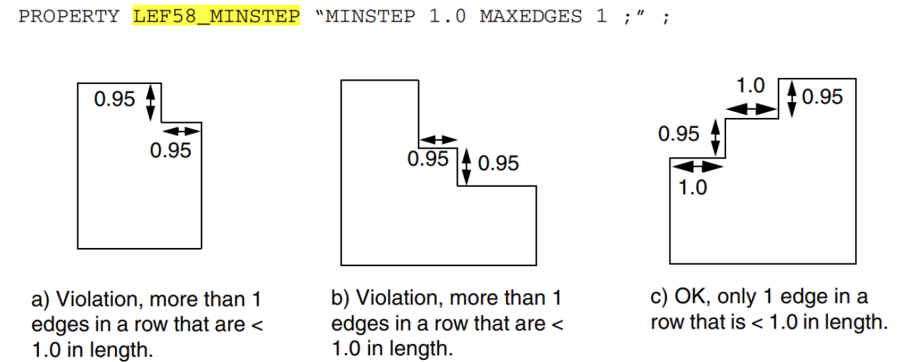

​                                               Figure 1.1 Check Object Corresponding to the Minimum Step Rule

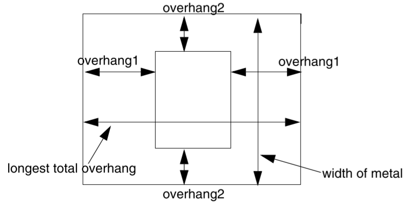

​                                               Figure 1.2 Check Object Corresponding to the Via Enclosure Rule

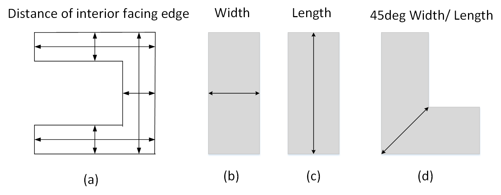

​                                               Figure 1.3 Interior Facing Edge Distance of Conductor Pattern (Check Object Corresponding to the Minimum Width Rule)

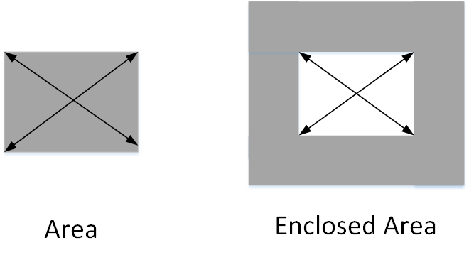

​                                               Figure 1.4 Left: Area of Conductor Pattern (Check Object Corresponding to the Minimum Area Rule)

​                                                         Right: Hole Area Surrounded by Conductor Pattern (Check Object Corresponding to the Minimum Enclosed Area Rule)

### Spacing Type Rules
| Term | Term Explanation                                                                                                                                                                                                                                                                                                                                                     |
| :-----------------: | :------------------------------------------------------------------------------------------------------------------------------------------------------------------------------------------------------------------------------------------------------------------------------------------------------------------------------------------------------ |
| Short Circuit Violation | When the conductor geometries belonging to different nets overlap in any form, a short circuit will occur. For example, the line segments (Wire) belonging to different nets, the Pins and vias belonging to different nets, the contact between the net pattern and the obstacle Block are not allowed and are regarded as short circuit violations, as shown in Figure 1.5. |
| Metal Minimum Spacing Rule | The minimum spacing rule can be understood as the exterior facing edge distance (Distance of exterior facing edge) between the conductor patterns in the layout must not be smaller than the minimum spacing parameter value of the current process layer specified in the TechFile. The exterior facing edge distance between conductors, as shown in Figure 1.2(a), the spacing rules include checking the spacing between conductors in the X direction, Y direction, and corner spacing, as shown in Figure 1.6. |
| Metal Minimum End-of-Line (EOL) Spacing Rule | This rule requires that no other metal lines can overlap with the area at the end of the metal line required in the TechFile; the possible size of the area is affected by factors such as the length of the adjacent edge of the end-of-line (EOL), whether there are vias nearby, and adjacent metal lines, as shown in Figure 1.7. |
| Metal Minimum Notch Spacing Rule | This rule requires that the bottom length of the notch formed by the metal line under the conditions specified in the TechFile must not be smaller than the specified value, as shown in Figure 1.8. |
| Metal Minimum Jog Spacing Rule | This rule requires certain specific spacing requirements between some metals existing between a wider metal line and its adjacent metal line with a Parallel Run Length length that meets the requirements of the TechFile, as shown in Figure 1.9. |
| Metal Minimum CornerFill Spacing Rule | This rule requires that when there is a notch-shaped area at the corner of the outer edge of the metal line that meets the requirements of the TechFile, a virtual piece of metal is created at the notch, and the spacing between the virtual metal and other metals is checked, as shown in Figure 1.10. |
| Cut Minimum Spacing Rule | This rule requires that the spacing between any two Cuts in the same Cut layer cannot be smaller than the specified value. Although the Spacing calculation of the Cut layer is generally defaulted to the edge-to-edge Euclidean distance, in some cases, it will change due to certain fields in the rule. In some cases, the maximum projected lengths of the two in the X and Y directions will be used instead of the Euclidean distance to calculate the Spacing, as shown in Figure 1.11. |

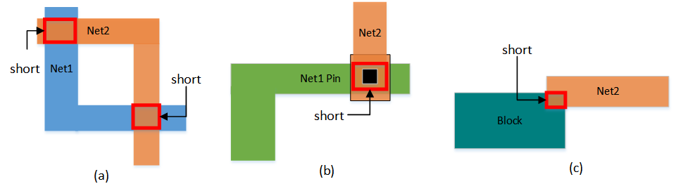

​                                               Figure 1.5 Short Circuit Violation

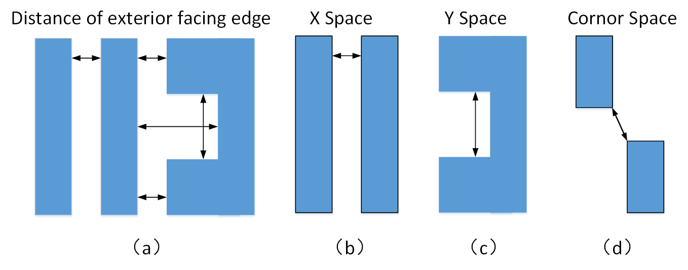

​                                               Figure 1.6 Schematic Diagram of the Exterior Facing Edge Spacing of the Conductor Pattern (Check Object Corresponding to the Minimum Spacing Rule)

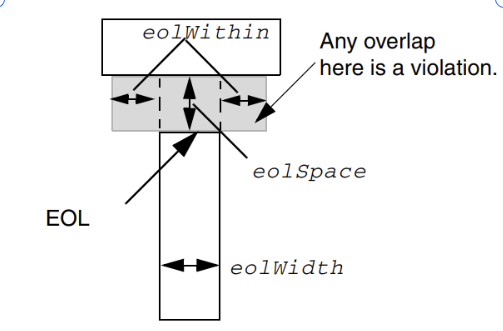

​                                               Figure 1.7 Check Object Corresponding to the Metal Minimum End-of-Line (EOL) Spacing Rule

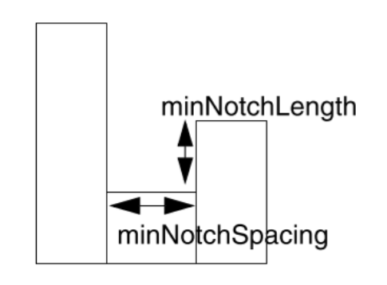

​                                               Figure 1.8 Check Object Corresponding to the Metal Minimum Notch Spacing Rule

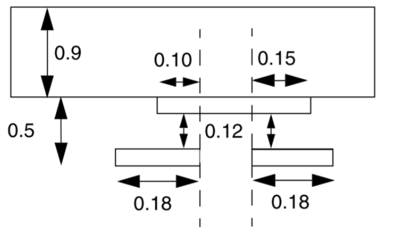

​                                               Figure 1.9 Check Object Corresponding to the Metal Minimum Jog Spacing Rule

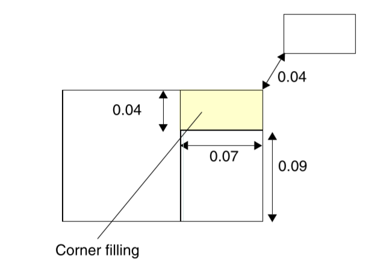

​                                               Figure 1.10 Check Object Corresponding to the Metal Minimum CornerFill Spacing Rule

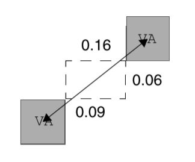

​                                               Figure 1.11 Check Object Corresponding to the Cut Minimum Spacing Rule

## Design Requirements and Goals

> *Describe requirements and goals.*

* **iDRC needs to support reading DEF files for design rule checks**: In the EDA toolchain, DEF files play an important role in the process of connecting different tools and exchanging data. As a DRC tool, it should support the application scenario of reading DEF files for DRC checks. iDRC obtains the graphic information and process rule information of the layout by reading DEF files and related LEF files through iDB. Based on the data information of DEF and LEF, it realizes various types of checks supporting 28nm process rules.

* **iDRC needs to support the design rule check mode interacting with iRT**: The design rule check result is an important evaluation for the routing tool iRT. Based on the design rule check result, iRT can optimize and iterate the routing result. Therefore, iDRC should provide an interaction interface with iRT. iDRC should support conducting design rule checks from the iRT routing result and feeding back the check result to the operation process of iRT.

## Check Result Reports
iDRC provides two forms of report files: global report and detailed report. The global report file is given in text form and contains the number of violations of various rules; the detailed report file contains detailed information of each violation, the marked box of the violation (indicating the specific location of the violation on the layout), the type of violation, layer information, etc., and supports reading and viewing using a visual interface.