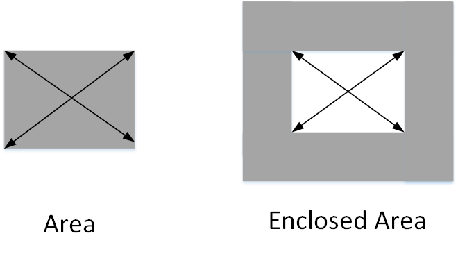
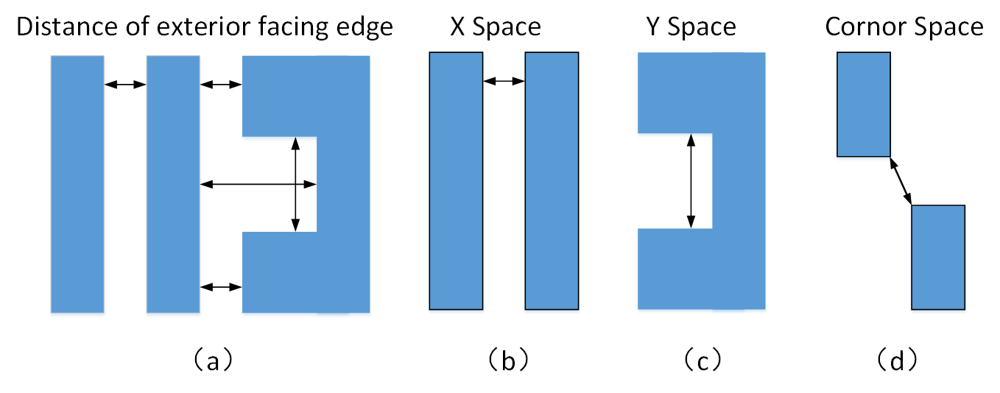
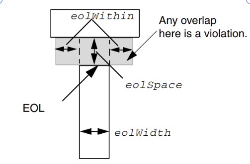

# iDRC 功能文档

## 一、概述

iDRC是iEDA工具链中的设计规则检查工具，目前支持28nm工艺下各Metal层与Cut层的设计规则检查。主要实现的设计规则检查包括：短路违规检查、金属最小间距检查、最小宽度检查、最小面积检查、孔洞面积检查、最小步长（MinStep）检查、通孔包围（Enclosure）相关检查、金属最小线端（EOL）间隔检查、金属最小凹槽（Notch）间隔检查、金属最小Jog间隔检查、金属最小CornerFill间隔检查、Cut层最小间隔相关检查。

## 二、支持的检查类型
### Shape类型规则
实现针对非Spacing类型规则的检查，主要包括MinStep、Width、Area、Enclosure相关规则的检查；
| 检查类型              |      介绍                                                                                                                                                                                                                                                                                                                                             |
| ----------------- | ------------------------------------------------------------------------------------------------------------------------------------------------------------------------------------------------------------------------------------------------------------------------------------------------------------------------------------------------------------ |
|  最小步长（MinStep）规则  |  该规则要求金属线外边缘不可以有超过 TechFile 限定个数的边长小于TechFile规定值的连续边；如图1.1所示                                                                                            |
| 通孔包围（Enclosure）规则   |     通孔包围规则规定了某一个Cut上下层的金属包围与Cut边缘的最小距离，超过这些距离会发生Enclosure违例，如图1.2所示     |
|  最小宽度规则      | 最小宽度规则是用于约束版图中导体图形的内边间距(Distance of interior facing edge)如图1.3(a)所示，它规定了导体图形的内边间距不得小于TechFile规定的最小宽度参数值，包括导体的长度，导体的宽度，导体的内对角宽度，如下图1.3中(b),(c),(d)所示。                                             |
|   最小面积规则    |最小面积规则规定了各个工艺层的导体面积不能小于TechFile中指定的最小面积参参数值，如下图1.4左图中的Area示意                                                |
|  最小孔洞面积规则   | 最小包围面积规定了由导体环绕包围形成的孔洞面积不能小于TechFile指定的最小面积参数值，如下图1.4右图中的Enclosed Area示意。                                             |

 

​                                               图1.1 最小步长规则对应的检查对象

 

​                                               图1.2 通孔包围规则对应的检查对象

 

​                                               图1.3 导体图形的内边间距（最小宽度规则对应的检查对象）
​                                                 

 

​                                               图1.4 左图为导体图形的面积（最小面积规则对应的检查对象）

​                                                         右图为导体图形包围形成的孔洞面积（最小包围面积规则对应的检查对象）

### Spacing类型规则
| 名词              | 名词解释                                                                                                                                                                                                                                                                                                                                                     |
| ----------------- | ------------------------------------------------------------------------------------------------------------------------------------------------------------------------------------------------------------------------------------------------------------------------------------------------------------------------------------------------------------ |
| 短路违规          | 当所属不同线网的导体几何图形产生任何形式的交叠，都会产生短路，比如，所属不同线网的线段(Wire)，所属不同线网的Pin和通孔Via，线网图形和障碍物Block，它们之间的触碰都是不允许的，都被视为短路违规如下图1.5所示。                                                                                                                                                     |
| 金属最小间距规则      | 最小间距规则可以理解为版图中导体图形间的外边间距(Distance of exterior facing edge)不得小于TechFile中规定的当前工艺层的最小间距参数值,导体间的外边间距，如下图1.2(a)所示，间距规则包括检查导体间X方向的间距，Y方向间距，与角间距，如图1.6所示。                                             |
| 金属最小线端（EOL）间隔规则    | 该规则要求在TechFile中要求的金属线末端的区域内不可以有其他的金属线与该区域产生交叠；区域的可能大小受到线端边（EOL）的邻接边长度、附近是否有通孔以及相邻金属线等因素影响，如图1.7所示。                      |
| 金属最小凹槽（Notch）间隔规则    | 该规则要求在符合TechFile规定条件的由金属线形成凹槽区域中，凹槽的底部长度不得小于规定值，如图1.8所示。                    |
| 金属最小Jog间隔规则    | 该规则要求在一个较宽金属线与其邻近的Parallel Run Length长度符合 TechFile要求的金属线之间存在的某些特定的金属之间的间隔要求，如图1.9所示。            |
| 金属最小CornerFill间隔规则    | 该规则要求在金属线外边缘存在符合TechFile要求的拐角处缺口型区域时，在该缺口处虚拟出一块金属，检查该虚拟出的金属与其他金属的间隔，如图1.10所示。          |
| Cut最小间隔规则    | 该规则要求同一Cut层中的任何两个Cut之间的间隔不能小于规定值,Cut层的Spacing计算虽然一般默认为edge-to-edge的欧式距离，但有些情况下会因为规则中的某些字段而发生改变，某些情况下会以两者在X、Y方向上的最大投影长度来代替欧式距离来计算Spacing，如图1.11所示。          |

 

​                                               图1.5 短路违规情况

 

​                                               图1.6 导体图形外边间距示意图（最小间距规则对应检查对象）

 

​                                               图1.7  金属最小线端（EOL）间隔规则对应的检查对象

 

​                                               图1.8 金属最小凹槽（Notch）间隔规则对应的检查对象

 

​                                               图1.9 金属最小Jog间隔规则对应的检查对象

 

​                                               图1.10 金属最小CornerFill间隔规则对应的检查对象

 

​                                               图1.11 Cut最小间隔规则对应的检查对象

## 设计需求和目标

> *描述需求和目标。*

* **iDRC需要支持读入DEF文件进行设计规则检查**  ：在EDA工具链中，DEF文件在衔接不同工具间流程和数据交换过程中扮演着一个重要角色，作为一个DRC工具应该支持读入DEF文件进行DRC检查的应用场景。 iDRC通过iDB读入DEF文件和相关LEF文件获得版图的图形信息和工艺规则信息，基于DEF与LEF的数据信息，实现支持28nm工艺规则的各类型检查。

* **iDRC需要支持与iRT交互的设计规则检查模式** ：设计规则检查结果对于绕线工具iRT而言是一个重要的的评估，基于设计规则检查结果iRT可以对绕线结果进行优化迭代，所以iDRC应该提供与iRT的交互接口，iDRC应该支持从iRT绕线结果进行设计规则检查并把检查结果反馈给iRT的运转流程。

## 检查结果报告
iDRC提供全局报告与详细报告两种形式的报告文件，全局报告文件以文本形式给出，包含各类规则的违例个数；详细报告文件包含了每个违例的详细信息，违例的标注框（标注出违例在版图上的具体位置）、违例的类型、层信息等，支持使用可视化界面读取查看。