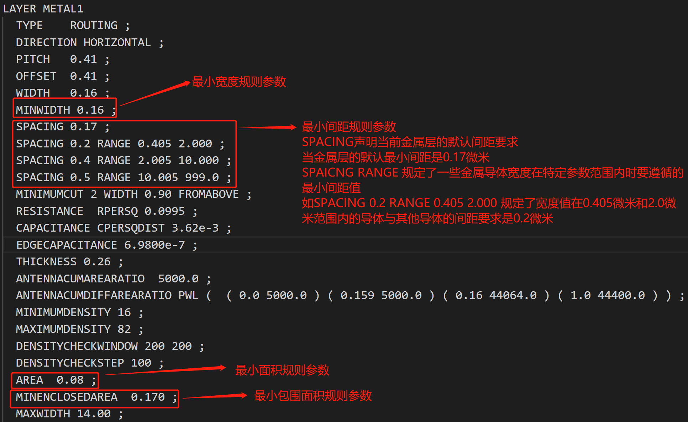
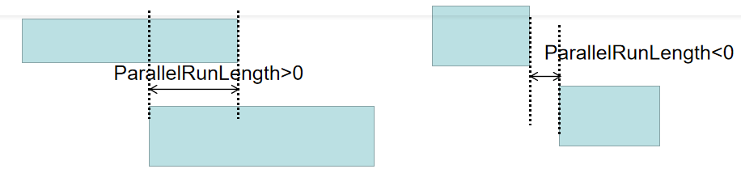
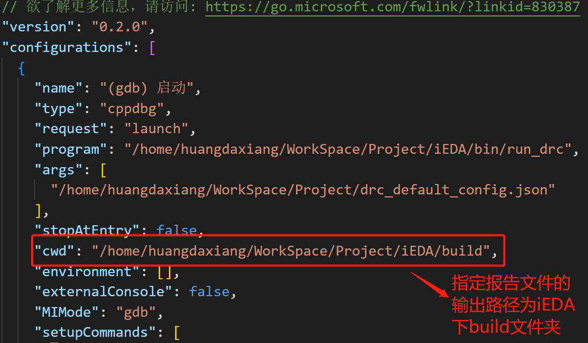
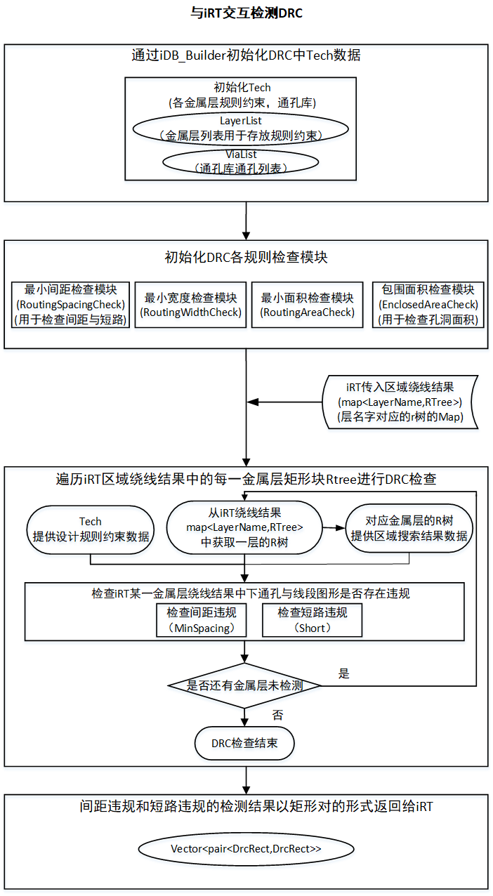
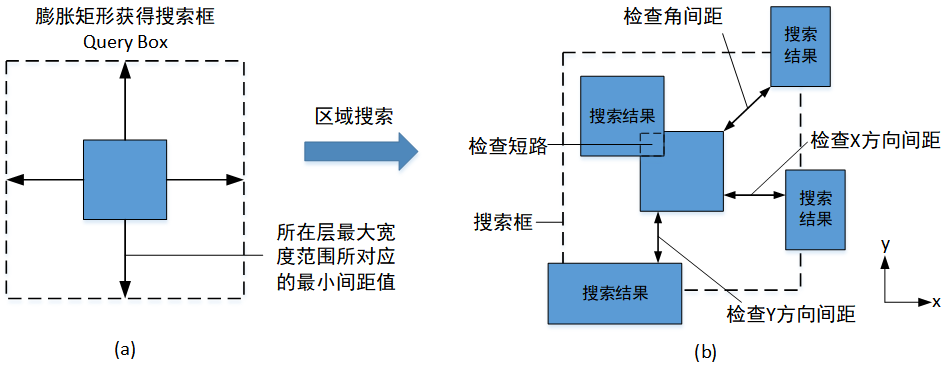
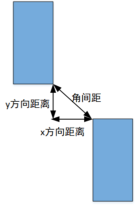
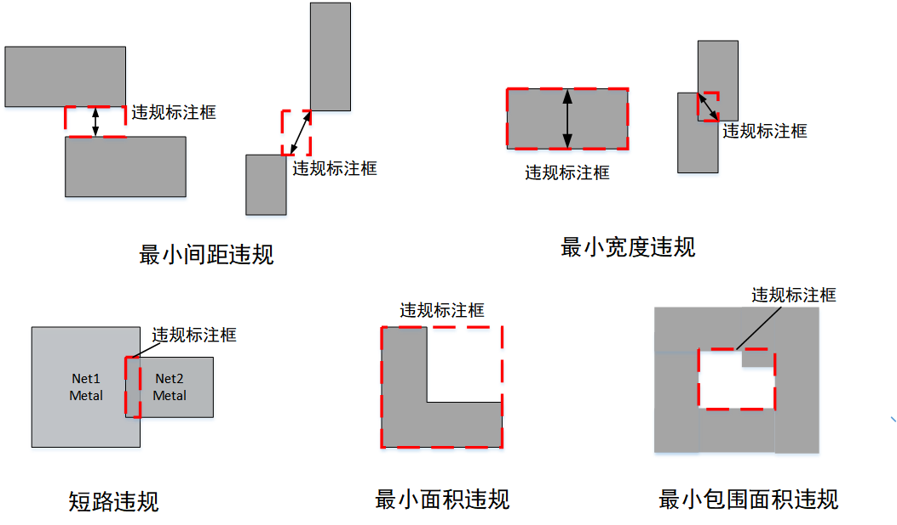

# **iDRC软件设计说明书**

**编制：** iEDA课题组

**审核：** 李兴权

**时间：** 2022年05月09日

---

## **版本修改历史**

| 版本号 | 日期       | 作者 | 简要说明 |
| ------ | ---------- | ---- | -------- |
| 0.10   | 202x-xx-xx |      |          |
|        |            |      |          |
|        |            |      |          |
|        |            |      |          |
|        |            |      |          |

---

## 1. 简介

> *简要描述设计的背景、编写目的、目标读者等；*

在物理设计(Physical Design)阶段完成版图设计后，需要对版图进行物理验证(Physical Verification)，而设计规则检查DRC(Design Rule Check)是物理验证中的重要步骤。针对不同的芯片工艺，晶圆代工厂在同一工艺层和不同工艺层之间规定了一些几何尺寸最小参数值，这些最小值参数的集合构成了芯片工艺制造的几何尺寸约束，也即是设计规则。违反设计规则的版图设计可能会引起潜在的短路、断路以及其它可能的不良效应，所以DRC的目的是验证的后端版图设计是否满足代工厂提供的设计规则，从而保证芯片生产的良率。

iDRC是iEDA工具链中的DRC工具，目前支持110工艺下各Metal层的设计规则检查。主要实现的设计规则检查包括：短路违规检查、最小间距检查、最小宽度检查、最小面积检查、孔洞面积检查

### 1.1 设计需求和目标

> *描述需求和目标。*

* **iDRC需要支持读入DEF文件进行设计规则检查：**在EDA工具链中，DEF文件在衔接不同工具间流程和数据交换过程中扮演着一个重要角色，作为一个DRC工具应该支持读入DEF文件进行DRC检查的应用场景。 iDRC通过iDB读入DEF文件和相关LEF文件获得版图的图形信息和工艺规则信息，基于DEF与LEF的数据信息，实现smic110工艺规则下的短路违规检查、最小间距检查、最小宽度检查、最小面积检查、孔洞面积检查。

* **iDRC需要支持与iRT交互的设计规则检查模式**  **：** 设计规则检查结果对于绕线工具iRT而言是一个重要的的评估，基于设计规则检查结果iRT可以对绕线结果进行优化迭代，所以iDRC应该提供与iRT的交互接口，iDRC应该支持从iRT绕线结果进行设计规则检查并把检查结果反馈给iRT的运转流程。

### 1.2 专有名词

| 名词              | 名词解释                                                                                                                                                                                                                                                                                                                                                     |
| ----------------- | ------------------------------------------------------------------------------------------------------------------------------------------------------------------------------------------------------------------------------------------------------------------------------------------------------------------------------------------------------------ |
| 短路违规          | 当所属不同线网的导体几何图形产生任何形式的交叠，都会产生短路，比如，所属不同线网的线段(Wire)，所属不同线网的Pin和通孔Via，线网图形和障碍物Block，它们之间的触碰都是不允许的，都被视为短路违规如下图1.1。                                                                                                                                                     |
| 最小间距规则      | 最小间距规则可以理解为版图中导体图形间的外边间距(Distance of exterior facing edge)不得小于TechFile中规定的当前工艺层的最小间距参数值,导体间的外边间距，如下图1.2(a)所示，间距规则包括检查导体间X方向的间距，Y方向间距，与角间距，如图1.2(b)(c)(d)所示。                                                                                                      |
| 最小宽度规则      | 最小宽度规则是用于约束版图中导体图形的内边间距(Distance of interior facing edge)如图1.3(a)所示，它规定了导体图形的内边间距不得小于TechFile规定的最小宽度参数值，包括导体的长度，导体的宽度，导体的内对角宽度，如下图1.3中(b),(c),(d)所示。                                                                                                                   |
| 最小面积规则      | 最小面积规则规定了各个工艺层的导体面积不能小于TechFile中指定的最小面积参参数值，如下图1.4左图中的Area示意                                                                                                                                                                                                                                                    |
| 最小包围面积      | 最小包围面积规定了由导体环绕包围形成的孔洞面积不能小于TechFile指定的最小面积参数值，如下图1.4右图中的Enclosed Area示意                                                                                                                                                                                                                                       |
| 规则声明字段      | 在TechFile文件中以对应的字段声明相关规则参数，如最小宽度参数值的声明字段为MINWIDTH，默认最小间距的声明字段为SPACING，一些宽度较大金属导体的间距要求通过字段SPACING 间距参数 RANGE 宽度范围下界 宽度范围上界来声明，最小面积规则参数的声明字段为AREA，最小包围面积参数的声明字段为MINENCLOSEDAREA，如下图1.5所示。更多详细的规则声明可参考DEF/LEF文件说明文档 |
| ParallelRunLength | 两导体图形间ParallelRunLength指得是它们在水平或垂直方向上投影的交叠长度，如果两导体图形在水平或垂直投影方向上存在交叠则ParallelRunLength>0，如果不存在则ParallelRunLength<0,如下图1.6所示，在最小间距检查时ParallelRunLength>0的情况需要检查两导体图形间X或Y方向的间距，ParallelRunLength<0的情况需要检查两个导体图形间的角间距                              |


​                                                                         图1.1 短路违规情况


​                                                   图1.2 导体图形外边间距示意图（最小间距规则对应检查对象）


​                                                 图1.3 导体图形的内边间距（最小宽度规则对应的检查对象）


​                                               图1.4 左图为导体图形的面积（最小面积规则对应的检查对象）

​                                                         右图为导体图形包围形成的孔洞面积（最小包围面积规则对应的检查对象）




​                                                       图1.5 金属1层中各个设计规则参数的声明




​                                                       图1.6两导体图形间的ParallelRunLength


### 1.3 参考文档

* **一个关于DRC基础知识介绍的网站：** [Layout Design Rules: Design Rule Check (DRC) |VLSI Concepts (vlsi-expert.com)](http://www.vlsi-expert.com/2014/12/design-rule-check.html)
* LEF/DEF文档说明

### 1.4 使用说明

> *每一个模块*  */*  *核心类*  */* *子程序的功能，需要的参数，截屏*

#### 1.4.1 iDRC通过读DEF文件进行DRC检查的大体流程：

```c++
int main(int argc, char* argv[])
{
  std::string drc_config_path = "/home/huangdaxiang/drc_default_config.json";
  // main
  DRC* drc = new DRC();

  //1.通过配置文件初始化DRC
  drc->initDRC(drc_config_path);
  //2.初始化各个设计规则检查模块
  drc->initCheckModule();
  //3.运行各个设计规则检查模块
  drc->run();
  //4.文件形式报告设计规则检查结果
  drc->report();
  return 0;
}

```

主要可以概括成以下四个步骤

* 通过配置文件初始化iDRC
* 初始化各个设计规则检查模块
* 运行各个设计规则检查模块
* 文件形式报告设计规则检查结果

可以看到iDRC在读DEF运行模式下，需要一个json配置文件记录需要读入的DEF与LEF文件路径
iDRC通过解析json配置文件中的DEF与LEF文件路径并借助IDB来读取对应的DEF与LEF文件数据
iDRC的默认配置文件格式如下：

```
{
  "INPUT": {
    "tech_lef_path": "./xxx_tech.lef",
    "lef_paths": [
      "./xxx_cell_1.lef",
      "./xxx_cell_2.lef"
    ],
    "def_path": "./RR.def"
  },
  "OUTPUT": {
    "output_dir_path": "<output_dir_path>"
  }
}
```

目前在json配置文件中iDRC工具还没有指定报告的输出路径"output_dir_path"，默认将违规报告的输出路径设置为iEDA工程的build文件夹下，需要在launch.json文件中指定build文件夹路径为违规报告文件输出路径。



  

#### 1.4.2 iDRC与iRT数据交互下的大体运转流程

```c++
  //给层名字对应R树的Map一个别名，不然太长了，命名为LayerNameToRTreeMap，这是iRT要传入的参数，一个绕   //线结果
  typedef std::map<std::string, bgi::rtree<std::pair<RTreeBox, DrcRect*>,       bgi::quadratic<16>>> LayerNameToRTreeMap;
  // main
  DRC* drc = new DRC();

  // 1.提供iDB_Builder指针初始化DRC的设计规则相关数据即Tech
  drc->initTechFromIDB(iDB_Builder);
  // 2.初始化规则数据后初始化各个检查模块
  drc->initCheckModule();
  // 3.检查iRT的绕线结果，传入参数为数据参数为层名字对应矩形块R树，需要iRT提供
  //layer_to_rects_rtree_map=iRT->get_LayerNameToRTreeMap
  vector<pair<DrcRect,DrcRect>> check_result;
  check_result=drc->checkiRTResult(layer_to_rects_rtree_map);
 
```
主要可以概括成以下四个步骤

* 提供iDB_Builder指针来初始化iDRC内部的设计规则相关数据即Tech

* 初始化规则数据后初始化各个检查模块

* 检查iRT的绕线结果，传入参数为数据参数为层名字对应矩形块R树，需要iRT提供

* checkiRTResult接口将会返回存在违规的矩形对（这个结果目前只涵盖短路违规与间距违规的结果）


## 2. 整体设计

### 2.1 总体架构


iDRC的总体架构如上图所示，其中：

* **iDB（DEF/LEF数据）** ：iDB可以解析LEF文件的数据存于idb_layout、解析DEF文件数据存于idb_design。iDRC以iDB作为数据来源。
* **Data Adapter（数据转换）** ：用iDRC内部的数据结构来承接iDB内部的数据，是一个数据转换的过程。iDRC中Tech承接来自idb_layout中关于设计规则的数据，DrcDesign承接来自idb_design中Net于blokage相关的版图图形数据，同时iDRC通过R树构建区域化方式的版图图形存储（初始化RegionQuery模块）。
* **各个设计规则检查模块** ：完成数据转化阶段后，iDRC的各个设计规则检查模块才拥有完善的数据支持，可以对版图结果进行包括最小宽度、最小间距、最小面积、最小包围面积、短路违规的检查。
* **SpotParser（违规报告生成）** ：各个设计规则检查模块以Spot的数据结构存储版图上违规的违规标记，SpotParser可以将各个设计规则检查模块中的违规记录用文件的形式输出。
* **MindData（数据处理层）** ：提供高效的数据处理、常用数据集加载等功能和编程接口，支持用户灵活的定义处理注册和pipeline并行优化。
* **iRT（交互对象）** ：iDRC提供与iRT交互的接口。

### 2.2 软件流程

> 描述软件的总体处理流程，**用文字描述清楚整个运行过程，并附上相应的代码**

#### 2.2.1 读取DEF文件检测DRC


#### 2.2.2 iRT交互检测DRC流程




### 2.3 子模块设计

> 描述软件的各个组成子模块的设计，独立完成功能，相互依赖关系等。这些模块的情况

下面主要介绍iDRC读取DEF文件的模式下各个设计规则检查模块的运转流程，与iRT交互模式下各个模块的运行逻辑是一致的，只是版图的数据来源和区域搜索的结果数据来源不同，都是由iRT传入的R树提供。

#### 2.3.1 区域搜索模块（RegionQuery）

在完成工艺设计规则信息（Tech）与版图设计结果信息的数据（DrcDesign）初始化之后，设计规则检查工具将会构建区域化方式的版图导体图形信息存储（在IDBWrapper中一并完成）。区域化的版图导体图形信息数据为设计规则检查工具提供了区域搜索上的便利，设计规则检查往往只在目标导体与其周边的的导体几何图形间进行，在对目标导体进行设计规则检查时，区域化存储的版图信息可以帮助工具快速获取指定导体附近区域内的其它导体图形，从而大幅度提高检查效率。iDRC的RegionQuery模块通过Boost的R树来构建区域化方式的版图导体图形信息存储，并通过Boost库中的R树相关接口实现区域索引。

关于Boost中R树的介绍还有相关接口与使用事例可参考如下Boost官方文档链接：

[R树的介绍]: https://www.jianshu.com/p/06ba03e1692f
[Boost R树搜索相关接口]: https://www.boost.org/doc/libs/1_77_0/libs/geometry/doc/html/geometry/spatial_indexes/queries.html
[Boost R树插入与删除等相关接口]: www.boost.org/doc/libs/1_77_0/libs/geometry/doc/html/geometry/spatial_indexes/creation_and_modification.html
[Boost R树搜索的使用事例]: https://www.boost.org/doc/libs/1_77_0/libs/geometry/doc/html/geometry/spatial_indexes/rtree_quickstart.html

在RegionQuery中将对应的金属层上通孔与线段的矩形以及Pin与Blockage矩形分开存储，Pin与Blockage被视为是Fix的矩形，如下：

```c++
// 金属层对应R树的Map，层每一金属层对应一个线段与通孔矩形的R树
  std::map<int, bgi::rtree<std::pair<RTreeBox, DrcRect*>, bgi::quadratic<16>>> _layer_to_routing_rects_tree_map;  // via and segment
// 金属层对应R树的Map，层每一金属层对应一个Pin与Blockage矩形的R树
  std::map<int, bgi::rtree<std::pair<RTreeBox, DrcRect*>, bgi::quadratic<16>>> _layer_to_fixed_rects_tree_map;    // pin and block
```

因为Boost库中R树的结点元素可以是一个Boost中R树专用的矩形数据结构RTreeBox，也可以是一个包含RTreeBox的Pair，Pair中除了RTreeBox外的另一个元素成员可以自定义，这种做法其实是为了将只包含矩形信息RTreeBox与需要的其它信息数对应起来的，比如在R树中存储的矩形块不能只有矩形信息，还需要这个矩形的层Id，NetId，矩形类型（是通孔还是Pin等），所以在RegionQuery中R树的节点元素是一个std::pair<RTreeBox, DrcRect*>,DecRect中包含着这个矩形RTreeBox中对应的层Id，NetId，矩形类型等相关信息。

在IDBWraper的过程中RegionQuery通过下面两个接口将版图上的矩形信息插入到R树中，首先通过getRTreeox()从iDRC自身的矩形数据结构DrcRect中提取出矩形信息转化为Boost数据结构RTreeBox，再调用Boost中R树接口将一个pair<RTreeBox,DrcRect*>插入到R树中。

```c++
/**
 * @brief 将对应金属层的线段或通孔矩形加入R树
 *
 * @param routingLayerId 金属层Id
 * @param rect 线段或通孔矩形
 */
void RegionQuery::add_routing_rect_to_rtree(int routingLayerId, DrcRect* rect)
{
  RTreeBox rTreeBox = getRTreeBox(rect);
  _layer_to_routing_rects_tree_map[routingLayerId].insert(std::make_pair(rTreeBox, rect));
}

/**
 * @brief 将对应金属层的Pin或Blockage矩形加入R树
 *
 * @param routingLayerId 金属层Id
 * @param rect Pin或Blockage矩形
 */
void RegionQuery::add_fixed_rect_to_rtree(int routingLayerId, DrcRect* rect)
{
  RTreeBox rTreeBox = getRTreeBox(rect);
  _layer_to_fixed_rects_tree_map[routingLayerId].insert(std::make_pair(rTreeBox, rect));
}


```

其它模块可以调用RegionQuery以下接口获得目标金属层中与指定搜索区域相交的矩形块，区域搜索功能调用Boost中R树的接口实现

```c++
/**
 * @brief 搜索金属层上与目标区域相交的所有矩形，并把搜索结果存放于搜索结果容器中
 *
 * @param routingLayerId 绕线层Id
 * @param query_box 搜索区域
 * @param query_result 搜索结果容器
 */
void RegionQuery::queryInRoutingLayer(int routingLayerId, RTreeBox query_box, std::vector<std::pair<RTreeBox, DrcRect*>>& query_result)
{
  searchRoutingRect(routingLayerId, query_box, query_result);
  searchFixedRect(routingLayerId, query_box, query_result);
}

/**
 * @brief 搜索绕线层上与目标区域相交的所有通孔与线段矩形，并把搜索结果存放于搜索结果容器中
 *
 * @param routingLayerId 绕线层Id
 * @param query_box 搜索区域
 * @param query_result 搜索结果容器
 */
void RegionQuery::searchRoutingRect(int routingLayerId, RTreeBox query_box, std::vector<std::pair<RTreeBox, DrcRect*>>& query_result)
{
  _layer_to_routing_rects_tree_map[routingLayerId].query(bgi::intersects(query_box), std::back_inserter(query_result));
}

/**
 * @brief 搜索绕线层上与目标区域相交的所有Pin与Blockage矩形，并把搜索结果存放于搜索结果容器中
 *
 * @param routingLayerId 绕线层Id
 * @param query_box 搜索区域
 * @param query_result 搜索结果容器
 */
void RegionQuery::searchFixedRect(int routingLayerId, RTreeBox query_box, std::vector<std::pair<RTreeBox, DrcRect*>>& query_result)
{
  _layer_to_fixed_rects_tree_map[routingLayerId].query(bgi::intersects(query_box), std::back_inserter(query_result));
}
```

所有对应R树的接口功能都可以参照上方提供的R树的接口网址。

#### 2.3.2 最小间距检查模块（RoutingSpacingCheck）

设计规则检查工具在存储的版图信息数据中，将线段于通孔矩形存放于线网DrcNet下的，将iDRC遍历线网数据中封装的各个线段与通孔导体矩形块，对每个通孔与线段矩形块进行最小间距的设计规则检查，专有名词介绍中提到过最小间距规则指的是导体间外边的间距不能小于某个指定间距值，这是以边的视角来描述最小间距规则，如果以矩形块的视角，我们可以理解为在最小间距设计规则的约束下，每个矩形块都存在下图所示的违规区域，如下图2.1所示，所有不属于同一导体多边形的矩形块触碰到违规区域时，会发生间距违规。


​                                               **图3.11 最小间距规则约束下每个导体矩形块的违规区域**

在获得目标线网中的某一导体矩形块后，为了检测该矩形块的违规区域是否被其它导体所触碰，将会通过区域搜索的方式搜索目标导体附近可能存在的潜在违规导体。要进行区域搜索前先要指定搜索区域，我们将目标矩形膨胀当前层最大导体宽度所对应的最小间距值，矩形膨胀的结果将作为违规搜索的搜索范围，也就是区域搜索的搜索框Query Box，如下图2.2(a)中所示，这是因为在此搜索框内的其它导体矩形块都有可能触碰到目标矩形的违规区域，都是潜在的违规导体。膨胀当前层最大导体宽度所对应的最小间距值而非导体本身宽度所对应的最小间距值，这样是为了获得一个涵盖所有违规可能的搜索区域，以免发生漏检的情况，这是因为目标检查矩形附近的其它导体矩形可能拥有更大的宽度，同时需要比目标检查矩形更大的间距要求。



​                                        **图2.2 (a)检查的目标矩形块膨胀获得目标区域搜索框** 

​                                                 **(b)搜索所有与搜索框相交的导体矩形**


```c++
/**
 * @brief 检查目标矩形与周边其它矩形是否存在间距违规或短路违规
 *
 * @param target_rect 目标矩形
 */
void RoutingSpacingCheck::checkRoutingSpacing(DrcRect* target_rect)
{
  int routingLayerId = target_rect->get_layer_id();
  //获得当前金属层的最大金属宽度对应的要求间距
  int layer_max_require_spacing = _tech->getRoutingMaxRequireSpacing(routingLayerId);
  //通过当前层的最大金属宽度所对应间距要求膨胀矩形获得搜索区域
  RTreeBox query_box = getSpacingQueryBox(target_rect, layer_max_require_spacing);
  //通过搜索区域获得对应金属层在区域内的所有矩形
  std::vector<std::pair<RTreeBox, DrcRect*>> query_result =       getQueryResult(routingLayerId, query_box);
  //检查当前金属层的检查目标矩形与搜索区域中的矩形是否存在间距违规
  checkSpacingFromQueryResult(routingLayerId, target_rect, query_result);
}
```
如上图2.2(b)所示，借助区域搜索的方式获得目标搜索框Query Box中的所有邻近的导体矩形，在间距检查的过程中需要跳过一些不必要的检查，比如Pin与Pin之间、本身就相连接的同一线网矩形、已经检查过的矩形、矩形自身与自身的检查这些情况需要跳过检查。与所获得的矩形搜索结果根据情景的不同需要进行不同方式的规则检查。如果目标矩形块与搜索结果矩形块发生交叠(overlap)，那么需要检查两者是否短路，短路的判断标准是，判断交叠的两个矩形块是否属于同一线网（Net），如果不同线网的矩形块间产生交叠，将会发生短路。非交叠的其余搜索结果矩形块都要与目标矩形块进行间距检测，检查完成后会记录已经完成检查的矩形。综上所述，最小间距检测模块对每个目标导体矩形块检查对象所作处理做如下。

```c++
/**
 * @brief 检查区域搜索获得的所有搜索结果矩形中是否存在矩形与目标矩形间存在间距违规，并存储违规结果
 *
 * @param target_rect 目标检查矩形
 * @param query_result 区域搜索结果
 */
void RoutingSpacingCheck::checkSpacingFromQueryResult(int routingLayerId, DrcRect* target_rect, std::vector<std::pair<RTreeBox, DrcRect*>>& query_result)
{
  for (auto rect_pair : query_result) {
    DrcRect* result_rect = rect_pair.second;
    //跳过一些不需要检查的情况
    if (skipCheck(target_rect, result_rect)) {
      continue;
    }
    //检查是否短路
    if (checkShort(target_rect, result_rect)) {
      storeViolationResult(routingLayerId, target_rect, result_rect, ViolationType::kShort);
      continue;
    }
    //检查是否存在间距违规
    if (checkSpacingViolation(routingLayerId, target_rect, result_rect, query_result)) {
      storeViolationResult(routingLayerId, target_rect, result_rect, ViolationType::kRoutingSpacing);
    }
  }
  _checked_rect_list.insert(target_rect);
}
```

短路违规检查代码

```c++
/**
 * @brief 检查两个矩形target_rect与result_rect是否存在短路违规，矩形相交且不属于同一NetId则存在短路
 * @param target_rect 目标矩形
 * @param result_rect 区域搜索结果矩形
 * @return true 存在短路违规
 * @return 不存在短路违规
 */
bool RoutingSpacingCheck::checkShort(DrcRect* target_rect, DrcRect* result_rect)
{
  if ((DRCUtil::intersection(target_rect, result_rect, true)) && (target_rect->get_net_id() != result_rect->get_net_id())) {
    return true;
  }
  return false;
}
```

间距检测根据两矩形块间的Parallel Run Length(PRL)分为两种情况，沿着XY方向的间距检查(Check XY Spacing)和角间距检查(Check Corner Spacing)。所谓的Parallel Run Length(PRL)指的是两矩形在水平方向或竖直方向投影的交叠长度，如果两矩形块在水平方向或竖直方向上的投影有交集，那么这两矩形间PRL>0,如下图2.3(a)与2.3(b)，此时应该检查两矩形间的X或Y方向间距是否满足最小间距约束，反之两矩形在水平或竖直方向上都不存在投影交集，那么PRL<0，应该检测两矩形的角间距是否满足当前层的最小间距约束。如图2.3(c)所示。


​                                **图2.3 两矩形间不同Parallel Run Length情况下的最小间距检查**

​                        **(a)(b)属于PRL>0的情况需要检查xy方向间距 (c)PRL<0应该检测角间距**

检查间距违规代码

```c++
/**
 * @brief 检查目标矩形与搜索结果矩形之间是否存在间距违规
 *
 * @param target_rect 目标矩形
 * @param result_rect 搜索结果矩形
 * @param query_result 区域搜索的所有矩形结果
 * @return true ：存在违规
 * @return false：不存在违规
 */
bool RoutingSpacingCheck::checkSpacingViolation(int routingLayerId,
                                                DrcRect* target_rect,
                                                DrcRect* result_rect,
                                                std::vector<std::pair<RTreeBox, DrcRect*>>& query_result)
{
  int max_require_spacing = _tech->getRoutingMaxRequireSpacing(routingLayerId);
  DrcRect query_rect = DRCUtil::enlargeRect(target_rect, max_require_spacing);
  //如果搜索结果矩形与膨胀后获得的搜索区域矩形仅仅是边沿相交则不存在违规，排除这些搜索结果矩形的检查
  if (intersectionExceptJustEdgeTouch(&query_rect, result_rect)) {
    int require_spacing = getRequireSpacing(routingLayerId, target_rect, result_rect);
    if (!isParallelOverlap(target_rect, result_rect)) {
      //如果两个矩形不存在平行交叠则检查角间距
      return checkCornerSpacingViolation(target_rect, result_rect, require_spacing);
    } else {
      //存在平行交叠检查X或Y方向上的间距
      return checkXYSpacingViolation(target_rect, result_rect, require_spacing, query_result);
    }
  }
  return false;
}
```

需要注意的是两矩形块间要求的最小间距，无论是角间距还是水平或竖直方向上的xy间距，都应该取两矩形块中最大宽度值所对应的最小间距约束。

在检查角间距时，获得矩形x方向间距与y方向间距，然后通过勾股定理求角间距，最后于要求的最小间距值比较



​                                                                                **图2.4 角间距**

角间距的检查函数如下

```c++
/**
 * @brief 检查不存在平行交叠的目标矩形与搜索结果矩形间是否存在“角间距”违规
 *
 * @param target_rect 目标矩形
 * @param result_rect 搜索结果矩形
 * @param require_spacing 最小间距要求
 * @return true 存在“角间距”违规
 * @return false 不存在“角间距”违规
 */
bool RoutingSpacingCheck::checkCornerSpacingViolation(DrcRect* target_rect, DrcRect* result_rect, int require_spacing)
{
   //x方向间距
  int distanceX = std::min(std::abs(target_rect->get_left() - result_rect->get_right()), std::abs(target_rect->get_right() - result_rect->get_left()));
    //y方向间距
  int distanceY = std::min(std::abs(target_rect->get_bottom() - result_rect->get_top()), std::abs(target_rect->get_top() - result_rect->get_bottom()));
    //勾股定理角间距并比较是否小于要求的最小间距值
  return require_spacing * require_spacing > distanceX * distanceX + distanceY * distanceY;
}
```

当检测到两个矩形间XY间距不满足最小间距要求，还要检查这两个矩形间的跨度矩形是否被第三个矩形所充满，如下图2.4(a)(d)所示，此时两个矩形可能存在水平方向平行与竖直方向平行两种情况，下图2.4(b)与(e)属于跨度矩形被第三个矩形充满,说明两矩形正常相连不存在违规，下图2.4(c)与(f)属于跨度矩形内存在第三个矩形在两矩形的平行方向上跨越整个跨度举行，这种情况违规标记应该给到目标矩形与第三个矩形之间，当前两个矩形不作为违规记录。


​                                **图2.5 XY间距检查时，两矩形不满足最小间距但不存在违规的情况**

```c++
/**
 * @brief 检查两个存在平行交叠的矩形在xy（水平或竖直）方向上的距离是否满足要求
 *
 * @param target_rect 目标检查矩形
 * @param result_rect 搜索结果矩形
 * @param require_spacing 要求间距
 * @param query_result 区域搜索得到的所有矩形结果
 * @return true 目标矩形target_rect与搜索结果矩形result_rect存在水平或竖直方向间距违规
 * @return false 不存在间距违规
 */
bool RoutingSpacingCheck::checkXYSpacingViolation(DrcRect* target_rect,
                                                  DrcRect* result_rect,
                                                  int require_spacing,
                                                  std::vector<std::pair<RTreeBox, DrcRect*>>& query_result)
{
  //获得两矩形间的跨度矩形
  RTreeBox span_box = DRCUtil::getSpanBoxBetweenTwoRects(target_rect, result_rect);
  bool isHorizontalParallelOverlap = false;
  int spacing = -1;
  int lb_x = span_box.min_corner().get<0>();
  int lb_y = span_box.min_corner().get<1>();
  int rt_x = span_box.max_corner().get<0>();
  int rt_y = span_box.max_corner().get<1>();
  //判断两矩形是横向平行还是竖直方向平行
  if (DRCUtil::isHorizontalParallelOverlap(target_rect, result_rect)) {
    isHorizontalParallelOverlap = true;
     //是横向平行的话两矩形间距就是span_box的左右x的跨度 
    spacing = std::abs(rt_y - lb_y);
  } else {
      //是竖直方向平行的话两矩形间距就是span_box的上下y的跨度 
    spacing = std::abs(rt_x - lb_x);
  }

  if (spacing < require_spacing) {
    //如果两矩形间的间距不满足间距要求且还要判断两矩形的跨度矩形是否被第三个矩形所充满，如果不是则存在违规，
    return !checkSpanBoxCoveredByExistedRect(span_box, isHorizontalParallelOverlap, query_result);
  }
  return false;
}
```

在检查到间距违规时，iDRC会将两个矩形间的跨度矩形作为标记（violation box）进行存储如图2.5(a)，在间距检查过程中如果存在标记矩形交叠的情况要将标记矩形融合成一个矩形，如图2.5(b)(c)都会将矩形1、2间的violation box1和1、3间的violation box2合并成一个矩形标记框进行存储，这个过程通过R树实现，每次将违规标记矩形存入R树时都会搜索是否存在先前的违规矩形与当前违规矩形交叠，如果交叠，将它们融合为一个矩形，在检查完一条net之后，将R树中违规标记矩形转存，并清空R树为下一条net的检查做准备。


​                                                              **图2.6 间距检查的违规标记矩形（violation box）存储**

如果是短路违规的两个矩形，那么会直接存储这两个违规矩形信息，包括它们的矩形左下角与右上角坐标，矩形NetId，等。最终这些信息都会以文件的形式进行报告。与iRT交互的模式下，因为iRT需要的是违规的矩形对，无论是短路检查还是间距检查，过程中会存储违规的矩形对并返回给iRT。

```c++
/**
 * @brief 存储间距违规结果
 *
 * @param routingLayerId：金属层Id
 * @param target_rect：目标检测矩形
 * @param result_rect：与目标检测矩形产生违规的矩形
 * @param type：违规类型
 */
void RoutingSpacingCheck::storeViolationResult(int routingLayerId, DrcRect* target_rect, DrcRect* result_rect, ViolationType type)
{
  if (type == ViolationType::kShort) {
    //短路违规
    if (_interact_with_irt) {
      // iRT模式存储
      _violation_rect_pair_list.push_back(std::make_pair(target_rect, result_rect));
    } else {
      // Def模式存储
      add_spot(routingLayerId, target_rect, result_rect, ViolationType::kShort);
    }
  } else if (type == ViolationType::kRoutingSpacing) {
    //间距违规
    if (_interact_with_irt) {
      // iRT模式存储
      _violation_rect_pair_list.push_back(std::make_pair(target_rect, result_rect));
    } else {
      // Def模式存储
      addViolationBox(routingLayerId, target_rect, result_rect);
    }
  }
}
```


#### 2.3.3 最小宽度检查模块（RoutingWidthCheck）

最小宽度设计规则不仅约束了导体多边形的内边间距，还约束了两个交叠的导体图形所产生的内对角间距不得小于规定的最小宽度值，如下图所示，两个导体矩形相交所形成的交叠部分矩形本文称之为Overlap Box。两交叠矩形所要检测的对角间距其实就是矩形Overlap Box的对角线长度如下图2.7。


​                                                        **图2.7 两个互相交叠导体矩形间的对角间距**

所以iDRC会遍历每一条Net，对每一条Net下的线段与通孔矩形进行检查，在对每一个目标矩形进行最小宽度检查时会先将检查矩形本身的内边间距是否满足最小宽度值，再通过区域索引获得与目标矩形相交的其它矩形，检查对角间距值，其中检查目标矩形自身的内边间距可以转化为检查矩形的短边长是否大于最小间距要求，因为矩形短边的长度代表着矩形较小的那对内边间距，较小的内边间距都已经满足要求，自然就满足要求）

```c++
/**
 * @brief 检查目标矩形是否存在最小宽度违规，主要分为以下两种情况
 * 情况1：矩形本身存在最小宽度违规
 * 情况2：目标矩形与其它矩形相交部分矩形的对角线长度值不符合最小宽度要求
 *
 * @param target_rect
 */
void RoutingWidthCheck::checkRoutingWidth(DrcRect* target_rect)
{
  int routingLayerId = target_rect->get_layer_id();
  /////////////////////////////////////////////////////////////////
  /**检查矩形本身是否满足最小宽度要求**/
  //直接检查目标矩形的短边长度是否满足最小宽度值
  int require_width = _tech->getRoutingMinWidth(routingLayerId);
  checkTargetRectWidth(routingLayerId, target_rect, require_width);
  ////////////////////////////////////////////////////////////////
  /**检查目标矩形与其它矩形相交部分矩形的对角线长度值不符合最小宽度要求**/
  //为获得与目标矩形相交的其它矩形，将目标矩形作为搜索区域进行区域搜索
  RTreeBox query_box = getQueryBox(target_rect);
  RegionQuery* region_query = RegionQuery::getInstance();
  std::vector<std::pair<RTreeBox, DrcRect*>> query_result;
  region_query->queryInRoutingLayer(routingLayerId, query_box, query_result);
  //遍历所有与目标矩形相交的矩形，查看它们与目标矩形构成的相交矩形部分是否存在最小宽度违规
  checkDiagonalLengthOfOverlapRect(routingLayerId, target_rect, require_width, query_result);
}
```

为了检测版图上所有因为图形交叠而产生的的对角间距是否满足最小宽度需求，对于每一个进行最小宽度检查的目标导体矩形，以导体矩形自身的覆盖范围作为搜索区域Query Box，搜索版图中所有与自身相交的其它导体矩形，获得目标检查矩形与每一个搜索结果矩形之间的形成的交叠矩形区域Overlap Box，再计算Overlap Box的对角线边长是否满足最小宽度约束。


​                           **图 2.8  目标导体矩形与所有其它导体矩形间交叠区域Overlap Box的获得方式**

需要注意的是并不是每一个与检测目标矩形所交叠产生的Overlap Box都要纳入最小宽度约束的考量，如上图2.8所示，目标矩形与目标相交矩形1所形成的交叠区域Overlap Box1，被相交搜索结果中的与目标矩形相交的矩形2所包含覆盖，所以Overlap Box1的信息其实被包含在与目标矩形相交的矩形2所形成的Overlap Box2中，所以并不考虑Overlap Box1的对角线长是否满足最小宽度，在图2.8中只需考虑Overlap Box2与Overlap Box3的对角线长是否满足最小宽度需求。对角间距检测的实现代码如下。

```c++
/**
 * @brief 遍历所有与目标矩形相交的矩形，查看它们与目标矩形构成的相交矩形部分是否存在最小宽度违规
 *
 * @param layerId 金属层Id
 * @param target_rect 目标检查矩形
 * @param require_width 最小宽度要求
 * @param query_result 与目标矩形作为搜索区域获得所有与目标矩形相交的矩形
 */
void RoutingWidthCheck::checkDiagonalLengthOfOverlapRect(int layerId,
                                                         DrcRect* target_rect,
                                                         int require_width,
                                                         std::vector<std::pair<RTreeBox, DrcRect*>>& query_result)
{
  for (auto& rect_pair : query_result) {
    DrcRect* result_rect = rect_pair.second;
     //如果两矩形不同net且相交则属于短路，已经在间距检查模块存储为短路违规跳过检查
    if (skipCheck(target_rect, result_rect)) {
      continue;
    }
    //获得目标检查矩形与周边矩形相交的部分
    DrcRectangle<int> overlap_rect = DRCUtil::getSpanRectBetweenTwoRects(target_rect, result_rect);
    //获得相交矩形部分的对角线长度
    double diag_length = DRCUtil::getRectDiagonalLength(overlap_rect);
    double requireWidth = static_cast<double>(require_width);
    if (diag_length < requireWidth) {
      //检查两个矩形的相交矩形部分的对角线边长时，如果对角线长度不满足要求值，还要看相交的矩形部分是否被两个矩形之外的第三个矩形所覆盖，如果是则不算违规
      if (!isOverlapBoxCoveredByExistedRect(target_rect, result_rect, overlap_rect, query_result)) {
        //将矩形交叠部分作为违规标记矩形存储
        add_spot(layerId, target_rect, result_rect);
      }
    }
  }
}
```

如果矩形本身存在最小间距违规则将矩形本身作为最小间距违规矩形进行存储，如果时与其它矩形的交叠矩形存在最小间距违规，则将交叠矩形部分作为违规标记矩形存储。最终以文件的形式报告违规结果。

#### 2.3.4 最小面积检查模块 （RoutingAreaCheck）

最小面积规则要求版图上的导体多边形面积不小于指定参数值，所以iDRC会通过Boost接口将每条net下的导体矩形融合为导体多边形，再对每个导体多边形进行面积检查。

[Boost多边接口可参考]: https://www.boost.org/doc/libs/1_67_0/libs/polygon/doc/index.htm


​                                                         **图 2.9 把矩形融合为导体多边形**

```c++
/**
 * @brief 检查目标线网是否存在最小面积违规
 *
 * @param target_net
 */
void RoutingAreaCheck::checkRoutingArea(DrcNet* target_net)
{
   //每检查一条net前先清除上一条net的矩形融合结果
  _layer_to_polygons_map.clear();
    //将目标检查线网中的各个矩形包括Via，segment，Pin通过Boost多边形接口合成多边形
  initLayerPolygonSet(target_net);
    //检查目标net下的导体多边形面积
  checkRoutingArea(target_net->get_net_id());
}
```

融合Net下的矩形获得导体多边形集合之后，遍历net下分属每一层的每个导体多边形进行最小面积检查，如果这个导体多边形与其它net的矩形相交，则不纳入检查（可能因为这个导体多边形属于本Net部分的图形面积并不达标，但因为与其它net矩形相交，加大了面积才没导致违规，但这本身属于短路，不纳入最小面积违规），最后将存在最小面积违规的导体多边形的外接矩形，作为违规标记矩形进行存储。

```c++
/**
 * @brief 检查目标net是否存在最小面积违规
 *
 * @param netId 目标net的Id
 */
void RoutingAreaCheck::checkRoutingArea(int netId)
{
  for (auto& [layerId, polygon_set] : _layer_to_polygons_map) {
    int require_area = _tech->getRoutingMinArea(layerId);
     //遍历当前层下所有导体多边形
    for (auto& polygon : polygon_set) {
      //获得导体多边形的面积
      int polygon_area = bp::area(polygon);
       //获得导体多边形的外接矩形
      BoostRect bounding_box;
      bp::extents(bounding_box, polygon);
      RTreeBox query_box = DRCUtil::getRTreeBox(bounding_box);
      //把外接矩形作为搜索区域，检查是否存在别的Net矩形与当前net检查的多边形相交情况
      //如果存在则属于短路违规，跳过检查
      if (skipCheck(layerId, netId, polygon, query_box)) {
        continue;
      }
      //如果当前多边形存在最小间距违规，将它的外接矩形作为违规标记矩形进行存储
      if (polygon_area < require_area) {
        DrcRectangle violation_box = DRCUtil::getRectangleFromBoostRect(bounding_box);
        add_spot(layerId, violation_box, ViolationType::kRoutingArea);
      }
    }
  }
}
```

#### 2.3.5 最小包围面积检查模块（EnclosedAreaCheck）

导体矩形块所组成的金属多边形可能是带孔洞的多边形如图2.10所示。


​                                         **图 2.10 导体矩形块所组成的金属多边形可能是带孔洞的多边形**

对带孔洞的多边形数据的处理借助了来自boost库中的一些带孔洞多边形算法接口，首先通过Boost库中的多边形接口将导体矩形融合成带洞的多边形，最后遍历每一个导体多边形内部的孔洞，求取孔洞多边形面积，与要求的最小包围面积参数作比较（注意多边形可能带有多个孔洞，boost中带孔洞多边形提供了迭代器，可访问每个孔洞）。

[Boost多边接口可参考]: https://www.boost.org/doc/libs/1_67_0/libs/polygon/doc/index.htm

```c++
/**
 * @brief 检查目标线网书否存在孔洞面积违规
 *
 * @param target_net
 */
void EnclosedAreaCheck::checkEnclosedArea(DrcNet* target_net)
{
    //每检查一条net前先清除上一条net的矩形融合结果
  _layer_to_polygons_map.clear();
    //将线网每一层的矩形包括Pin，Via，Segment矩形合并为带孔洞的导体多边形
  initLayerPolygonSet(target_net);
    //检查目标net下的带孔洞导体多边形中每一个孔洞的面积
  checkEnclosedArea();
}
```

对每一个带洞多边形进行孔洞检查，

```c++
/**
 * @brief 检查线网中各个孔洞的面积是否满足EnclosedArea，可以通过Boost相关数据与接口获得孔洞
 *
 * @param hole_polygon_list 线网下某一层融合生成的的带洞多边形列表
 * @param requre_enclosed_area 要求的最小孔洞面积
 * @param layerId 金属层Id
 */
void EnclosedAreaCheck::checkEnclosedAreaFromHolePlygonList(const std::vector<PolygonWithHoles>& hole_polygon_list, int requre_enclosed_area, int layerId)
{
  //遍历线网中的每一个带孔洞多边形
  for (auto& hole_polygon : hole_polygon_list) {
    //遍历线网中带孔洞多边形中孔洞进行检查
    for (auto hole_it = hole_polygon.begin_holes(); hole_it != hole_polygon.end_holes(); ++hole_it) {
      auto hole_polygon = *hole_it;
      // int hole_area = bp::area(hole_polygon);
      // if (hole_area < requre_enclosed_area) {
      //   BoostRect bounding_box;
      //   bp::extents(bounding_box, hole_polygon);
      //   Rectangle violation_box = DRCUtil::getRectangleFromBoostRect(bounding_box);
      //   add_spot(layerId, violation_box, ViolationType::kEnclosedArea);
      // }

      // IDB还未解析enclosed area的值！！！！目前只要检测到有环路就是有孔洞就加入违规存储，如果iDB解析了enclosed area的值去掉下面代码，打开上面注释代码即可
      //目前DR绕线生成的孔洞都是小孔洞，基本上都是违规的
      BoostRect bounding_box;
      bp::extents(bounding_box, hole_polygon);
      DrcRectangle violation_box = DRCUtil::getRectangleFromBoostRect(bounding_box);
      add_spot(layerId, violation_box, ViolationType::kEnclosedArea);
    }
  }
}
```

#### 2.3.6 设计检查违规报告模块（SpotParser）

各个设计规则检查模块在进行设计规则检查之后，会将标注版图上违规地点的违规标注矩形存储在存储在数据结构Spot中，作为一个污点标记，spot数据结构的设计如下图5.1所示，每一个Spot都存储着存在设计违规的矩形框标注以及对应的设计违规类型。同的违规类型都由不同的违规矩形框来标定，最小间距检查，最小宽度检查，最小面积检查的，最小包围面积检查各自的违规标注矩形框如下图所示。



​                                                            **图2.11 各种设计违规情况下的违规标注框**

iDRC最终会将这些标注框信息以及对应的违规类型信息等以文件的形式输出到报告文件中。（短路目前报告内容又改回了两个短路的矩形块信息，包括netId信息，短路的矩形块类型信息，两个短路的矩形块左下角与右上角坐标）

### 2.4 评价指标

* **线长HPWL**
* **线长光滑化：SA**
* **Bellshap:**
* **电场能：**
* **时序：**
* **可布线性：**

### 2.5 算法设计

> 描述软件用到的主要算法，可以用伪代码的形式描述。

* **二次规划：**
* **Conjugate：** 基于一阶梯度的优化方法，参照上一步信息，用于全局布局
* **Nesterov：** 基于一阶梯度的优化方法，会参照上两步信息，用于全局布局
* 最大费用流：？
* Abacus：
* Tetris：
* Cell_Swap：

### 2.6 数据结构设计

> 描述用到的主要数据结构，包括类的设计，继承关系等等。


## 3. 接口设计

### 3.1 外部接口

> 包括用户界面、软件接口。

```c++
/**
 * @brief 读取DEF文件的模式下获得短路违规的数目
 *
 * @return int 短路违规的数目
 */
int DRC::getShortViolationNum()
{
  return _routing_sapcing_check->get_short_violation_num();
}

/**
 * @brief 读取DEF文件的模式下获得间距违规的数目
 *
 * @return int 间距违规的数目
 */
int DRC::getSpacingViolationNum()
{
  return _routing_sapcing_check->get_spacing_violation_num();
}

/**
 * @brief 读取DEF文件的模式下获得宽度违规的数目
 *
 * @return int 宽度违规的数目
 */
int DRC::getWidthViolationNum()
{
  return _routing_width_check->get_width_violation_num();
}

/**
 * @brief 读取DEF文件的模式下获得面积违规的数目
 *
 * @return int 面积违规的数目
 */
int DRC::getAreaViolationNum()
{
  return _routing_area_check->get_area_violation_num();
}

/**
 * @brief 读取DEF文件的模式下获得包围面积违规的数目
 *
 * @return int 包围面积违规的数目
 */
int DRC::getEnclosedAreaViolationNum()
{
  return _enclosed_area_check->get_enclosed_area_violation_num();
}

/**
 * @brief 返回存储短路违规信息的Spot列表
 *
 * @return std::map<int, std::vector<DrcSpot>>&
 */
std::map<int, std::vector<DrcSpot>>& DRC::getShortSpotList()
{
  return _routing_sapcing_check->get_routing_layer_to_short_spots_list();
}

/**
 * @brief 返回存储间距违规信息的Spot列表
 *
 * @return std::map<int, std::vector<DrcSpot>>&
 */
std::map<int, std::vector<DrcSpot>>& DRC::getSpacingSpotList()
{
  return _routing_sapcing_check->get_routing_layer_to_spacing_spots_list();
}

/**
 * @brief 返回存储宽度违规信息的Spot列表
 *
 * @return std::map<int, std::vector<DrcSpot>>&
 */
std::map<int, std::vector<DrcSpot>>& DRC::getWidthSpotList()
{
  return _routing_width_check->get_routing_layer_to_spots_map();
}

/**
 * @brief 返回存储面积违规信息的Spot列表
 *
 * @return std::map<int, std::vector<DrcSpot>>&
 */
std::map<int, std::vector<DrcSpot>>& DRC::getAreaSpotList()
{
  return _routing_area_check->get_routing_layer_to_spots_map();
}

/**
 * @brief 返回存储孔洞面积违规信息的Spot列表
 *
 * @return std::map<int, std::vector<DrcSpot>>&
 */
std::map<int, std::vector<DrcSpot>>& DRC::getEnclosedAreaSpotList()
{
  return _enclosed_area_check->get_routing_layer_to_spots_map();
}

/**
 * @brief 通过配置文件的方式初始化Tech数据（工艺设计规则数据）
 *
 * @param drc_config_path 配置文件路径
 */
void DRC::initTechFromIDB(std::string& drc_config_path)
{
  DrcConfigurator* configurator = new DrcConfigurator();
  configurator->set(_config, drc_config_path);
  delete configurator;

  _idb_wrapper = new DrcIDBWrapper(_config, _tech, _drc_design, _region_query);
  _idb_wrapper->initTech();  //传入IdbBuilder？
}

/**
 * @brief 通过iDB_Builder的指针的方式初始化Tech数据（工艺规则数据）
 *
 * @param idb_builder idb_builder指针
 */
void DRC::initTechFromIDB(idb::IdbBuilder* idb_builder)
{
  _idb_wrapper = new DrcIDBWrapper(_config, _tech, _drc_design, _region_query);
  _idb_wrapper->initTech(idb_builder);  //传入IdbBuilder？
}

/**
 * @brief 通过配置文件的方式初始化iDRC，包括Tech数据，DrcDesign数据，RegionQuery模块数据
 *
 * @param drc_config_path 配置文件路径
 */
void DRC::initDRC(std::string& drc_config_path)
{
  DrcConfigurator* configurator = new DrcConfigurator();
  configurator->set(_config, drc_config_path);
  delete configurator;

  _idb_wrapper = new DrcIDBWrapper(_config, _tech, _drc_design, _region_query);
  _idb_wrapper->input();  //传入IdbBuilder？
}

/**
 * @brief 初始化各个设计规则检查模块，为进行设计规则检查做准备
 *
 */
void DRC::initCheckModule()
{
  _routing_sapcing_check = RoutingSpacingCheck::getInstance(_config, _tech, _conflict_graph);
  _routing_area_check = RoutingAreaCheck::getInstance(_config, _tech);
  _routing_width_check = RoutingWidthCheck::getInstance(_config, _tech);
  _enclosed_area_check = EnclosedAreaCheck::getInstance(_config, _tech);
  _spot_parser = SpotParser::getInstance(_config, _tech);
}

/**
 * @brief 更新当前各个设计规则检查模块的过程数据与存储结果，以备下一轮设计规则检查
 *
 */
void DRC::update()
{
  _region_query->clear_layer_to_routing_rects_tree_map();
  clearRoutingShapesInDrcNetList();
  _routing_sapcing_check->reset();
  _routing_area_check->reset();
  _routing_width_check->reset();
  _enclosed_area_check->reset();
}

/**
 * @brief 遍历每一条Net运行各个设计规则检查模块对每一条Net进行设计规则检查
 *
 */
void DRC::run()
{
  for (auto& drc_net : _drc_design->get_drc_net_list()) {
    _routing_sapcing_check->checkRoutingSpacing(drc_net);
    _routing_width_check->checkRoutingWidth(drc_net);
    _routing_area_check->checkRoutingArea(drc_net);
    _enclosed_area_check->checkEnclosedArea(drc_net);
  }
  if (_conflict_graph != nullptr) {
  }
}

/**
 * @brief 检查目标Net是否存在设计违规（需要重新实现）
 *
 * @param netId
 */
void DRC::checkTargetNet(int netId)
{
  // DrcNet* targrt_net = _idr_wrapper->get_drc_net(netId);
  // _routing_sapcing_check->checkRoutingSpacing(targrt_net);
  // _routing_width_check->checkRoutingWidth(targrt_net);
  // _routing_area_check->checkRoutingArea(targrt_net);
  // _enclosed_area_check->checkEnclosedArea(targrt_net);
}

/**
 * @brief 以文件的形式报告每个模块的设计规则检查结果
 *
 */
void DRC::report()
{
  _spot_parser->reportSpacingViolation(_routing_sapcing_check);
  _spot_parser->reportShortViolation(_routing_sapcing_check);
  _spot_parser->reportAreaViolation(_routing_area_check);
  _spot_parser->reportWidthViolation(_routing_width_check);
  _spot_parser->reportEnclosedAreaViolation(_enclosed_area_check);
}

/**
 * @brief 与iRT的交互接口
 *
 * @param layer_to_rects_rtree_map iRT的区域绕线结果，包含多层的导体图形信息
 * @return std::vector<std::pair<DrcRect*, DrcRect*>> 存在间距违规或短路违规的矩形对
 */
std::vector<std::pair<DrcRect*, DrcRect*>> DRC::checkiRTResult(const LayerNameToRTreeMap& layer_to_rects_rtree_map)
{
  update();
  _routing_sapcing_check->switchToiRTMode();
  _routing_sapcing_check->checkRoutingSpacing(layer_to_rects_rtree_map);
  return _routing_sapcing_check->get_violation_rect_pair_list();
}
```


### 3.2 内部接口

> 内部模块之间的接口。


## 4. 测试报告


### 4.1 测试环境

> *描述测试环境。*


### 4.2 测试结果

> 描述测试人员应该覆盖的功能点


| **测试****编号** | **测试****版本** | **测试功能点** | **测试****描述** |
| ---------------- | ---------------- | -------------- | ---------------- |
| TR01             | V1.0             |                |                  |
| …                | …                | …              | …                |


### 4.3 比对

*图、表描述与第三方的性能比对。*


## 5. TO BE DONE


### 5.1 疑难问题

>  *描述重点难点问题* ；
>
> *说明在开发过程中遇到的问题，以及解决方法。例如：方法的选择、参数的处理、需要说明的其他具体问题。如果有不能正常工作的模块，说明具体情况，猜测可能的原因。*


### 5.2 待研究

> *待研究问题；*
