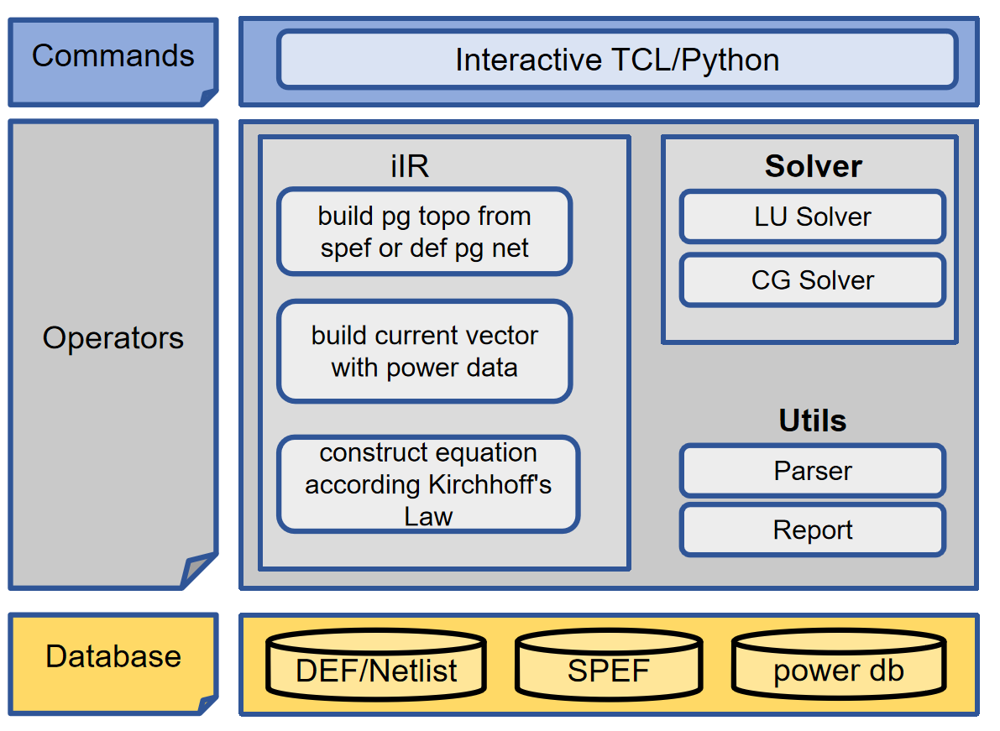

# iIR: IR Drop Calculation

## Introduction to the iIR
The iIR tool is mainly used for analyzing the IR drop of the power distribution network.

<div align="center">

 

 **iIR--An open-source intelligent IR Drop Analysis for ASIC design.**

</div>

### Supported features
- **Read SPEF File or Estimate RC Data**: Extracts the RC data of the power network from the SPEF file or estimate the RC When iIR as a IR engine.
- **Read Instance Power Database or Run Power Analysis Adhoc**: Reads the instance power data from the CSV file, or run power analysis adhoc including internal power, switching power, leakage power, etc.
- **Solving IR Drop**: Builds the conductance matrix and the current vector, and then selects an appropriate solver (the LU solver or the CG solver) to solve the IR drop AX=B problem.
- **GPU Mode**: Accelerate the IR (voltage drop) solving process using CUDA.


## Example of how to use the iIR tool
### Write the tcl file(run_iIR.tcl)

#### Set the timing report output path

```bash
set work_dir "../src/operation/iSTA/source/data/example1"
set_design_workspace $work_dir/rpt
```

#### Read verilog file

```bash
read_netlist $work_dir/example1.v
```

#### Read .lib files

```bash
set LIB_FILES $work_dir/example1_slow.lib
read_liberty $LIB_FILES
```

#### Link_design design_name

```bash
link_design top
```

#### Read sdc file

```bash
read_sdc  $work_dir/example1.sdc
```

#### Read spef file

```bash
read_spef $work_dir/example1.spef
```

#### run the timing analysis

```bash
report_timing
```

#### run the power analysis

```bash
report_power
```

#### read PG SPEF file(Optional)

```bash
read_pg_spef $work_dir/example_vdd_vss.spef
```

#### run IR drop analysis

```bash
report_ir_drop -net_name VDD
```

### Build iEDA

### Run the tcl file with iEDA(or iPower)

```bash
 cd bin/
 ./iEDA run_iIR.tcl (Or ./iPower run_iIR.tcl)
```