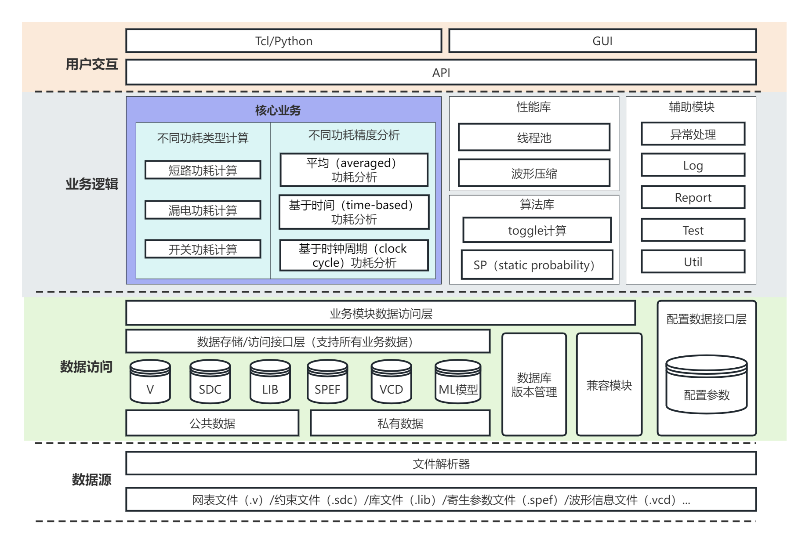

# iPower用户手册

## ipower介绍

### 软件架构图



### 支持特性

* 支持解析VCD波形文件。
* 支持输出功耗分析报告，包括不同类型功耗（内部功耗、开关功耗和漏电功耗）和不同分组功耗（时钟网络、组合逻辑、时序逻辑等）。

## 使用iPower工具示例

### 编写 tcl 文件(run_ipw.tcl)

* 示例tcl文件：../source/data/example1/run_ipw.tcl

首先根据 iSTA README.md, 完成解析verilog, .lib 文件, link design, 解析sdc, spef 文件，进行时序分析并获取时序报告。

#### 解析 vcd 文件

```
read_vcd test.vcd -top_name top-i
```

#### 获取功耗报告

```
report_power
```

## 通过tcl文件运行iPower

```bash
 ./iPower run_ipwr.tcl
```
