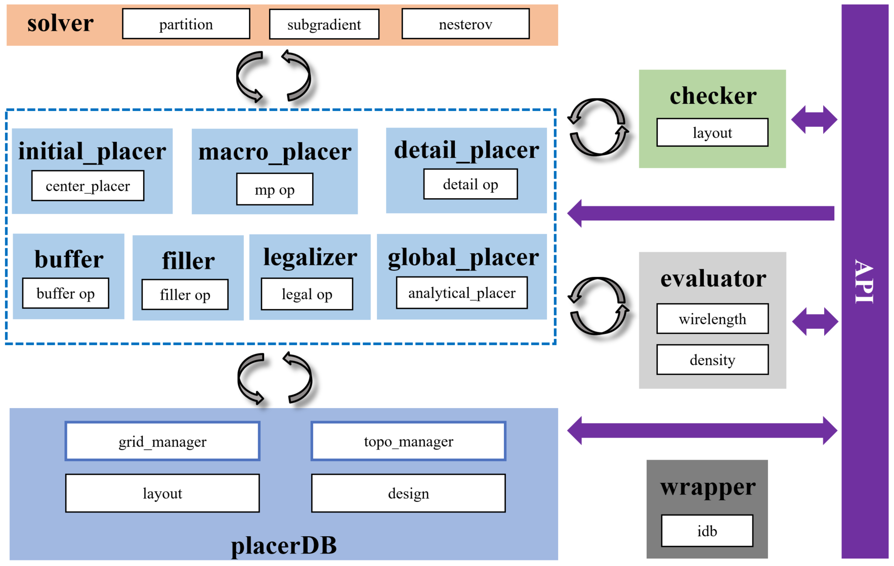

# iPL: Placement

## 1. Background Introduction

1. Placement Problem: Given a set of cells with connection relationships (nets) and a placement area, the placement places the cells. The general placement goal is to minimize the total wire length/timing/power consumption of the nets, and requires the cells to meet the legality requirements (within the placement area, aligned with Rows/Sites, and no overlap between cells, etc.).

 - Net: A single net can connect multiple Pin points (Pin points are located on the cells or at the IO); The routing direction of the net is only horizontal and vertical.
 - Cell: The shape is usually rectangular. Cell types include macro cells, standard cells (timing cells, logic cells), etc.; Cell states include fixed and to be placed.

<center>


Figure 1 Main Flowchart of iPL
</center>


## 2. Main Implementations

### 2.1 Function Implementations

<!--  -->

Figure 5 The main placement process implemented in iPL. Solving large-scale placement problems in one step is NP-hard. Therefore, it is generally divided into three stages: global placement, legalization, and detailed placement.

 - Place std cell into proper location
   - Satisfy layer poly, well, contact, and metal 1 design rule
   - Optimize wirelength, timing, congestion
 - Place macro cell location automatically
 - Incremental placement
 - Timing-driven placement (coming soon)
 - Congestion-driven placement (coming soon)

<!--  -->

Figure 6 Schematic Diagram of Placement

### 2.2 Tool API Implementations

| Method Name | Sub-method | Type | Parameter List | Return Value | Method Description |
| :------------------- | :-------------------------------- | :-------- | :------------------------- | :------------- | :--------------------------- |
| initAPI | * | action | pl_json_path, idb_builder | self | Initialize iPL |
| runFlow | runGP | action | void | self | Run global placement |
| runFlow | runBufferInsertion | action | void | self | Run buffer insertion |
| runFlow | runLG | action | void | self | Run legalization |
| runFlow | runDP | action | void | self | Run detailed placement |
| runFlow | writeBackSourceDataBase | action | void | self | Write back placement data to the data source |
| runIncrLG | * | action | inst_list | self | Run incremental legalization |
| updatePlacerDB | * | action | void/inst_list | self | Update (specified) data from the data source |
| obtainAvailableWhiteSpaceList | * | action | row_range, site_range | rectanglelist | Obtain the available placement space in the specified area (for inserting cells) |
| checkLegality | * | accessor | void | bool | Check the legality of the current placement result |
| isSTAStarted | * | accessor | void | bool | Check if STA has been started |
| isPlacerDBStarted | * | accessor | void | bool | Check if PlacerDB has been initialized |
| isAbucasLGStarted | * | accessor | void | bool | Check if the Abucas legalizer has been started |
| reportPLInfo | reportHPWLInfo | accessor | feed | self | Report HPWL information |
| reportPLInfo | reportSTWLInfo | accessor | feed | self | Report STWL information |
| reportPLInfo | reportLongNetInfo | accessor | feed | self | Report long net information |
| reportPLInfo | reportLayoutInfo | accessor | feed | self | Report layout violation information |
| reportPLInfo | reportPeakBinDensity | accessor | feed | self | Report the peak density of the Bin area |
| reportPLInfo | reportTimingInfo | accessor | feed | self | Report layout timing information |
| reportPLInfo | reportCongestionInfo | accessor | feed | self | Report layout congestion information |
| obtainTimingInfo | obtainPinEarly(Late)Slack | action | pin_name | value | Obtain the Slack information on the Pin |
| obtainTimingInfo | obtainPinEarly(Late)ArrivalTime | action | pin_name | value | Obtain the ArrivalTime information on the Pin |
| obtainTimingInfo | obtainPinEarly(Late)RequiredTime | action | pin_name | value | Obtain the RequiredTime information on the Pin |
| obtainTimingInfo | obtainWNS/TNS | action | clk_name | value | Obtain WNS/TNS information |
| obtainTimingInfo | updateTiming | action | void | self | Update timing evaluation |
| obtainCongesionInfo | obtainPinDens | action | void | value | Obtain Pin Density information |
| obtainCongesionInfo | obtainNetCong | action | rudy_type | value | Obtain net congestion information |
| obtainCongesionInfo | evalGRCong | action | void | value | Update congestion evaluation |

## 3. Key Technologies

### 3.1 Module Design

<!--  -->

Figure 7 Division of iPL Modules

 - PlacerDB Module: Encapsulates and maintains the layout data (layout) and design data (Design) required for placement
 - Operator Module: Extracts placement data for operation, calls the solver module for solving during the process, the evaluator module for evaluating indicators, and the checker module for checking the placement result
 - Solver Module: A collection of mature solving tools to assist in placement
 - Checker Module: Conduct violation checks, functional detections, and report output on the current placement. Evaluator Module: Evaluate the current placement indicators
 - Wrapper Module: Read placement data from the data source and write the placement result back to the data source
 - API: The interaction interface between iPL and the outside

### 3.2 Routing Feasibility Solution

 - Wirelength Gradient: WA Wirelength Smooth Model
 - Density Gradient: e-Density Electrostatic Field Model
 - Optimization Algorithm: Nesterov Gradient Descent Algorithm
 - Congestion Evaluation Method (API provided by iEDA evaluator):
   - LUT-RUDY (Look Up Table-based RUDY)
   - Early-GR
 - Fine-grained Cell Expansion:
   - Select cells in peak congestion grids for expansion
   - Independent expansion in H/V directions
   - Dynamic expansion rate adjustment
   - Superlinear expansion index correction

When all cells in the global placement are spread out enough (density overflow < 0.2), start evaluating and optimizing the routing feasibility.

<!--  -->

Figure 8 Process of iPL Routing Feasibility Solution

## 4. Input and Output

**Input**

 - Netlist optimization def file./result/iTO_fix_fanout_result.def

**Output**

 -./result/iPL_result.def
 -./result/iPL_result.v

**Evaluation and Report**

 -./result/report/pl_db.rpt

The intermediate reports of the iPL tool are stored in the directory by default: `./scripts/design/sky130_gcd/result/pl/`

<!--  -->

Figure 9 Checking whether the current placement result has violations. The detailed violation situation is in the file violation_record.txt in the same-level directory

<!--  -->

Figure 10 Wire length index report of placement optimization. The detailed report of long nets is in the file wirelength_record.txt in the same-level directory; The density information of cell distribution, the detailed report is in the file density_record.txt in the same-level directory; The timing information of the placement result, the detailed report is in the file timing_record.txt in the same-level directory; The routing feasibility information of the placement result, the detailed report is in the file congestion_record.txt in the same-level directory

 - report/violation_record.txt : Cells with placement violations
 - report/wirelength_record.txt : Statistics of HPWL wire length, STWL wire length, and long wire length of the placement
 - report/density_record.txt : Peak bin density of the placement
 - report/timing_record.txt : Timing information of the placement (wns, tns), calling Flute for simple routing
 - report/congestion_record.txt : Routing feasibility information of the placement

## 5 **Parameter Description**

Refer to iEDA_config/pl_default_config.json: `./scripts/design/sky130_gcd/iEDA_config/pl_default_config.json`

| Parameter Name | Function Description | Parameter Range | Default Value |
| :--------------------------------------------- | :----------------------------------------------------------- | :---------------------------- | :------------- |
| is_max_length_opt | Whether to enable maximum wire length optimization | [0,1] | 0 |
| max_length_constraint | Specify the maximum wire length | [0-1000000] | 1000000 |
| is_timing_aware_mode | Whether to enable timing mode | [0,1] | 0 |
| ignore_net_degree | Ignore nets with more than the specified number of pins | [10-10000] | 100 |
| num_threads | Specify the number of CPU threads | [1-64] | 8 |
| [GP-Wirelength] init_wirelength_coef | Set the initial wire length coefficient | [0.0-1.0] | 0.25 |
| [GP-Wirelength] reference_hpwl | Adjust the reference wire length for density penalty | [100-1000000] | 446000000 |
| [GP-Wirelength] min_wirelength_force_bar | Control the wire length boundary | [-1000-0] | -300 |
| [GP-Density] target_density | Specify the target density | [0.0-1.0] | 0.8 |
| [GP-Density] bin_cnt_x | Specify the number of Bins in the horizontal direction | [16,32,64,128,256,512,1024] | 512 |
| [GP-Density] bin_cnt_y | Specify the number of Bins in the vertical direction | [16,32,64,128,256,512,1024] | 512 |
| [GP-Nesterov] max_iter | Specify the maximum number of iterations | [50-2000] | 2000 |
| [GP-Nesterov] max_backtrack | Specify the maximum number of backtracks | [0-100] | 10 |
| [GP-Nesterov] init_density_penalty | Specify the density penalty in the initial state | [0.0-1.0] | 0.00008 |
| [GP-Nesterov] target_overflow | Specify the target overflow value | [0.0-1.0] | 0.1 |
| [GP-Nesterov] initial_prev_coordi_update_coef | The coefficient when perturbing the initial coordinates | [10-10000] | 100 |
| [GP-Nesterov] min_precondition | Set the minimum value of the precondition | [1-100] | 1 |
| [GP-Nesterov] min_phi_coef | Set the minimum phi parameter | [0.0-1.0] | 0.95 |
| [GP-Nesterov] max_phi_coef | Set the maximum phi parameter | [0.0-1.0] | 1.05 |
| [BUFFER] max_buffer_num | Specify the maximum number of buffers to be inserted | [0-1000000] | 35000 |
| [BUFFER] buffer_type | Specify the name of the buffer type that can be inserted | Process-related | List[...,...] |
| [LG] max_displacement | Specify the maximum displacement of cells | [10000-1000000] | 50000 |
| [LG] global_right_padding | Specify the spacing between cells (in units of Site) | [0,1,2,3,4...] | 1 |
| [DP] max_displacement | Specify the maximum displacement of cells | [10000-1000000] | 50000 |
| [DP] global_right_padding | Specify the spacing between cells (in units of Site) | [0,1,2,3,4...] | 1 |
| [Filler] first_iter | Specify the Filler used in the first iteration | Process-related | List[...,...] |
| [Filler] second_iter | Specify the Filler used in the second iteration | Process-related | List[...,...] |
| [Filler] min_filler_width | Specify the minimum width of the Filler (in units of Site) | Process-related | 1 |
| [MP] fixed_macro | Specify the fixed macro unit (string macro_name) | Design-related | List[...,...] |
| [MP] fixed_macro_coordinate | Specify the position coordinates of the fixed macro unit (int location_x, int location_y) | Design-related | List[...,...] |
| [MP] blockage | Specify the rectangular blocking area of the macro unit, and the macro unit should avoid being placed in this area (int left_bottom_x, int left_bottom_y, int right_top_x, int right_top_y) | Design-related | List[...,...] |
| [MP] guidance_macro | Specify the macro unit for guidance placement, and each macro unit can set the expected placement area (string macro_name) | Design-related | List[...,...] |
| [MP] guidance | Specify the guidance placement area corresponding to the macro unit (int left_bottom_x, int left_bottom_y, int right_top_x, int right_top_y) | Design-related | List[...,...] |
| [MP] solution_type | Specify the representation of the solution | ["BStarTree","SequencePair"] | "BStarTree" |
| [MP] perturb_per_step | Specify the number of perturbations per step in the simulated annealing | [10-1000] | 100 |
| [MP] cool_rate | Specify the cooling rate of the simulated annealing temperature | [0.0-1.0] | 0.92 |
| [MP] parts | Specify the number of partitions of standard cells (int) | [10-100] | 66 |
| [MP] ufactor | Specify the unbalance value of the standard cell partition (int) | [10-1000] | 100 |
| [MP] new_macro_density | Specify the density of the virtual macro unit | [0.0-1.0] | 0.6 |
| [MP] halo_x | Specify the halo in the horizontal direction of the macro unit | [0-1000000] | 0 |
| [MP] halo_y | Specify the halo in the vertical direction of the macro unit | [0-1000000] | 0 |
| [MP] output_path | Specify the output file path |  | "./result/pl" |


### Supported Functions

 - Support global placement, legalization, and detailed placement of standard cells;
 - Support conducting violation checks on the placement result, reporting wire length, density, timing, and congestion in the placement stage
 - Support inserting buffers during the placement stage for long wire optimization;
 - Support incremental legalization;
 - Timing optimization and congestion optimization are further improved;

---

> ## iPL Usage Example

### Startup via tcl

Refer to iPL_script/run_iPL.tcl: `<ieda_path>/scripts/design/sky130_gcd/script/iPL_script/run_iPL.tcl`

Tcl commands supported by iPL

```
run_placer -conifg <config_path> // Run the entire iPL completely
run_filler -conifg <config_path> // Fill the blank areas of the placement with cells
run_incremental_flow -conifg <config_path> // Re-legalize the result of changing the cell positions
run_incremental_lg // Perform incremental legalization. Ensure iPL has been run
placer_check_legality // Check the legality of the current placement
placer_report // Report the status of the current placement
init_pl -conifg <config_path> // Initialize the placer
destroy_pl // Destroy the placer
placer_run_mp // Perform macro cell placement
placer_run_gp // Perform global placement of standard cells
placer_run_lg // Perform legalization of standard cells
placer_run_dp // Perform detailed placement of standard cells
```

### Config Configuration File

Refer to iEDA_config/pl_default_config.json: `<ieda_path>/scripts/design/sky130_gcd/iEDA_config/pl_default_config.json`

| JSON Parameter | Function Description | Parameter Range | Default Value |
| :--------------------------------------------- | :----------------------------------------------------------- | :---------------------------- | :------------- |
| is_max_length_opt | Whether to enable maximum wire length optimization | [0,1] | 0 |
| max_length_constraint | Specify the maximum wire length | [0-1000000] | 1000000 |
| is_timing_effort | Whether to enable timing optimization mode | [0,1] | 0 |
| is_congestion_effort | Whether to enable routability optimization mode |  |  |
| ignore_net_degree | Ignore nets with more than the specified number of pins | [10-10000] | 100 |
| num_threads | Specify the number of CPU threads | [1-64] | 8 |
| [GP-Wirelength] init_wirelength_coef | Set the initial wire length coefficient | [0.0 - 1.0] | 0.25 |
| [GP-Wirelength] reference_hpwl | Adjust the reference wire length for density penalty | [100 - 1000000] | 446000000 |
| [GP-Wirelength] min_wirelength_force_bar | Control the wire length boundary | [-1000 - 0] | -300 |
| [GP-Density] target_density | Specify the target density | [0.0 - 1.0] | 0.8 |
| [GP-Density] bin_cnt_x | Specify the number of Bins in the horizontal direction | [16, 32, 64, 128, 256, 512, 1024] | 512 |
| [GP-Density] bin_cnt_y | Specify the number of Bins in the vertical direction | [16, 32, 64, 128, 256, 512, 1024] | 512 |
| [GP-Nesterov] max_iter | Specify the maximum number of iterations | [50 - 2000] | 2000 |
| [GP-Nesterov] max_backtrack | Specify the maximum number of backtracks | [0 - 100] | 10 |
| [GP-Nesterov] init_density_penalty | Specify the density penalty in the initial state | [0.0 - 1.0] | 0.00008 |
| [GP-Nesterov] target_overflow | Specify the target overflow value | [0.0 - 1.0] | 0.1 |
| [GP-Nesterov] initial_prev_coordi_update_coef | The coefficient when perturbing the initial coordinates | [10 - 10000] | 100 |
| [GP-Nesterov] min_precondition | Set the minimum value of the precondition | [1 - 100] | 1 |
| [GP-Nesterov] min_phi_coef | Set the minimum phi parameter | [0.0 - 1.0] | 0.95 |
| [GP-Nesterov] max_phi_coef | Set the maximum phi parameter | [0.0 - 1.0] | 1.05 |
| [BUFFER] max_buffer_num | Specify the maximum number of buffers to be inserted | [0 - 1000000] | 35000 |
| [BUFFER] buffer_type | Specify the name of the buffer type that can be inserted | Process-related | List[...,...] |
| [LG] max_displacement | Specify the maximum displacement of cells | [10000 - 1000000] | 50000 |
| [LG] global_right_padding | Specify the spacing between cells (in units of Site) | [0, 1, 2, 3, 4,...] | 1 |
| [DP] max_displacement | Specify the maximum displacement of cells | [10000 - 1000000] | 50000 |
| [DP] global_right_padding | Specify the spacing between cells (in units of Site) | [0, 1, 2, 3, 4,...] | 1 |
| [Filler] first_iter | Specify the Filler used in the first iteration | Process-related | List[...,...] |
| [Filler] second_iter | Specify the Filler used in the second iteration | Process-related | List[...,...] |
| [Filler] min_filler_width | Specify the minimum width of the Filler (in units of Site) | Process-related | 1 |
| [MP] fixed_macro | Specify the fixed macro unit (string macro_name) | Design-related | List[...,...] |
| [MP] fixed_macro_coordinate | Specify the position coordinates of the fixed macro unit (int location_x, int location_y) | Design-related | List[...,...] |
| [MP] blockage | Specify the rectangular blocking area of the macro unit, and the macro unit should avoid being placed in this area (int left_bottom_x, int left_bottom_y, int right_top_x, int right_top_y) | Design-related | List[...,...] |
| [MP] guidance_macro | Specify the macro unit for guidance placement, and each macro unit can set the expected placement area (string macro_name) | Design-related | List[...,...] |
| [MP] guidance | Specify the guidance placement area corresponding to the macro unit (int left_bottom_x, int left_bottom_y, int right_top_x, int right_top_y) | Design-related | List[...,...] |
| [MP] solution_type | Specify the representation of the solution | ["BStarTree", "SequencePair"] | "BStarTree" |
| [MP] perturb_per_step | Specify the number of perturbations per step in the simulated annealing | [10 - 1000] | 100 |
| [MP] cool_rate | Specify the cooling rate of the simulated annealing temperature | [0.0 - 1.0] | 0.92 |
| [MP] parts | Specify the number of partitions of standard cells (int) | [10 - 100] | 66 |
| [MP] ufactor | Specify the unbalance value of the standard cell partition (int) | [10 - 1000] | 100 |
| [MP] new_macro_density | Specify the density of the virtual macro unit | [0.0 - 1.0] | 0.6 |
| [MP] halo_x | Specify the halo in the horizontal direction of the macro unit | [0 - 1000000] | 0 |
| [MP] halo_y | Specify the halo in the vertical direction of the macro unit | [0 - 1000000] | 0 |

### Running Log and Report

Stored in the directory by default: `<ieda_path>/scripts/design/sky130_gcd/result/pl/`

 * report/violation_record.txt : Cells with placement violations
 * report/wirelength_record.txt : Statistics of HPWL wire length, STWL wire length, and long wire length of the placement
 * report/density_record.txt : Peak bin density of the placement
 * report/timing_record.txt : Timing information of the placement (wns, tns), calling Flute for simple routing