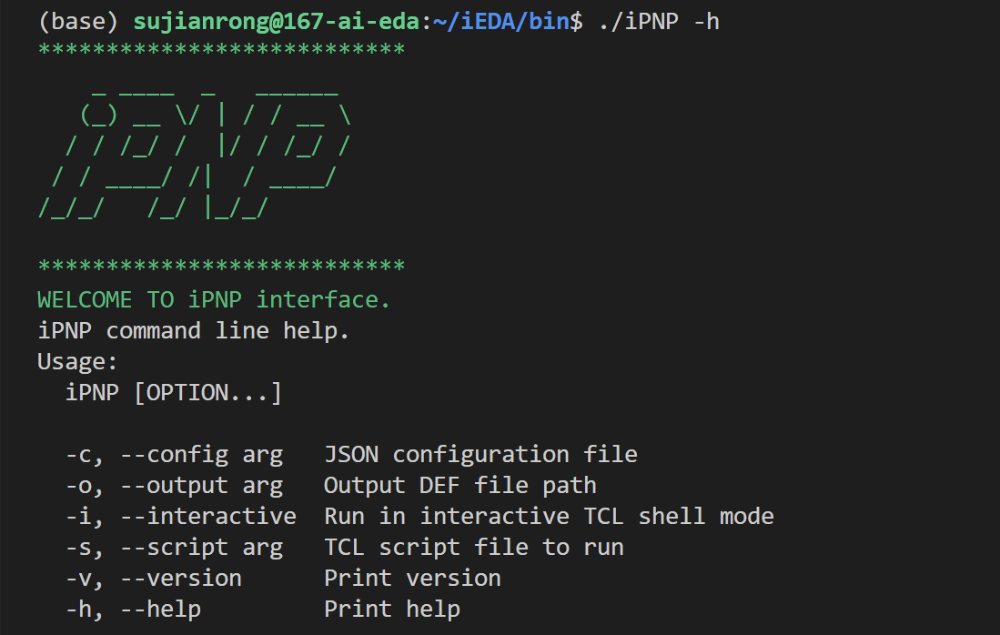
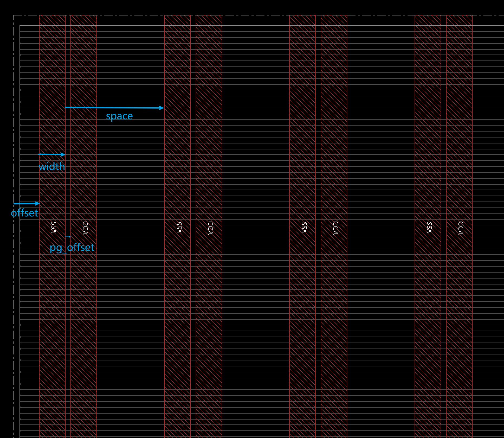

# iPNP 使用指南

## 概述

iPNP是一个平衡拥塞和电压降的芯片电源网络布局工具，基于模拟退火算法实现，它支持电源网络生成、IR降分析和拥塞评估等功能。

## 目前支持的功能

1. 读入 def/lef 文件，构建 idb_builder，在 builder 中添加电源线和通孔，输出结果 def 文件

2. 对芯片版图进行划分，每个区域都可以分配不同的电源模板，即可控制每个区域的电源线密度

3. 按照设定好的模板，对每层的每个区域打上电源线，层与层之间打上通孔，实现电源的连通

4. 可调用 iPL 工具，先完成快速布局，为后续评估拥塞和 IR drop 做准备

5. 可调用 EGR 工具，计算出当前电源网络下，每一层的 overflow

6. 可调用 IR evaluation 工具，计算出到每个 instance 的 IR drop

7. 以模拟退火算法为核心，经过多次迭代，找到关于 overflow 和 IR drop 的 best score

   

## 安装

iPNP工具位于 `src/operation/iPNP/` 目录下。编译完成后，可执行文件将位于 `bin/` 目录中。


## 使用方法

### 编写配置文件

首先需要创建一个JSON格式的配置文件，例如 `pnp_config.json`。配置文件包含了iPNP运行所需的所有参数。

### 运行iPNP

有几种运行iPNP的方式：

**命令行模式**：

```bash
cd bin/
./iPNP -c /path/to/pnp_config.json
```

**指定输出文件**：

```bash
./iPNP -c /path/to/pnp_config.json -o /path/to/output.def
```

**交互式模式**：

```bash
./iPNP -i
```

**运行TCL脚本**：

```bash
./iPNP -s /path/to/script.tcl
```

**帮助：**

```bash
./iPNP -h
```



### TCL命令

运行完整的iPNP流程：

```tcl
run_pnp -config /path/to/pnp_config.json
```

在VIA1上添加通孔，即连接M2和M1层。根据VIA2的通孔位置，在相同坐标下添加VIA1的通孔，确保电源网络可以完全连通到M1层。

（注意：这个tcl命令不会运行完整的iPNP流程，只用于通孔没达到M1上的数据集）

```tcl
add_via1 -config /path/to/pnp_config.json
```


## 配置文件详解

配置文件采用JSON格式，包含以下主要部分：

### design - 设计文件信息
```json
"design": {
  "lef_files": ["文件1.lef", "文件2.lef", ...],  // LEF技术和单元库文件
  "def_file": "设计.def",                   // 输入DEF文件
  "output_def_file": "输出.def",            // 输出DEF文件路径
  "sdc_file": "时序.sdc"                    // SDC时序约束文件
}
```

### lib - 库文件信息
```json
"lib": {
  "liberty_files": ["文件1.lib", "文件2.lib", ...]  // liberty库文件列表
}
```

### timing - 时序分析设置
```json
"timing": {
  "design_workspace": "/path/to/workspace"  // ir drop结果输出目录
}
```

### power - 电源网络设置
```json
"power": {
  "power_net_name": "VDD"  // 电源网络名称
}
```

### egr - 拥塞评估相关
```json
"egr": {
  "map_path": "/path/to/map"  // 拥塞图输出路径
}
```

### grid - 电源网格设置
```json
"grid": {
  "power_layers": [9, 8, 7, 6, 5, 4, 3],  // 电源层列表，从高到低排列
  "ho_region_num": 2,                     // 水平区域数量
  "ver_region_num": 2                     // 垂直区域数量
}
```

### templates - 电源网格模板设置
```json
"templates": {
  "horizontal": [  // 水平方向模板
    {
      "width": 8000.0,		// 电源线宽度
      "pg_offset": 1600.0,	// VDD和VSS的间距
      "space": 19200.0,		// 两条VDD之间的距离
      "offset": 8000.0		// 第一条VDD距离die底部/左侧的距离
    },
    // 更多水平模板...
  ],
  "vertical": [  // 垂直方向模板
    {
      "width": 8000.0,
      "pg_offset": 1600.0,
      "space": 19200.0,
      "offset": 8000.0
    },
    // 更多垂直模板...
  ]
}
```

### simulated_annealing - 模拟退火算法参数

```json
"simulated_annealing": {
  "initial_temp": 100.0,          // 初始温度
  "cooling_rate": 0.95,           // 冷却率
  "min_temp": 0.1,                // 最小温度
  "iterations_per_temp": 10,      // 每个温度的迭代次数
  "ir_drop_weight": 0.6,          // IR drop权重
  "overflow_weight": 0.4,         // 拥塞权重
  "modifiable_layer_min": 3,      // 模拟退火可替换模板的最底层
  "modifiable_layer_max": 6       // 模拟退火可替换模板的最高层
}
```


## 配置示例

以下是一个完整的配置文件示例：

```json
{
  "design": {
    "lef_files": [
      "/home/sujianrong/T28/tlef/tsmcn28_9lm6X2ZUTRDL.tlef",
      "/home/sujianrong/T28/lef/PLLTS28HPMLAINT.lef",
      "/home/sujianrong/T28/lef/tcbn28hpcplusbwp30p140opplvt.lef",
      "/home/sujianrong/T28/lef/tcbn28hpcplusbwp35p140lvt.lef",
      "/home/sujianrong/T28/lef/tcbn28hpcplusbwp35p140uhvt.lef",
      "/home/sujianrong/T28/lef/tcbn28hpcplusbwp40p140hvt.lef",
      "/home/sujianrong/T28/lef/tcbn28hpcplusbwp40p140oppuhvt.lef",
      "/home/sujianrong/T28/lef/ts5n28hpcplvta256x32m4fw_130a.lef",
      "/home/sujianrong/T28/lef/tcbn28hpcplusbwp30p140cg.lef",
      "/home/sujianrong/T28/lef/tcbn28hpcplusbwp30p140oppuhvt.lef",
      "/home/sujianrong/T28/lef/tcbn28hpcplusbwp35p140mbhvt.lef",
      "/home/sujianrong/T28/lef/tcbn28hpcplusbwp35p140ulvt.lef",
      "/home/sujianrong/T28/lef/tcbn28hpcplusbwp40p140.lef",
      "/home/sujianrong/T28/lef/tcbn28hpcplusbwp40p140uhvt.lef",
      "/home/sujianrong/T28/lef/ts5n28hpcplvta64x100m2fw_130a.lef",
      "/home/sujianrong/T28/lef/tcbn28hpcplusbwp30p140hvt.lef",
      "/home/sujianrong/T28/lef/tcbn28hpcplusbwp30p140oppulvt.lef",
      "/home/sujianrong/T28/lef/tcbn28hpcplusbwp35p140mb.lef",
      "/home/sujianrong/T28/lef/tcbn28hpcplusbwp40p140cgcwhvt.lef",
      "/home/sujianrong/T28/lef/tcbn28hpcplusbwp40p140lvt.lef",
      "/home/sujianrong/T28/lef/tpbn28v_9lm.lef",
      "/home/sujianrong/T28/lef/ts5n28hpcplvta64x128m2f_130a.lef",
      "/home/sujianrong/T28/lef/tcbn28hpcplusbwp30p140.lef",
      "/home/sujianrong/T28/lef/tcbn28hpcplusbwp30p140uhvt.lef",
      "/home/sujianrong/T28/lef/tcbn28hpcplusbwp35p140mblvt.lef",
      "/home/sujianrong/T28/lef/tcbn28hpcplusbwp40p140cgcw.lef",
      "/home/sujianrong/T28/lef/tcbn28hpcplusbwp40p140mbhvt.lef",
      "/home/sujianrong/T28/lef/tpbn28v.lef",
      "/home/sujianrong/T28/lef/ts5n28hpcplvta64x128m2fw_130a.lef",
      "/home/sujianrong/T28/lef/tcbn28hpcplusbwp30p140lvt.lef",
      "/home/sujianrong/T28/lef/tcbn28hpcplusbwp30p140ulvt.lef",
      "/home/sujianrong/T28/lef/tcbn28hpcplusbwp35p140opphvt.lef",
      "/home/sujianrong/T28/lef/tcbn28hpcplusbwp40p140cgehvt.lef",
      "/home/sujianrong/T28/lef/tcbn28hpcplusbwp40p140mb.lef",
      "/home/sujianrong/T28/lef/tphn28hpcpgv18_9lm.lef",
      "/home/sujianrong/T28/lef/ts5n28hpcplvta64x88m2fw_130a.lef",
      "/home/sujianrong/T28/lef/tcbn28hpcplusbwp30p140mb.lef",
      "/home/sujianrong/T28/lef/tcbn28hpcplusbwp35p140cghvt.lef",
      "/home/sujianrong/T28/lef/tcbn28hpcplusbwp35p140opp.lef",
      "/home/sujianrong/T28/lef/tcbn28hpcplusbwp40p140cghvt.lef",
      "/home/sujianrong/T28/lef/tcbn28hpcplusbwp40p140oppehvt.lef",
      "/home/sujianrong/T28/lef/ts1n28hpcplvtb2048x48m8sw_180a.lef",
      "/home/sujianrong/T28/lef/ts5n28hpcplvta64x92m2fw_130a.lef",
      "/home/sujianrong/T28/lef/tcbn28hpcplusbwp30p140mblvt.lef",
      "/home/sujianrong/T28/lef/tcbn28hpcplusbwp35p140cg.lef",
      "/home/sujianrong/T28/lef/tcbn28hpcplusbwp35p140opplvt.lef",
      "/home/sujianrong/T28/lef/tcbn28hpcplusbwp40p140cg.lef",
      "/home/sujianrong/T28/lef/tcbn28hpcplusbwp40p140opphvt.lef",
      "/home/sujianrong/T28/lef/ts1n28hpcplvtb512x128m4sw_180a.lef",
      "/home/sujianrong/T28/lef/ts5n28hpcplvta64x96m2fw_130a.lef",
      "/home/sujianrong/T28/lef/tcbn28hpcplusbwp30p140opphvt.lef",
      "/home/sujianrong/T28/lef/tcbn28hpcplusbwp35p140hvt.lef",
      "/home/sujianrong/T28/lef/tcbn28hpcplusbwp35p140oppuhvt.lef",
      "/home/sujianrong/T28/lef/tcbn28hpcplusbwp40p140cguhvt.lef",
      "/home/sujianrong/T28/lef/tcbn28hpcplusbwp40p140opp.lef",
      "/home/sujianrong/T28/lef/ts1n28hpcplvtb512x64m4sw_180a.lef",
      "/home/sujianrong/T28/lef/ts6n28hpcplvta2048x32m8sw_130a.lef",
      "/home/sujianrong/T28/lef/tcbn28hpcplusbwp30p140opp.lef",
      "/home/sujianrong/T28/lef/tcbn28hpcplusbwp35p140.lef",
      "/home/sujianrong/T28/lef/tcbn28hpcplusbwp35p140oppulvt.lef",
      "/home/sujianrong/T28/lef/tcbn28hpcplusbwp40p140ehvt.lef",
      "/home/sujianrong/T28/lef/tcbn28hpcplusbwp40p140opplvt.lef",
      "/home/sujianrong/T28/lef/ts1n28hpcplvtb8192x64m8sw_180a.lef"
    ],
    "def_file": "/home/sujianrong/iEDA/src/operation/iPNP/data/test/aes_no_pwr.def",
    "output_def_file": "/home/sujianrong/iEDA/src/operation/iPNP/data/test/output.def",
    "sdc_file": "/home/sujianrong/aes/aes.sdc"
  },
  "lib": {
    "liberty_files": [
      "/home/sujianrong/T28/lib/tcbn28hpcplusbwp40p140ssg0p81v125c.lib",
      "/home/sujianrong/T28/lib/tcbn28hpcplusbwp40p140hvtssg0p81v125c.lib",
      "/home/sujianrong/T28/lib/tcbn28hpcplusbwp35p140ssg0p81v125c.lib",
      "/home/sujianrong/T28/lib/tcbn28hpcplusbwp35p140lvtssg0p81v125c.lib",
      "/home/sujianrong/T28/lib/tcbn28hpcplusbwp40p140lvtssg0p81v125c.lib",
      "/home/sujianrong/T28/lib/tcbn28hpcplusbwp30p140lvtssg0p81v125c.lib",
      "/home/sujianrong/T28/lib/tcbn28hpcplusbwp30p140ssg0p81v125c.lib" 
    ]
  },
  "timing": {
    "design_workspace": "/home/sujianrong/iEDA/src/operation/iPNP/data/ir/ir_temp_directory"
  },
  "power": {
    "power_net_name": "VDD"
  },
  "egr":{
    "map_path":"/home/sujianrong/iEDA/src/operation/iPNP/data"
  },
  "grid": {
    "power_layers": [9,8,7,6,5,4,3],
    "ho_region_num": 2,
    "ver_region_num": 2
  },
  "simulated_annealing": {
    "initial_temp": 100.0,
    "cooling_rate": 0.95,
    "min_temp": 0.1,
    "iterations_per_temp": 10,
    "ir_drop_weight": 0.6,
    "overflow_weight": 0.4,
    "modifiable_layer_min": 3,
    "modifiable_layer_max": 6
  },
  "templates":{
    "horizontal": [
      {
        "width": 8000.0,
        "pg_offset": 1600.0,
        "space": 19200.0,
        "offset": 8000.0
      },
      {
        "width": 8000.0,
        "pg_offset": 1600.0,
        "space": 38400.0,
        "offset": 8000.0
      },
      {
        "width": 8000.0,
        "pg_offset": 1600.0,
        "space": 38400.0,
        "offset": 27200.0
      }
    ],
    "vertical": [
      {
        "width": 8000.0,
        "pg_offset": 1600.0,
        "space": 19200.0,
        "offset": 8000.0
      },
      {
        "width": 8000.0,
        "pg_offset": 1600.0,
        "space": 38400.0,
        "offset": 8000.0
      },
      {
        "width": 8000.0,
        "pg_offset": 1600.0,
        "space": 38400.0,
        "offset": 27200.0
      }
    ]
  }
} 
```


## 输出结果

运行完成后，iPNP会生成以下文件：

1. 带有电源网格的DEF文件（在配置的`output_def_file`路径）
2. IR drop分析报告
3. 拥塞评估结果


## 注意事项

1. 确保所有文件路径正确且文件存在
2. 电源层列表按从高到低的顺序排列
3. 模板中的参数已经乘了dbu
