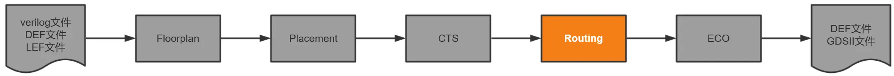
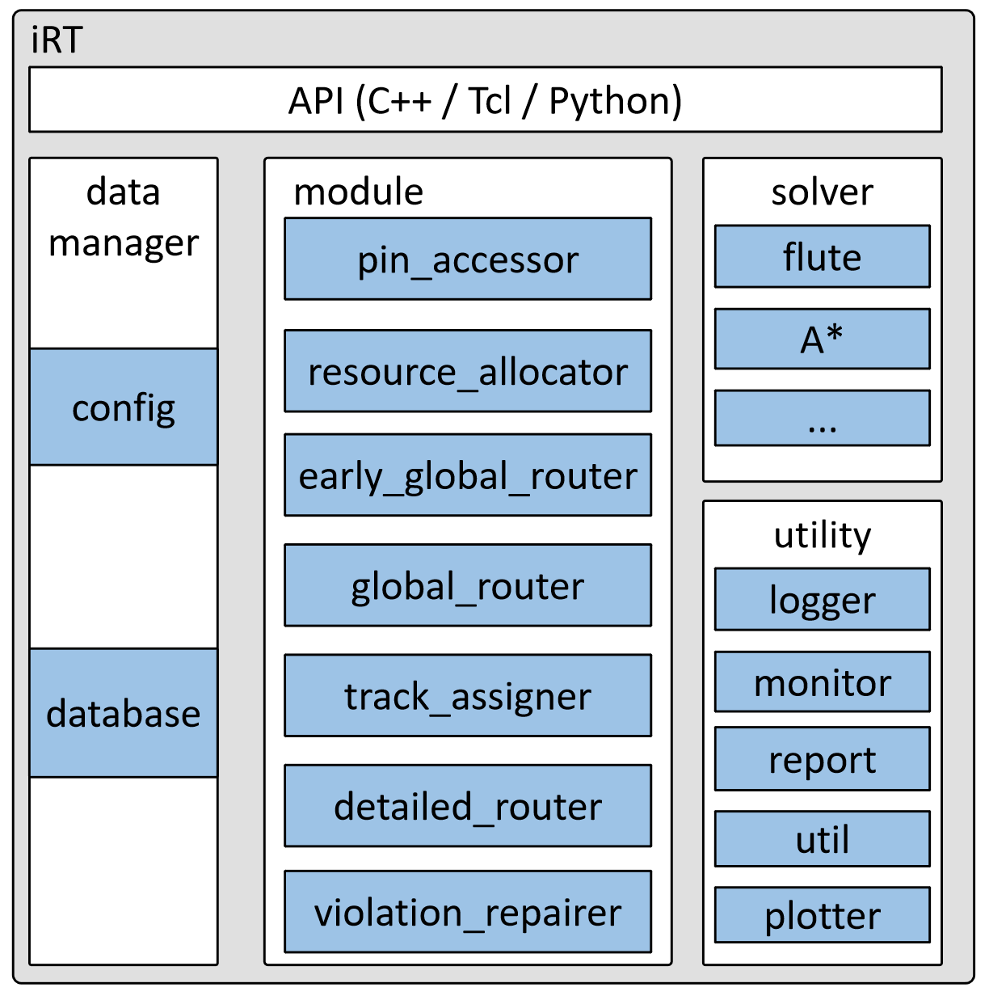
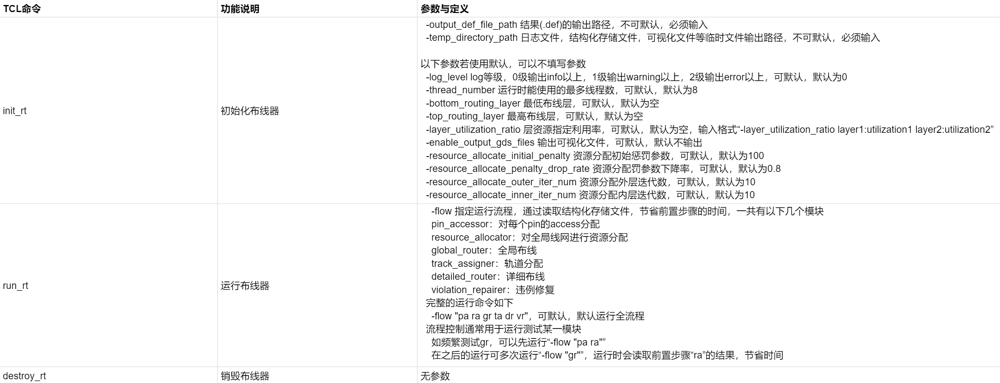

# iRT: Routing

## Background

Wiring is an important physical implementation task after layout and clock tree synthesis. Its content is to interconnect the modules, standard cells, and input/output interface units distributed in the chip core according to the logical relationship, and optimize to meet various constraint conditions. iRT is a wire router designed for the wiring stage by the iEDA research group, and it integrates global wiring and detailed wiring internally.

## Software Structure

### API: iRT interfaces in multiple languages

### Data Manager: Top-level data manager

### Module: Main algorithm modules

- Pin_accessor: Allocates access points for all pins and finds accessible points on the port

- Global_router: Global router, in units of GCell, performs global wiring on a three-dimensional grid

- Track_assigner: Wire track assignment, modeled as a wiring problem for track assignment

- Detailed_router: Detailed router, a DRC-driven detailed router based on a three-dimensional track grid

### Solver: Solvers that can be used during wiring

- Flute: Generates fast Steiner trees in the form of lookup tables

- A*: Three-dimensional path search algorithm

### Utility: Tool modules

- Logger: Log module

- Monitor: Runtime status monitor

- Report: Reporter

- Util: Utility functions

- Plotter: Debug visualization module