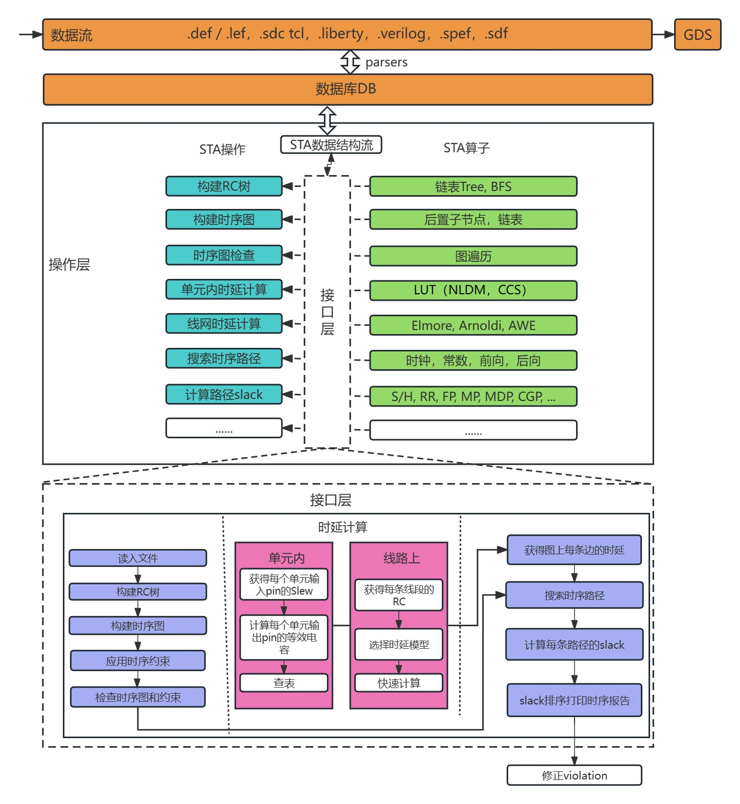

# iSTA: Timing Analysis

## Introduction to the iSTA

### Software structure diagram

<div align="center">

 

 **iSTA--An open-source intelligent Static Timing Analysis for ASIC design.**

</div>

### Supported features

- Perfect support for reading standard input files (Def/Verilog, sdc, spef/sdf, liberty).

- Delay calculation not only supports the NLDM/Elmore calculation model, but also supports the CCS current model and the Arnoldi reduced-order model.

- Timing analysis supports Clock Gate analysis, Removal/Recovery analysis and Multicycle analysis.

- The timing path analysis mode supports the OCV mode and the AOCV mode.

- Noise analysis preliminarily supports the impact of Crosstalk and will be further improved in the future.

- Provide a timing analysis engine (timing engine) for physical design calls.

---

## Example of how to use the iSTA tool

### Write the tcl file(run_ista.tcl)

The example tcl file path: src/operation/iSTA/source/data/example1/run_ista.tcl

#### Set the timing report output path

```bash
set work_dir "../src/operation/iSTA/source/data/example1"
set_design_workspace $work_dir/rpt
```

#### Read verilog file

```bash
read_netlist $work_dir/example1.v
```

#### Read .lib files

```bash
set LIB_FILES $work_dir/example1_slow.lib
read_liberty $LIB_FILES
```

#### Link_design design_name

```bash
link_design top
```

#### Read sdc file

```bash
read_sdc  $work_dir/example1.sdc
```

#### Read spef file

```bash
read_spef $work_dir/example1.spef
```

#### Get the timing report

```bash
report_timing
```

The timing report will be under the timing report output path set in the first step, including:

- top.rpt（report WNS,TNS and timing path）
- top.cap（report violation capacitance）
- top.fanout（report violation fanout）
- top.trans（report violation transition）
- top_hold.skew（report clock skew in hold mode)
- top_setup.skew（report clock skew in setup mode）

### Build iSTA（iSTA path: bin/）

### Run the tcl file with iSTA

```bash
 cd bin/
 ./iSTA run_ista.tcl
```
